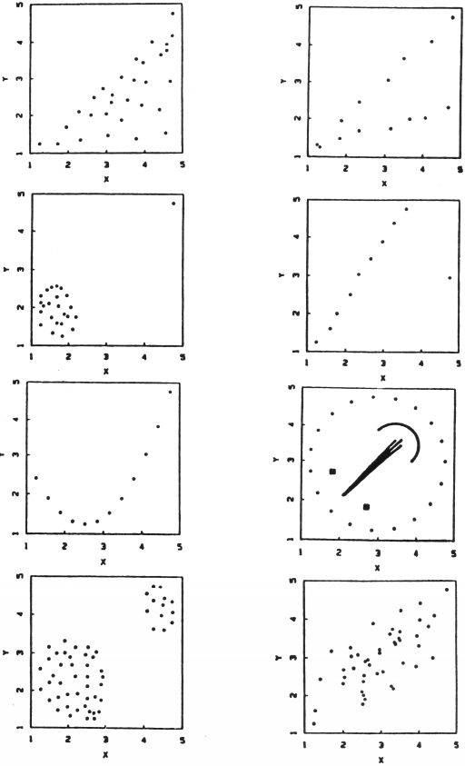
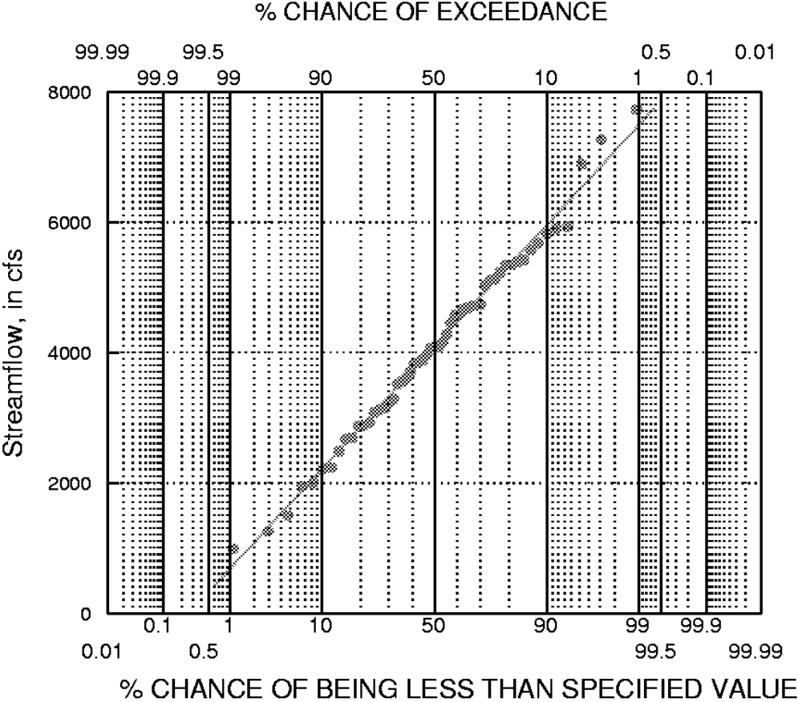
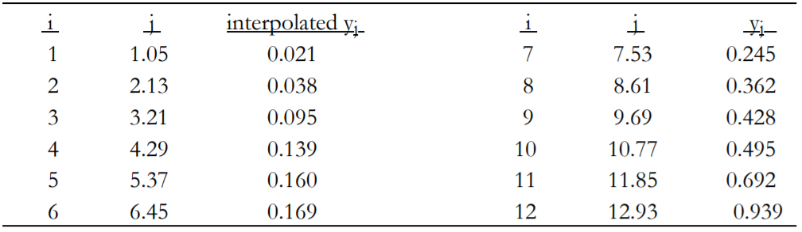
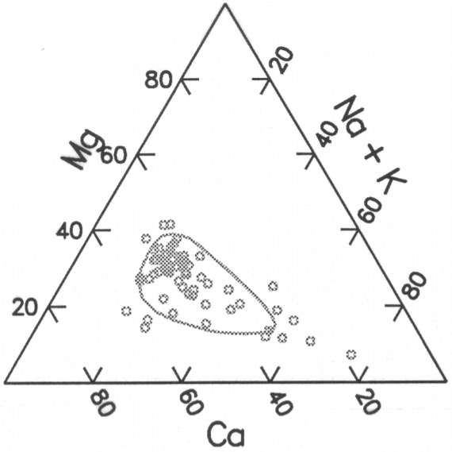

# Graphical Data Analysis {#ch2}

Perhaps it seems odd that a chapter on graphics appears at the front of a text on statistical methods. We believe this is very appropriate, as graphs provide crucial information to the data analyst which is difficult to obtain in any other way. For example, figure \@ref(fig:fig-2-1) shows eight scatterplots, all of which have exactly the same correlation coefficient. Computing statistical measures without looking at a plot is an invitation to misunderstanding data, as figure \@ref(fig:fig-2-1) illustrates. Graphs provide visual summaries of data which more quickly and completely describe essential information than do tables of numbers.

Graphs are essential for two purposes:

1. to provide insight for the analyst into the data under scrutiny, and
2. to illustrate important concepts when presenting the results to others.

The first of these tasks has been called <u>exploratory data analysis</u> (EDA), and is the subject of this chapter. EDA procedures often are (or should be) the 'first look' at data. Patterns and theories of how the system behaves are developed by observing the data through graphs. These are inductive procedures -- the data are summarized rather than tested. Their results provide guidance for the selection of appropriate deductive hypothesis testing procedures.

Once an analysis is complete, the findings must be reported to others. Whether a written report or oral presentation, the analyst must convince the audience that the conclusions reached are supported by the data. No better way exists to do this than through graphics. Many of the same graphical methods which have concisely summarized the information for the analyst will also provide insight into the data for the reader or audience.

The chapter begins with a discussion of graphical methods for analysis of a single data set. Two methods are particularly useful: boxplots and probability plots. Their construction is presented in detail. Next, methods for comparison of two or more groups of data are discussed. Then bivariate plots (scatterplots) are presented, with an especially useful enhancement called a smooth. The chapter ends with a discussion of plots appropriate for multivariate data.

```{r fig-2-1,  echo=FALSE, fig.cap = "Eight scatterplots all with correlation coefficient r = 0.70 (@chambers_graphical_1983)", fig.align="center"}

```

Throughout sections \@ref(ch2-1) and \@ref(ch2-2) two data sets will be used to compare and contrast the effectiveness of each graphical method. These are annual streamflow (in cubic feet per second, or cfs) for the Licking River at Catawba, Kentucky, from 1929 through 1983, and unit well yields (in gallons per minute per foot of water-bearing material) for valleys without fracturing in
Virginia (@wright_effects_1985).

## Graphical Analysis of Single Data Sets {#ch2-1}
### Histograms

Histograms are familiar graphics, and their construction is detailed in numerous introductory texts on statistics. Bars are drawn whose height is the number n~i~, or fraction n~i~/n, of data falling into one of several categories or intervals (figures \@ref(fig:fig-2-2-1)  & \@ref(fig:fig-2-2-2)). @iman_modern_1983 suggest that, for a sample size of n, the number of intervals k should be the smallest integer such that 2^k^ ≥ n.

Histograms have one primary deficiency -- their visual impression depends on the number of categories selected for the plot. For example, compare figure \@ref(fig:fig-2-2-1) with \@ref(fig:fig-2-2-2). Both are histograms of the same data: annual streamflows for the Licking River. Comparisons of shape and similarity among these two figures and the many other possible histograms of the same data depend on the choice of bar widths and centers. False impressions that these are different distributions might be given by characteristics such as the gap around 6,250 cfs. It is seen in \@ref(fig:fig-2-2-2) but not in \@ref(fig:fig-2-2-1).

Histograms are quite useful for depicting large differences in shape or symmetry, such as whether a data set appears symmetric or skewed. They cannot be used for more precise judgements such as depicting individual values. Thus from figure \@ref(fig:fig-2-2-1) the lowest flow is seen to be larger than 750 cfs, but might be as large as 2,250 cfs. More detail is given in \@ref(fig:fig-2-2-2), but this lowest observed discharge is still only known to be somewhere between 500 to 1,000 cfs.

For data measured on a continuous scale (such as streamflow or concentration), histograms are not the best method for graphical analysis. The process of forcing continuous data into discrete categories may obscure important characteristics of the distribution. However, histograms are excellent when displaying data which have natural categories or groupings. Examples of such data would include the number of individual organisms found at a stream site grouped by species type, or the number of water-supply wells exceeding some critical yield grouped by geologic unit.

```{r fig-2-2-1, echo = FALSE, fig.show = 'hold', fig.cap = "Histogram of annual streamflow for the Licking River", fig.align="center", message = FALSE, warning = FALSE}
library(data.table)
library(ggplot2)
source("./data/themes.R")
source("./data/palettes.R")
monthly_streamflow <- fread('data/licking_river_streamflow.csv')
annual_streamflow <- monthly_streamflow[, year_va := mean(mean_va), by = year_nu][,unique(year_va), by = year_nu]
ggplot(annual_streamflow, aes(x = V1)) + 
  geom_histogram(binwidth = 1500, color = "white", fill = palettes_bright$colset_cheer_brights[1]) +
  theme_generic + 
  labs(x = NULL, y = "NUMBER OF OCCURRENCES") + 
  scale_x_continuous(breaks = seq(1500, 7500, 1500))
```

```{r fig-2-2-2, echo = FALSE, fig.show = 'hold', fig.cap = "Second histogram of same data, but with different interval divisions", fig.align="center"}
ggplot(annual_streamflow, aes(x = V1)) + 
  geom_histogram(binwidth = 500, center = 750, color = "white", fill = palettes_bright$colset_cheer_brights[1]) +
  theme_generic + 
  labs(x = "ANNUAL DISCHARGE", y = "NUMBER OF OCCURRENCES") + 
  scale_x_continuous(breaks = seq(750, 7750, 500)) +
  theme(axis.text.x = element_text(angle = 45))
```

### Stem and Leaf Diagrams

Figure [2.4](#fig-2-3) shows a stem and leaf (S-L) diagram for the Licking River streamflow data with the same divisions as in figure \@ref(fig:fig-2-2-2). Stem and leaf diagrams are like histograms turned on their side, with data magnitudes to two significant digits presented rather than only bar heights. Individual values are easily found. The S-L profile is identical to the histogram and can similarly be used to judge shape and symmetry, but the numerical information adds greater detail. One S-L could function as both a table and a histogram for small data sets.

An S-L is constructed by dividing the range of the data into roughly 10 intervals, and placing the first digit corresponding to these intervals to the left of the vertical line. This is the 'stem', ranging from 1 to 8 (0 to 8000+ cfs) in figure [2.4*](#fig-2-3). Each observation is then represented by one digit to the right of the line (the 'leaves'), so that the number of leaves equals the number of observations falling into that interval. To provide more detail, figure [2.4*](#fig-2-3) has two lines for each stem digit, split to allow 5 leaf digits per line (0-4 and 5-9). Here the first stem is the stem for leaves less than 5, and the second stem for leaves greater than or equal to 5. For example, in figure [2.4*](#fig-2-3) three observations occur between 1500 and 2000 cfs, with values of 1800, 1900, and 1900 cfs.

The lowest flow is now seen to be between 1000 and 1500 cfs. The gap between 7,000 to 7,500 cfs is still evident, and now the numerical values of the three highest flows are presented. Comparisons between distributions still remain difficult using S-L plots, however, due to the required arbitrary choice of group boundaries.
<a id="fig-2-3"></a>

```{r echo = FALSE}
stem(annual_streamflow$V1, scale = 2)
"Fig 2.4* Stem and Leaf Plot of Annual Streamflow"
```

### Quantile Plots

Quantile plots visually portray the quantiles, or percentiles (which equal the quantiles times 100) of the distribution of sample data. Quantiles of importance such as the median are easily discerned (quantile, or cumulative frequency = 0.5). With experience, the spread and skewness of the data, as well as any bimodal character, can be examined. Quantile plots have three advantages:

1. Arbitrary categories are not required, as with histograms or S-L's.
2. All of the data are displayed, unlike a boxplot.
3. Every point has a distinct position, without overlap.

Figure \@ref(fig:fig-2-4) is a quantile plot of the streamflow data from figures \@ref(fig:fig-2-2-1) and \@ref(fig:fig-2-2-2). Attributes of the data such as the gap between 6500 and 7500 cfs (indicated by the nearly horizontal line segment) are evident. The percent of data in the sample less than a given cfs value can be read from the graph with much greater accuracy than from a histogram. 
```{r fig-2-4, echo = FALSE, fig.cap = "Quantile plot of the Licking River annual streamflow data", fig.align="center"}
setorder(annual_streamflow,V1)
annual_streamflow[, idx := as.numeric(row.names(.SD))][, p_i := (idx - 0.4)/(.N + 0.2)]
ggplot(annual_streamflow, aes(x = V1, y = p_i)) + 
  geom_point() +
  geom_line() +
  scale_color_manual(values = palettes_bright$colset_cheer_brights) +
  theme_generic +
  labs(x = "Streamflow, in cfs", y = "CUMULATIVE FREQUENCY") +
  scale_x_continuous(breaks = seq(0, 8000, 1000), limits = c(0, 8000)) +
  scale_y_continuous(breaks = seq(0, 1, 0.1))
```

#### Construction of a quantile plot

To construct a quantile plot, the data are ranked from smallest to largest. The smallest data value is assigned a rank i = 1, while the largest receives a rank i = n, where n is the sample size of the data set. The data values themselves are plotted along one axis, usually the horizontal axis. On the other axis is the "plotting position", which is a function of the rank i and sample size n. As discussed in the next section, the Cunnane plotting position p~i~ = (i−0.4)/(n+0.2) is used in this book. Below are listed the first and last 5 of the 50 data pairs used in construction of figure \@ref(fig:fig-2-4). When tied data values are present, each is assigned a separate plotting position (the plotting positions are not averaged). In this way tied values are portrayed as a vertical "cliff" on the plot.

```{r echo = FALSE}
rbind(head(annual_streamflow[, c("idx", "V1", "p_i")], 5), tail(annual_streamflow[, c("idx", "V1", "p_i")], 5))
```

Quantile plots are sample approximations of the cumulative distribution function (cdf) of a continuous random variable. The cdf for a normal distribution is shown in figure \@ref(fig:fig-2-7). A second approximation is the sample (or empirical) cdf, which differs from quantile plots in its vertical scale. The vertical axis of a sample cdf is the probability i/n of being less than or equal to that observation. The largest observation has i/n = 1, and so has a zero probability of being exceeded. For samples (subsets) taken from a population, a nonzero probability of exceeding the largest value observed thus far should be recognized. This is done by using the plotting position, a value less than i/n, on the vertical axis of the quantile plot. As sample sizes increase, the quantile plot will more closely mimic the underlying population cdf.

##### Plotting positions

Variations of quantile plots are used frequently for three purposes:

1. to compare two or more data distributions (a Q-Q plot),
2. to compare data to a normal distribution (a probability plot), and
3. to calculate frequencies of exceedance (a flow-duration curve).

Unfortunately, different plotting positions have traditionally been used for each of the above three purposes. It would be desirable instead to use one formula that is suitable for all three. Numerous plotting position formulas have been suggested, most having the general formula $$p = (i − a) / (n + 1 − 2a)$$ where a varies from 0 to 0.5. Five of the most commonly-used formulas are: 

| Reference | a | Formula |
| :---: | :---: | :---: |
| @weibull_phenomenon_1939 | 0 | $i / (n + 1)$|
| @blom_statistical_1958 | 0.375 | $(i - 0.375) / (n + 0.25)$|
| @cunnane_unbiased_1978 | 0.4 | $(i - 0.4) / (n + 0.2)$|
| @gringorten_plotting_1963 | 0.44 | $(i - 0.44) / (n + 0.12)$|
| @hazen_storage_1914 | 0.5 | $(i - 0.5) / n$|

The Weibull formula has long been used by hydrologists in the United States for plotting flowduration and flood-frequency curves (@langbein_plotting_1960). It is used in Bulletin 17B, the standard reference for determining flood frequencies in the United States (@interagency_guidelines_1982). The Blom formula is best for comparing data quantiles to those of a normal distribution in probability plots, though all of the above formulas except the Weibull are acceptable for that purpose (@looney_probability_1985). The Hazen formula is used by @chambers_graphical_1983 for comparing two or more data sets using Q-Q plots. 

Separate formulae could be used for the situations in which each is optimal. In this book we instead use one formula, the Cunnane formula given above, for all three purposes. We do this in an attempt to simplify. The Cunnane formula was chosen because

1. it is acceptable for normal probability plots, being very close to Blom.
2. it is used by Canadian and some European hydrologists for plotting flowduration and flood-frequency curves. @cunnane_unbiased_1978 presents the arguments for use of this formula over the Weibull when calculating exceedance probabilities.

For convenience when dealing with small sample sizes, table B1 of the Appendix presents Cunnane plotting positions for sample sizes n = 5 to 20. 

### Boxplots

A very useful and concise graphical display for summarizing the distribution of a data set is the boxplot (figure \@ref(fig:fig-2-5)). Boxplots provide visual summaries of

1. the center of the data (the median--the center line of the box)
2. the variation or spread (interquartile range--the box height)
3. the skewness (quartile skew--the relative size of box halves)
4. presence or absence of unusual values ("outside" and "far outside" values).
 
Boxplots are even more useful in comparing these attributes among several data sets.

Compare figures \@ref(fig:fig-2-4) and \@ref(fig:fig-2-5), both of the Licking River data. Boxplots do not present all of the data, as do stem-and-leaf or quantile plots. Yet presenting all data may be more detail than is necessary, or even desirable. Boxplots do provide concise visual summaries of essential data characteristics. For example, the symmetry of the Licking River data is shown in figure \@ref(fig:fig-2-5) by the similar sizes of top and bottom box halves, and by the similar lengths of whiskers. In contrast,
in figure \@ref(fig:fig-2-6) the taller top box halves and whiskers indicate a right-skewed distribution, the most commonly occurring shape for water resources data. Boxplots are often put side-by-side to visually compare and contrast groups of data.

Three commonly used versions of the boxplot are described as follows (figure \@ref(fig:fig-2-6)). Any of the three may appropriately be called a boxplot.

```{r fig-2-5, echo = FALSE, fig.cap = "Boxplot of the Licking River annual streamflow data", fig.align="center"}
ggplot(annual_streamflow, aes(y = V1)) +
  geom_boxplot(alpha = 0.4, coef = 1.58) +
  annotate("text", x = 0.9, y = min(annual_streamflow$V1), label = "SMALLEST PT WITHIN 1 STEP BELOW BOX") +
  annotate("text", x = 0.8, y = quantile(annual_streamflow$V1,0.25), label = "25th PERCENTILE") +
  annotate("text", x = 0.95, y = median(annual_streamflow$V1), label = "MEDIAN (50th PERCENTILE)") +
  annotate("text", x = 0.8, y = quantile(annual_streamflow$V1,0.75), label = "75th PERCENTILE") +
  annotate("text", x = 0.9, y = max(annual_streamflow$V1), label = "LARGEST PT WITHIN 1 STEP BELOW BOX") +
  labs(x = "LICKING RIVER", y = "STREAMFLOW, IN CFS") +
  scale_x_continuous(limits = c(-1, 2)) +
  scale_fill_manual(values = palettes_bright$colset_cheer_brights) +
  scale_color_manual(values = palettes_bright$colset_cheer_brights) +
  theme_generic +
  theme(legend.position = "none", panel.grid = element_blank(), axis.text.x = element_blank(), axis.ticks.x = element_blank()) 
```

#### Simple boxplot

The simple boxplot was originally called a "box-and-whisker" plot by @tukey_exploratory_1977. It consists of a center line (the median) splitting a rectangle defined by the upper and lower hinges (very similar to quartiles -- see appendix). Whiskers are lines drawn from the ends of the box to the maximum and minimum of the data, as depicted in graph a of figure \@ref(fig:fig-2-6). 

#### Standard boxplot

Tukey's "schematic plot" has become the most commonly used version of a boxplot (middle graph in figure \@ref(fig:fig-2-6)), and will be the type of boxplot used throughout this book. With this standard boxplot, outlying values are distinguished from the rest of the plot. The box is as defined above. However, the whiskers are shortened to extend only to the last observation within one step beyond either end of the box ("adjacent values"). A step equals 1.5 times the height of the box (1.5 times the interquartile range). Observations between one and two steps from the box in either direction, if present, are plotted individually with an asterisk ("outside values"). Outside values occur fewer than once in 100 times for data from a normal distribution. Observations farther than two steps beyond the box, if present, are distinguished by plotting them with a small circle ("far-out values"). These occur fewer than once in 300,000 times for a normal distribution. The occurrence of outside or far-out values more frequently than expected gives a quick visual indication that data may not originate from a normal distribution.

#### Truncated boxplot

In a third version of the boxplot (left graph of figure \@ref(fig:fig-2-6)), the whiskers are drawn only to the 90th and 10th percentiles of the data set. The largest 10 percent and smallest 10 percent of the data are not shown. This version could easily be confused with the simple boxplot, as no data appear beyond the whiskers, and should be clearly defined as having eliminated the most extreme 20 percent of data. It should be used only when the extreme 20 percent of data are not of interest.

In a variation on the truncated boxplot, @cleveland_graphical_1985 plotted all observations beyond the 10th and 90th percentile-whiskers individually, calling this a "box graph". The weakness of this style of graph is that 10 percent of the data will always be plotted individually at each end, and so the plot is far less effective than a standard boxplot for defining and emphasizing unusual values.

Further detail on construction of boxplots may be found in the appendix, and in @chambers_graphical_1983 and @mcgill_variations_1978. 

```{r fig-2-6, echo = FALSE, fig.cap = "Three versions of the boxplot (unit well yield data).", fig.align="center"}
unit_well_yield_data <- fread('data/well_yields_virginia.csv')
ggplot(unit_well_yield_data, aes(y = unit_well_yield)) +
  geom_boxplot(aes(x = 0), alpha = 0.4, coef = 5) +
  geom_boxplot(aes(x = 1), alpha = 0.4, coef = 2) +
  geom_boxplot(aes(x = 2), alpha = 0.4, coef = 4, outlier.shape = NA) +
  labs(x = NULL, y = "WELL YIELD, IN GAL/MIN/FT.") +
  scale_x_continuous(limits = c(-1, 3), breaks = c(0, 1, 2), labels = c("SIMPLE", "STANDARD", "TRUNCATED")) +
  scale_y_continuous(limits = c(0, 1.2), breaks = seq(0, 1.2, 0.2)) +
  scale_fill_manual(values = palettes_bright$colset_cheer_brights) +
  scale_color_manual(values = palettes_bright$colset_cheer_brights) +
  theme_generic +
  theme(legend.position = "none", panel.grid = element_blank())
```

### Probability Plots

Probability plots are used to determine how well data fit a theoretical distribution, such as the normal, lognormal, or gamma distributions. This could be attempted by visually comparing histograms of sample data to density curves of the theoretical distributions such as figures \@ref(fig:fig-1-1) and \@ref(fig:fig-1-2). However, research into human perception has shown that departures from straight lines are discerned more easily than departures from curvilinear patterns. By expressing the theoretical distribution as a straight line, departures from the distribution are more easily perceived. This is what occurs with a probability plot.

To construct a probability plot, quantiles of sample data are plotted against quantiles of the standardized theoretical distribution. In figure \@ref(fig:fig-2-7), quantiles from the quantile plot of the Licking River streamflow data (lower scale) are overlain with the S-shaped quantiles of the standard normal distribution (upper scale). For a given cumulative frequency (plotting position, p), quantiles from each curve are paired and plotted as one point on the probability plot, figure \@ref(fig:fig-2-8). Note that quantiles of the data are simply the observation values themselves, the pth quantiles where $p = (i − 0.4)/(n + 0.2)$. Quantiles of the standard normal distribution are available in table form in most textbooks on statistics. Thus, for each observation, a pair of quantiles is plotted in figure \@ref(fig:fig-2-8) as one point. For example, the median $(p = 0.5)$ equals 0 for the standard normal, and 4068 cfs for the Licking River data. The point (0,4068) is one point included in figure \@ref(fig:fig-2-8). Data closely approximating the shape of the theoretical distribution, in this case a normal distribution, will plot near to a straight line.

To illustrate the construction of a probability plot in detail, data on unit well yields (y~i~) from @wright_effects_1985 will be plotted versus their normal quantiles (also called normal scores). The data are ranked from the smallest ($i = 1$) to largest (i=n), and their corresponding plotting positions $p_{i} = (i − 0.4)/(n + 0.2)$ calculated. Normal quantiles (Zp) for a given plotting position p~i~ may be obtained in one of three ways:

a. from a table of the standard normal distribution found in most statistics textbooks
b. from table B2 in the Appendix, which presents standard normal quantiles for the Cunnane plotting positions of table B1
c. from a computerized approximation to the inverse standard normal distribution available in many statistical packages, or as listed by @zelen_probability_1964. 

Entering the table with $p_{i} = .05$, for example, will provide a $Zp = − 1.65$. Note that since the median of the standard normal distribution is 0, Zp will be symmetrical about the median, and only half of the Zp values must be looked up:

```{r fig-2-7, echo = FALSE, fig.cap = "Overlay of Licking River and standard normal distribution quantile plots", fig.align="center"}
annual_streamflow[, zp:= qnorm(p_i, 0, 1)]
ggplot(annual_streamflow, aes(x = V1, y = p_i)) + 
  geom_point() +
  geom_line() +
  geom_line(aes(x = (zp + 3)*8000/6), linetype = "dashed") +
  scale_color_manual(values = palettes_bright$colset_cheer_brights) +
  theme_generic +
  labs(x = "Streamflow, in cfs", y = "CUMULATIVE FREQUENCY") +
  scale_x_continuous(breaks = seq(0, 8000, 1000), limits = c(0, 8000), sec.axis = sec_axis(~ . *6/8000 - 3, name = "Normal Quantiles", breaks = seq(-3, 3, 1))) +
  scale_y_continuous(breaks = seq(0, 1, 0.1))
```

```{r fig-2-8, echo = FALSE, fig.cap = "Probability plot of the Licking River data", fig.align="center"}
ggplot(annual_streamflow, aes(x = zp, y = V1)) + 
  geom_point() +
  geom_line(aes(y = qnorm(p_i, 4106.029, 1508.486))) +
  scale_color_manual(values = palettes_bright$colset_cheer_brights) +
  theme_generic +
  labs(y = "Streamflow, in cfs", x = "NORMAL QUANTILES") +
  scale_y_continuous(breaks = seq(0, 8000, 2000), limits = c(0, 8000)) +
  scale_x_continuous(breaks = seq(-2.5, 2.5, 0.5), limits = c(-2.5, 2.5))
```

```{r echo = FALSE}
unit_well_yield_data <- fread('data/well_yields_virginia.csv')
setorder(unit_well_yield_data,unit_well_yield)
unit_well_yield_data[, idx := as.numeric(row.names(.SD))][, p_i := (idx - 0.4)/(.N + 0.2)][, zp:= qnorm(p_i, 0, 1)][,idx := NULL]
unit_well_yield_data
```

For comparison purposes, it is helpful to plot a reference straight line on the plot. The solid line on figure \@ref(fig:fig-2-8) is the normal distribution which has the same mean and standard deviation as do the sample data. This reference line is constructed by plotting $\overline{y}$ as the y intercept of the line ($Zp = 0$), so that the line is centered at the point ($0, \overline{y}$), the mean of both sets of quantiles. The standard deviation $s$ is the slope of the line on a normal probability plot, as the quantiles of a standard normal distribution are in units of standard deviation. Thus the line connects the points ($0, \overline{y}$) and ($1 , \overline{y} + s$).

#### Probability paper

Specialized 'probability paper' is often used for probability plots. This paper simply retransforms the linear scale for quantiles of the standard distribution back into a nonlinear scale of plotting positions (figure \@ref(fig:fig-2-9)). There is no difference between the two versions except for the horizontal scale. With probability paper the horizontal axis can be directly interpreted as the percent probability of occurrence, the plotting position times 100. The linear quantile scale of figure \@ref(fig:fig-2-8) is sometimes included on probability paper as 'probits,' where a probit = normal quantile + 5.0. Probability paper is available for distributions other than the normal, but all are constructed the same way, using standardized quantiles of the theoretical distribution.

In figure \@ref(fig:fig-2-9) the lower horizontal scale results from sorting the data in increasing order, and assigning rank 1 to the smallest value. This is commonly done in water-quality and low-flow studies. Had the data been sorted in decreasing order, assigning rank 1 to the largest value as is done in flood-flow studies, the upper scale would result -- the percent exceedance. Either horizontal scale may be obtained by subtracting the other from 100 percent.

```{r fig-2-9,  echo=FALSE, fig.cap = "Probability plot of Licking River data on probability paper", fig.align="center"}

```

#### Deviations from a linear pattern

If probability plots do not exhibit a linear pattern, their nonlinearity will indicate why the data do not fit the theoretical distribution. This is additional information that hypothesis tests for normality (described later) do not provide. Three typical conditions resulting in deviations from linearity are: asymmetry or skewness, outliers, and heavy tails of the distribution. These are
discussed below.

Figure \@ref(fig:fig-2-10) is a probability plot of the base 10 logarithms of the Licking River data. The data are negatively (left) skewed. This is seen in figure \@ref(fig:fig-2-10) as a greater slope on the left-hand side of the plot, producing a slightly convex shape. Figure \@ref(fig:fig-2-11) shows a right-skewed distribution, the unit well yield data. The lower bound of zero, and the large slope on the right-hand side of the plot produces an overall concave shape. Thus probability plots can be used to indicate what type of transformation is needed to produce a more symmetric distribution. The degree of curvature gives some indication of the severity of skewness, and therefore the degree of transformation required.

Outliers appear on probability plots as departures from the pattern of the rest of the data. Figure \@ref(fig:fig-2-12) is a probability plot of the Licking River data, but the two largest observations have been altered (multiplied by 3). Compare figures \@ref(fig:fig-2-12) and \@ref(fig:fig-2-8). Note that the majority of points in figure \@ref(fig:fig-2-12) still retain a linear pattern, with the two outliers offset from that pattern. Note that the straight line, a normal distribution with mean and standard deviation equal to those of the altered data, does not fit the data well. This is because the mean and standard deviation are inflated by the two outliers. 

The third departure from linearity occurs when more data are present in both tails (areas furthest from the median) than would be expected for a normal distribution. Figure \@ref(fig:fig-2-13) is a probability plot of adjusted nitrate concentrations in precipitation from Wellston, Michigan (@schertz_trend_1985). These data are actually residuals (departures) from a regression of log of nitrate concentration versus log of precipitation volume. A residual of 0 indicates that the concentration is exactly what would be expected for that volume, a positive residual more than what is expected, and negative less than expected. The data in figure \@ref(fig:fig-2-13) display a predominantly linear pattern, yet one not fit well by the theoretical normal shown as the solid line. Again this lack of fit indicates outliers are present. The outliers are data to the left which plot below the linear pattern, and those above the pattern to the right of the figure. Outliers occur on both ends in greater numbers than expected from a normal distribution. A boxplot for the data is shown in figure \@ref(fig:fig-2-14) for comparison. Note that both the box and whiskers are symmetric, and therefore no power transformation such as those in the "ladder of powers" would produce a more nearly normal distribution. Data may depart from a normal distribution not only in skewness, but by the number of extreme values. Excessive numbers of extreme values may cause significance levels of tests requiring the normality assumption to be in error. Therefore procedures which assume normality for their validity when applied to data of this type may produce quite inaccurate results.

```{r fig-2-10, echo = FALSE, fig.cap = "Probability plot of a left-skewed distribution (logs of Licking River data)", fig.align="center"}
ggplot(annual_streamflow, aes(x = zp, y = log10(V1))) + 
  geom_point() +
  geom_line(aes(y = qnorm(p_i, 3.580878, 0.1782828))) +
  scale_color_manual(values = palettes_bright$colset_cheer_brights) +
  theme_generic +
  labs(y = "BASE 10 LOGARITHM OF STREAMFLOW (CFS)", x = "NORMAL QUANTILES") +
  scale_y_continuous(breaks = seq(2.8, 4.2, 0.2), limits = c(2.8, 4.2)) +
  scale_x_continuous(breaks = seq(-2.5, 2.5, 0.5), limits = c(-2.5, 2.5))
```

```{r fig-2-11, echo = FALSE, fig.cap = "Probability plot of a right-skewed distribution (unit well yields)", fig.align="center", message = FALSE, warning = FALSE}
ggplot(unit_well_yield_data, aes(x = zp, y = unit_well_yield)) + 
  geom_point() +
  geom_line(aes(y = qnorm(p_i, 0.19025, 0.3123))) +
  scale_color_manual(values = palettes_bright$colset_cheer_brights) +
  theme_generic +
  labs(y = "Well Yield, in gal/min/foot", x = "NORMAL QUANTILES") +
  scale_y_continuous(breaks = seq(-1, 1.5, 0.5), limits = c(-1, 1.5)) +
  scale_x_continuous(breaks = seq(-2.5, 2.5, 0.5), limits = c(-2.5, 2.5))
```

```{r fig-2-12, echo = FALSE, fig.cap = "Probability plot of data with high outliers", fig.align="center"}
annual_streamflow_altered <- annual_streamflow
annual_streamflow_altered[idx > 48, V1 := 3*V1]
ggplot(annual_streamflow_altered, aes(x = zp, y = V1)) + 
  geom_point() +
  geom_line(aes(y = qnorm(p_i, 4725.941, 4039.01))) +
  scale_color_manual(values = palettes_bright$colset_cheer_brights) +
  theme_generic +
  labs(y = "ALTERED STREAMFLOW DATA, IN CFS", x = "NORMAL QUANTILES") +
  scale_y_continuous(breaks = seq(0, 25000, 5000), limits = c(0, 25000)) +
  scale_x_continuous(breaks = seq(-2.5, 2.5, 0.5), limits = c(-2.5, 2.5))
```

```{r fig-2-13, echo = FALSE, fig.cap = "Probability plot of a heavy-tailed data set", fig.align="center"}
nitrate <- fread('data/nitrate_michigan.csv')
setorder(nitrate,NO3_res)
nitrate[, idx := as.numeric(row.names(.SD))][, p_i := (idx - 0.4)/(.N + 0.2)][, zp:= qnorm(p_i, 0, 1)]
ggplot(nitrate, aes(x = zp, y = NO3_res)) + 
  geom_point() +
  geom_line(aes(y = qnorm(p_i, -0.02681564, 0.7110962))) +
  scale_color_manual(values = palettes_bright$colset_cheer_brights) +
  theme_generic +
  labs(y = "NITRATE RESIDUALS", x = "NORMAL QUANTILES") +
  scale_y_continuous(breaks = seq(-6, 2, 2), limits = c(-6, 2)) +
  scale_x_continuous(breaks = seq(-3, 3, 0.5), limits = c(-3, 3))
```

```{r fig-2-14, echo = FALSE, fig.cap = "Boxplot of a heavy-tailed data set", fig.align="center"}
ggplot(nitrate, aes(y = NO3_res)) +
  geom_boxplot(alpha = 0.4, coef = 1.58) +
  labs(x = NULL, y = "NITRATE RESIDUALS") +
  scale_x_continuous(breaks = NULL, limits = c(-2, 2)) +
  scale_y_continuous(breaks = seq(-6, 2, 2), limits = c(-6, 2)) +
  scale_fill_manual(values = palettes_bright$colset_cheer_brights) +
  scale_color_manual(values = palettes_bright$colset_cheer_brights) +
  theme_generic +
  theme(legend.position = "none", axis.text.x = element_blank(), axis.ticks.x = element_blank()) 
```

#### Probability plots for comparing among distributions

In addition to comparisons to a normal distribution, quantiles may be computed and probability plots constructed for any two-parameter distribution. The distribution which causes data to be most like a straight line on its probability plot is the one which most closely resembles the distributional shape of the data. Data may be compared to a two-parameter lognormal distribution by simply plotting the logarithms of the data as the data quantiles, as was done in figure \@ref(fig:fig-2-10). @vogel_probability_1986 demonstrated the construction of probability plots for the Gumbel (extreme-value) distribution, which is sometimes employed for flood-flow studies. @vogel_low_1989 cover the use of probability plots for the two-parameter Weibull distribution, used in fitting low-flow data. Again, the best fit is obtained with the distribution which most closely produces a linear plot. In both references, the use of a test of significance called the probability plot correlation coefficient augmented the visual determination of linearity on the plot. This test will be covered in detail in Chapter 4.

Use of three-parameter distributions can also be indicated by probability plots. For example, if significant right-skewness remains after logarithms are taken, the resulting concave shape on a lognormal probability plot indicates that a log-Pearson III distribution would better fit the data. @vogel_low_1989 demonstrate the construction of a probability plot for the log-Pearson III distribution using a Wilson-Hilferty transformation. 

## Graphical Comparisons of Two or More Data Sets {#ch2-2}

Each of the graphical methods discussed thus far can be, and have been, used for comparing more than one group of data. However, each is not equally effective. As the following sections show, histograms are not capable of providing visual comparisons between data sets at the same level of detail as boxplots or probability plots. Boxplots excel in clarity and easy discrimination of important distributional characteristics, even for comparisons between many groups of data. A newer type of plot, the quantile-quantile (Q-Q) plot, provides additional information about the relationship between two data sets.

Each graphic will be developed for the same data set, a comparison of unit well yields in Virginia (@wright_effects_1985). These are small data sets: 13 wells are from valleys underlain by fractured rocks, and 12 wells from valleys underlain by unfractured rocks.

### Histograms

Figure \@ref(fig:fig-2-15) presents histograms for the two sets of well yield data. The right-skewness of each data set is easily seen, but it is difficult to discern whether any differences exist between them. Histograms do not provide a good visual picture of the centers of the distributions, and only a slightly better comparison of spreads. Positioning histograms side-by-side instead of one above the other provide even less ability to compare data, as the data axes would not be aligned. Unfortunately, this is commonly done. Also common are overlapping histograms, such as in figure \@ref(fig:fig-2-16). Overlapping histograms provide poor visual discrimination between multiple data sets.

```{r fig-2-15, echo = FALSE, fig.cap = "Histogram of the unit well yield data", fig.align="center"}
knitr::include_graphics("figures/2_15.png")
```

```{r fig-2-16, echo = FALSE, fig.cap = "Overlapping histograms of the unit well yield data", fig.align="center"}
knitr::include_graphics("figures/2_16.png")
```

### Dot and Line Plots of Means, Standard Deviations

Figure \@ref(fig:fig-2-17) is a "dot and line" plot often used to represent the mean and standard deviation (or standard error) of data sets. Each dot is the mean of the data set. The bars extend to plus and minus either one standard deviation (shown), or plus and minus one or more standard errors $(s.e. = s / \sqrt{n})$, beyond the mean. This plot displays differences in mean yields, but little else. No information on the symmetry of the data or presence of outliers is available. Because of this, there is not much information given on the spread of the data, as the standard deviation may describe the spread of most of the data, or may be strongly influenced by skewness and a few outliers.

```{r fig-2-17, echo = FALSE, fig.cap = "Dot and line plot for the unit well yield data", fig.align="center"}
knitr::include_graphics("figures/2_17.png")
```

To emphasize the deficiencies of dot and line plots such as these, figure \@ref(fig:fig-2-18) presents three data sets with very different characteristics. The first is a uniform distribution of values between 0 and 20. It is symmetric. The second is a right-skewed data set with outliers. The third is a bimodal distribution, also symmetric. All three have a mean of 10 and standard deviation of 6.63. Therefore each of the three would be represented by the same dot and line plot, shown at the right of the figure.

Dot and line plots are useful only when the data are actually symmetric. If skewness or outliers are present, as with data set 2, neither the plots (or a table of means and standard deviations) indicate their presence. Even for symmetric distributions, differences such as those between data sets 1 and 3 will not be evident. Far better graphical methods are available.

```{r fig-2-18, echo = FALSE, fig.cap = "Number lines of 3 dissimilar groups of data, all having an identical dot and line plot (shown at right)", fig.align="center"}
knitr::include_graphics("figures/2_18.png")
```

### Boxplots

Figure \@ref(fig:fig-2-19) presents boxplots of the well yield data. The median well yield is seen to be higher for the areas with fractures. The IQR of wells with fractures is slightly larger than that for wells without, and the highest value for each group is similar. Both data sets are seen to be rightskewed. Thus a large amount of information is contained in this very concise illustration. The mean yield, particularly for wells without fractures, is undoubtedly inflated due to skewness, and differences between the two groups of data will in general be larger than indicated by the differences in their mean values.

```{r fig-2-19, echo = FALSE, fig.cap = "Boxplots of the unit well yield data", fig.align="center"}
knitr::include_graphics("figures/2_19.png")
```

In figure \@ref(fig:fig-2-20), boxplots of the three data sets given in figure \@ref(fig:fig-2-18) are presented. The skewness of data set 2 is clear, as is the symmetry of 1 and 3. The difference in shape between 1 and 3 is evident. The minute whiskers of data set 3 illustrate that over 25 percent of the data are located essentially at the upper and lower quartiles -- a bimodal distribution.

```{r fig-2-20, echo = FALSE, fig.cap = "Boxplots of the 3 dissimilar groups of data shown in figure 2.18", fig.align="center"}
knitr::include_graphics("figures/2_20.png")
```

The characteristics which make boxplots useful for inspecting a single data set make them even more useful for comparing multiple data sets. They are valuable guides in determining whether central values, spread, and symmetry differ among groups of data. They will be used in later chapters to guide whether tests based on assumptions of normality may be employed. The essential characteristics of numerous groups of data may be displayed in a small space. For example, the 20 boxplots of figure \@ref(fig:fig-2-21) were used by @holtschlag_changes_1987 to illustrate the source of ammonia nitrogen on a section of the Detroit River. The Windmill Point Transect is upstream of the U.S. city of Detroit, while the Fermi Transect is below the city. Note the marked changes in concentration (the median lines of the boxplots) and variability (the widths of the boxes) on the Michigan side of the river downstream of Detroit. A lot of information on streamwater quality is succinctly summarized in this relatively small figure.

```{r fig-2-21, echo = FALSE, fig.cap = "Boxplots of total ammonia nitrogen concentrations (mg/L as N) at two transects on the Detroit River (from @holtschlag_changes_1987)", fig.align="center"}
knitr::include_graphics("figures/2_21.png")
```

### Probability Plots

Probability plots are also useful graphics for comparing groups of data. Characteristics evident in boxplots are also seen using probability plots, though in a different format. Comparisons of each quantile, not just the boxplot quartiles, can be made. The straightness of each data set also allows quick comparisons to conformity with the theoretical distribution.

Figure \@ref(fig:fig-2-22) is a probability plot of the two well yield data sets. The right-skewness of each data set is shown by their concave shapes. Wells without fractures have greater skewness as shown by their greater concavity on the plot. Quantiles of the wells with fractures are higher than those without, indicating generally higher yields. Figure \@ref(fig:fig-2-22) shows that the lowest yields in each group are similar, as both data sets approach zero yield. Also seen are the similarity in the highest yield for each group, due to the outlier for the without fractures group. Comparisons between median values are simple to do -- just travel up the normal quantile = 0 line. Comparisons of spreads are more difficult -- the slopes of each data set display their spread.

```{r fig-2-22, echo = FALSE, fig.cap = "Probability plot of the unit well yield data", fig.align="center"}
knitr::include_graphics("figures/2_22.png")
```

In general, boxplots summarize the differences between data groups in a manner more quickly discerned by the viewer. When comparisons to a particular theoretical distribution such as the normal are important, or comparisons between quantiles other than the quartiles are necessary, probability plots are useful graphics. Either have many advantages over histograms or dot and line plots.

### Q-Q Plots

Direct comparisons can be made between two data sets by graphing the quantiles (percentiles) of one versus the quantiles (percentiles) of the second. This is called a quantile-quantile or Q-Q plot (@chambers_graphical_1983). If the two data sets came from the same distribution, the quantile pairs would plot along a straight line with $Yp = Xp$, where p is the plotting position and Yp is the pth quantile of Y. In this case it would be said that the median, the quartiles, the 10th and 90th percentiles, etc., of the two data sets were equal. If one data set had the same shape as the second, differing only by an additive amount (each quantile was 5 units higher than for the other data set, for example), the quantile pairs would fall along a line parallel to but offset from the $Yp = Xp$ line, also with slope = 1. If the data sets differed by a multiplicative constant ($Yp = 5 \bullet Xp$, for example), the quantile pairs would lie along a straight line with slope equal to the multiplicative constant. More complex relationships will result in pairs of quantiles which do not lie along a straight line. The question of whether or not data sets differ by additive or multiplicative relationships will become important when hypothesis testing is conducted.

Figure \@ref(fig:fig-2-23) is a Q-Q plot of the well yield data. Several aspects of the relationship between the two data sets are immediately seen. First, the lowest 9 quantile pairs appear to fall along a straight line with a slope greater than 1, not parallel to the $Yp = Xp$ line shown as a reference. This indicates a multiplicative relation between the data, with $Y \cong 4.4 \bullet X$, where 4.4 is the slope of those data on the plot. Therefore, the yields with fractures are generally 4.4 times those without fractures for the lowest 75 percent of the data. The 3 highest quantile pairs return near to the $Y = X$ line, indicating that the higher yields in the two data sets approach being equal. The hydrologist might be able to explain this phenomenon, such as higher yielding wells are deeper and less dependent on fracturing, or that some of the wells were misclassified, etc. Therefore the Q-Q plot becomes a valuable tool in understanding the relationships between data sets prior to performing any hypothesis tests.

```{r fig-2-23, echo = FALSE, fig.cap = "Q-Q plot of the unit well yield data", fig.align="center"}
knitr::include_graphics("figures/2_23.png")
```

#### Construction of Q-Q plots

Q-Q plots are similar to probability plots. Now instead of plotting data quantiles from one group against quantiles of a theoretical distribution such as the normal, they are plotted against quantiles of a second data group.

When sample sizes of the two groups are identical, the x's and y's can be ranked separately, and the Q-Q plot is simply a scatterplot of the ordered data pairs $(x_{1}, y_{1}) \cdots (x_{n}, y_{n})$. When sample sizes are not equal, consider n to be the sample size of the smaller data set and m to be the sample size of the larger data set. The data values from the smaller data set are its pth quantiles, where $p = (i − 0.4) / (n + 0.2)$. The n corresponding quantiles for the larger data set are interpolated values which divide the larger data set into n equally-spaced parts. The following example illustrates the procedure.

For the well yield data, the 12 values without fractures designated $x_{i}, i = 1, \cdots n$ are themselves the sample quantiles for the smaller data set. Repeating the without fractures data given earlier in the chapter:

```{r, echo = FALSE, fig.align="center"}
knitr::include_graphics("figures/2_A.png")
```

The .05 quantile (5th percentile) value of 0.001, for example, is to be paired on the Q-Q plot with the .05 quantile of the yields with fractures. To compute the corresponding y quantiles for the second data set, $p = (j − 0.4) / (m + 0.2)$, and therefore j must be:
\begin{equation}
\begin{aligned}
\frac{(j - 0.4)}{(m + 0.2)} & = \frac{(i - 0.4)}{(n + 0.2)} && \text{, or}\\
j & = \frac{(m + 0.2) \bullet (i - 0.4)}{(n + 0.2)} + 0.4
\end{aligned}
(\#eq:2-1)
\end{equation}
If j is an integer, the data value y~j~ itself is plotted versus x~i~. Usually, however, j will lie between two integers, and the y quantile must be linearly interpolated between the y data corresponding to the ranks on either side of j:
\begin{equation}
\begin{aligned}
y_{j} & = y_{j^{\prime}} + \left( j - j^{\prime} \right) \bullet \left( y_{\left( j^{\prime} + 1 \right)} - y_{j^{\prime}} \right)\\
&& \text{where $j^{\prime}$ = integer(j)}
\end{aligned}
(\#eq:2-2)
\end{equation}
For example, the well yield data with fractures are the following:
$$0.020\;\;0.031\;\;0.086\;\;0.130\;\;0.160\;\;0.160\;\;0.180\;\;0.300\;\;0.400\;\;0.440\;\;0.510\;\;0.720\;\;0.950$$
Therefore $n = 12$ &nbsp; &nbsp; &nbsp; $m = 13$ &nbsp; &nbsp; &nbsp; and from eq. \@ref(eq:2-1), $j = 1.08i − 0.03$.\
The first of the 12 quantiles to be computed for the data with fractures is then:
\begin{equation}
\begin{aligned}
& i = 1 && j = 1.05 &&& j^{\prime} = 1 &&&& y_{j} = y_{1} + 0.05 \bullet \left( y_{2} - y_{1} \right) \\
& && &&& &&&& y_{j} = 0.020 + 0.05 \bullet (0.031 + 0.020) \\
& && &&& &&&& y_{j} = 0.021
\end{aligned}
\end{equation}
All 12 quantiles are similarly interpolated:

```{r, echo = FALSE, fig.align="center"}

```

These interpolated values are added to the table of quantiles given previously:

```{r, echo = FALSE, fig.align="center"}
knitr::include_graphics("figures/2_C.png")
```

These (x~i~, y~j~) pairs are the circles which were plotted in figure \@ref(fig:fig-2-23).

## Scatterplots and Enhancements

The two-dimensional scatterplot is one of the most familiar graphical methods for data analysis. It illustrates the relationship between two variables. Of usual interest is whether that relationship appears to be linear or curved, whether different groups of data lie in separate regions of the scatterplot, and whether the variability or spread is constant over the range of data. In each case, an enhancement called a "smooth" enables the viewer to resolve these issues with greater clarity than would be possible using the scatterplot alone. The following sections discuss these three uses of the scatterplot, and the enhancements available for each use. 

### Evaluating Linearity

Figure \@ref(fig:fig-2-24) is a scatterplot of the mass load of transported sand versus stream discharge for the Colorado River at Lees Ferry, Colorado, during 1949-1964. Are these data sufficiently linear to fit a linear regression to them, or should some other term or transformation be included in order to account for curvature? In Chapters 9 and 11, other ways to answer this question will be presented, but many judgements on linearity are made solely on the basis of plots. To aid in this judgement, a "smooth" will be superimposed on the data.

The human eye is an excellent judge of the range of data on a scatterplot, but has a difficult time accurately judging the center -- the pattern of how y varies with x. This results in two difficulties with judging linearity on a scatterplot as evident in figure \@ref(fig:fig-2-24). Outliers such as the two lowest sand concentrations may fool the observer into believing a linear model may not fit. Alternatively, true changes in slope are often difficult to discern from only a scatter of data. To aid in seeing central patterns without being strongly influenced by outliers, a resistant center line can be fit to the data whose direction and slope varies locally in response to the data themselves. Many methods are available for constructing this type of center line -- probably the most familiar is the (non-resistant) moving average. All such methods may be called a "middle smooth", as they smooth out variations in the data into a coherent pattern through the middle. We discuss computation of smooths in Chapter 10. For now, we will merely illustrate their use as aids to graphical data analysis. The smoothing procedure we prefer is called LOWESS, or LOcally WEighted Scatterplot Smoothing (@cleveland_many_1984; @cleveland_graphical_1985).

```{r fig-2-24, echo = FALSE, fig.cap = "Suspended sand transport at Lees Ferry, Arizona, 1949-1952", fig.align="center"}
knitr::include_graphics("figures/2_24.png")
```

Figure \@ref(fig:fig-2-25) presents the Lees Ferry sediment data of figure \@ref(fig:fig-2-24), with a superimposed middle smooth. Note the nonlinearity now evident by the curving smooth on the left-hand side of the plot. The rate of sand transport slows above 6600 (e^8.8^) cfs. This curvature is easier to see with the superimposed smooth. It is important to remember that no model, such as a linear or quadratic function, is assumed prior to computing a smooth. The smoothed pattern is totally derived by the pattern of the data, and may take on any shape. As such, smooths are an exploratory tool for discerning the form of relationship between y and x. Seeing the pattern of figure \@ref(fig:fig-2-25), a quadratic term might be added, a piecewise linear fit used, or a transformation stronger than logs used prior to performing a linear regression of concentration versus discharge (see Chapter 9).

```{r fig-2-25, echo = FALSE, fig.cap = "Data of figure 2.24 with superimposed lowess smooth", fig.align="center"}
knitr::include_graphics("figures/2_25.png")
```

Middle smooths should be regularly used when analyzing data on scatterplots, and when presenting those data to others. As no model form is assumed by them, they let the data describe the pattern of dependence of y on x. Smooths are especially useful when large amounts of data are to be plotted, and several groups of data are placed on the same plot. For example, @welch_arsenic_1988 depicted the dependence of log of arsenic concentration on pH for thousands of groundwater samples throughout the western United States (figure \@ref(fig:fig-2-26)). By using middle smooths, data from one physiographic province was seen to differ from the other three provinces in its relationship between pH and arsenic.

```{r fig-2-26, echo = FALSE, fig.cap = "Dependance of log(As) on pH for 4 areas in the western U.S. (@welch_arsenic_1988)", fig.align="center"}
knitr::include_graphics("figures/2_26.png")
```

### Evaluating Differences in Location on a Scatterplot

Figure \@ref(fig:fig-2-27) is a scatterplot of conductance versus pH for samples collected at low-flow in small streams within the coal mining region of Ohio (data from @helsel_mine_1983). Each stream was classified by the type of land it was draining -- unmined land, lands mined and later reclaimed, and lands mined and then abandoned without reclamation. These three types of upstream lands are plotted with different symbols in figure \@ref(fig:fig-2-27).

```{r fig-2-27, echo = FALSE, fig.cap = "Scatterplot of water-quality draining three types of upstream land use", fig.align="center"}
knitr::include_graphics("figures/2_27.png")
```

To see the three locations more clearly, a smooth can be constructed for each group which encloses either 50 or 75 percent of the data. This type of smooth is called a polar smooth (@cleveland_many_1984), and its computation is detailed in Chapter 10. Briefly, the data are transformed into polar coordinates, a middle or similar smooth computed, and the smooth is re-transformed back into the original units. In figure \@ref(fig:fig-2-28). a polar smooth enclosing 75 percent of the data in each of the types of upstream land is plotted. These smooths are again not limited to a prior shape or form, such as that of an ellipse. Their shapes are determined from the data. 

Polar smooths can be a great aid in exploratory data analysis. For example, the irregular pattern for the polar smooth of data from abandoned lands in figure \@ref(fig:fig-2-28) suggests that two separate subgroups are present, one with higher pH than the other. Using different symbols for data from each of the two geologic units underlying these streams shows indeed that the basins underlain by a limestone unit have generally higher pH than those underlain by a sandstone. Therefore the type of geologic unit should be included in any analysis or model of the behavior of chemical constituents for these data.

Polar smooths are especially helpful when there is a large amount of data to be plotted on a scatterplot. In such situations, the use of different symbols for distinguishing between groups will be ineffective, as the plot will be too crowded to see patterns in the locations of symbols. Indeed, in some locations it will not be possible to distinguish which symbol is plotted. Plots presenting small data points and the polar smooths as in figure \@ref(fig:fig-2-28), or even just the polar smooths themselves, will provide far greater visual differentiation between groups.

```{r fig-2-28, echo = FALSE, fig.cap = "Polar smooths for the three groups of data in figure 2.27", fig.align="center"}
knitr::include_graphics("figures/2_28.png")
```

### Evaluating Differences in Spread

In addition to understanding where the middle of data lie on a scatterplot, it is often of interest to know something about the spread of the data as well. Homoscedasticity (constant variance) is a crucial assumption of ordinary least-squares regression, as we will see later. Changes in variance also invalidate parametric hypothesis test procedures such as analysis of variance. From a more exploratory point of view, changes in variance may be as important or more important than changes in central value. Differences between estimation methods for flood quantiles, or between methods of laboratory analysis of some chemical constituent, are often differences in repeatability of the results and not of method bias. Graphs again can aid in judging differences in data variability, and are often used for this purpose.

A major problem with judgements of changing spread on a scatterplot is again that the eye is sensitive to seeing the <u>range</u> of data. The presence of a few unusual values may therefore incorrectly trigger a perception of changing spread. This is especially a problem when the density of data changes across a scatterplot, a common occurrence. Assuming the distribution of data to be identical across a scatterplot, and that no changes in variablility or spread actually occur, areas where data are more dense are more likely to contain outlying values on the plot, and the range of values is likely to be larger. This leads to a perception that the spread has changed.

One graphical means of determining changes in spread has been given by @chambers_graphical_1983. First, a middle smooth is computed, as in figure \@ref(fig:fig-2-25). The absolute values of differences |d~i~| between each data point and the smooth at its value of x is a measure of spread.
\begin{equation}
\begin{aligned}
& |d_{i}| = |y_{i} - l_{i}| && \text{where $l_{i}$ is the value for the lowess smooth at $x_{i}$}
\end{aligned}
(\#eq:2-3)
\end{equation}
By graphing these absolute differences |d~i~| versus x~i~, changes in spread will show as changes in absolute differences. A middle smooth of these differences should also be added to make the pattern more clear. This is done in figure \@ref(fig:fig-2-29), a plot of the absolute differences between sand concentration and its lowess smooth for the Lees Ferry data of figure \@ref(fig:fig-2-25). Note that there is a slight decrease in |d~i~|, indicating a small decrease of variability or spread in concentration with increasing discharge at that site.

```{r fig-2-29, echo = FALSE, fig.cap = "Absolute residuals show wheter the spread changes with changing x -- sediment concentrations at Lees Ferry, Arizona", fig.align="center"}
knitr::include_graphics("figures/2_29.png")
```

## Graphs for Multivariate Data

Boxplots effectively illustrate the characteristics of data for a single variable, and accentuate outliers for further inspection. Scatterplots effectively illustrate the relationships between two variables, and accentuate points which appear unusual in their x-y relationship. Yet there are numerous situations where relationships between more than two variables should be considered simultaneously. Similarities and differences between groups of observations based on 3 or more variables are frequently of interest. Also of interest is the detection of outliers for data with multiple variables. Graphical methods again can provide insight into these relationships. They supplement and enhance the understanding provided by formal hypothesis test procedures. Two multivariate graphical methods already are widely used in water-quality studies -- Stiff and Piper diagrams. These and other graphical methods are outlined in the following sections. For more detailed discussions on multivariate graphical methods, see @chambers_graphical_1983, or the textbook by @everitt_graphical_1978. 

### Profile Plots

Profile plots are a class of graphical methods which assign each variable to a separate and parallel axis. One observation is represented by a series of points, one per axis, which are connected by a straight line forming the profile. Each axis is scaled independently, based on the range of values in the entire data set. Comparisons between observations are made by comparing profiles.

As an example, assume that sediment loads are to be regionalized. That is, mean annual loads are to be predicted at ungaged sites based on basin characteristics (physical and climatic conditions) at those sites. Of interest may be the interrelationships between sites based on their basin characteristics, as well as which characteristics are associated with high or low annual values. Profile plots such as the one of site basin characteristics in figure \@ref(fig:fig-2-30) would effectively illustrate those relationships.

```{r fig-2-30, echo = FALSE, fig.cap = "Profile plot of selected basin characteristics, Cow Creek near Lyons, Kansas (data from @jordan_relation_1979)", fig.align="center"}
knitr::include_graphics("figures/2_30.png")
```

#### Stiff diagrams

Stiff diagrams (@hem_study_1985) are the most familiar application of profile plots in water resources. In a Stiff diagram, the milliequivalents of major water-quality constituents are plotted for a single sample, with the cation profile plotted to the left of the center line, and anion profile to the right (figure \@ref(fig:fig-2-31)). Comparisons between several samples based on multiple water-quality constituents is then easily done by comparing shapes of the Stiff diagrams. Figure \@ref(fig:fig-2-32) shows one such comparison for 14 groundwater samples from the Fox Hills Sandstone in Wyoming (@henderson_geochemistry_1985).

```{r fig-2-31, echo = FALSE, fig.cap = "Stiff diagram for a groundwater sample from the Columbia River Basalt aquifer, Oregon (data from @miller_oregon_1984)", fig.align="center"}
knitr::include_graphics("figures/2_31.png")
```

```{r fig-2-32, echo = FALSE, fig.cap = "Stiff diagrams to display areal differences in water quality (from @henderson_geochemistry_1985)", fig.align="center"}
knitr::include_graphics("figures/2_32.png")
```

### Star Plots

A second method of displaying multiple axes is to have them radiate from a central point, rather than aligned parallel as in a profile plot. Again, one observation would be represented by a point on each axis, and these points are connected by line segments. The resulting figures resemble a star pattern, and are often called star plots. Angles between rays of the star are $360^{\circ}/k$, where $k$ is the number of axes to be plotted. To provide the greatest visual discrimination between observations, rays measuring related characteristics should be grouped together. Unusual observations will stand out as a star looking quite different than the other data, perhaps having an unusually long or short ray. In figure \@ref(fig:fig-2-33), the basalt water-quality data graphed using a Stiff diagram in figure \@ref(fig:fig-2-31) is displayed as a star plot. Note that the cations are grouped together on the top half of the star, with anions along the bottom.

```{r fig-2-33, echo = FALSE, fig.cap = "Star diagram of the basalt water-quality data", fig.align="center"}
knitr::include_graphics("figures/2_33.png")
```

#### Kite diagrams

A simplified 4-axis star diagram, the "kite diagram", has been used for displaying water-quality compositions, especially to portray compositions of samples located on a map (@colby_sedimentation_1956). Cations are plotted on the two vertical axes, and anions on the two horizontal axes. The primary advantage of this plot is its simplicity. Its major disadvantage is also its simplicity, in that the use of only four axes may hide important characteristics of the data. One might need to know whether calcium or magnesium were present in large amounts, for example, but that could not be determined from the kite diagram. There is no reason why a larger number of axes could not be employed to give more detail, making the plot a true star diagram. Compare for example the basalt data plotted as a star diagram in figure \@ref(fig:fig-2-33) and as a kite diagram in figure \@ref(fig:fig-2-34).

```{r fig-2-34, echo = FALSE, fig.cap = "Kite diagram of the basalt water-quality data", fig.align="center"}
knitr::include_graphics("figures/2_34.png")
```

One innovative use of the kite diagram was made by @davis_assessment_1984. They plotted the quartiles of all observations taken from each of several formations, and at different depth ranges, in order to compare water quality between formations and depths (figure \@ref(fig:fig-2-35)). The kite plots in this case are somewhat like multivariate boxplots. There is no reason why the other multivariate plots described here could not also present percentile values for a group of observations rather than descriptions of individual values, and be used to compare among groups of data.

```{r fig-2-35, echo = FALSE, fig.cap = "Kite diagram of quartiles of composition from an alluvial formation in Montana (from @davis_assessment_1984)", fig.align="center"}
knitr::include_graphics("figures/2_35.png")
```

### Trilinear Diagrams

Trilinear diagrams have been used within the geosciences since the early 1900's. When three variables for a single observation sum to 100 percent, they can be represented as one point on a triangular (trilinear) diagram. Figure \@ref(fig:fig-2-36) is one example -- three major cation axes upon which is plotted the cation composition for the basalt data of figure \@ref(fig:fig-2-31). Each of the three cation values, in milliequivalents, is divided by the sum of the three values, to produce a new scale in percent of total cations:
\begin{equation}
c_{i} = m_{i} / \left( m_{1} + m_{2} + m_{3} \right) \\
\text{where the $c_{i}$ is in percent of total cations, and $m_{i}$ are the milliequivalents of cation i.}
(\#eq:2-4)
\end{equation}
For the basalt data, $Ca = 0.80\;meq$, $Mg = 0.26\;meq$, and $Na + K = 0.89\;meq$. Thus $\% Ca = 41$, $\% Mg = 13$, and $\%[Na + K] = 46$. As points on these axes sum to 100 percent, only two of the variables are independent. By knowing two values $c_{1}$ and $c_{2}$, the third is also known: $c_{3} = \left( 100 − c_{1} − c_{2} \right)$. 

```{r fig-2-36, echo = FALSE, fig.cap = "Trilinear diagram for the basalt cation composition (units are percent milliequivalents).", fig.align="center"}

```

#### Piper diagrams

@piper_graphic_1944 applied these trilinear diagrams to both cation and anion compositions of water qualtiy data. He also combined both trilinear diagrams into a single summary diagram with the shape of a diamond (figure \@ref(fig:fig-2-37)). This diamond has four sides, two for cations and two for anions. However, it also has only two independent axes, one for a cation (say $Ca + Mg$), and one for an anion (say $Cl + SO_{4}$). If the ($Ca + Mg$) percentage is known, so is the ($Na + K$) percentage, as one is 100% minus the other, and similarly for the anions. The collection of these three diagrams in the format shown in figure \@ref(fig:fig-2-37) is called a Piper diagram.

Piper diagrams have the advantage over Stiff and star diagrams that each observation is shown as only one point. Therefore, similarities and differences in composition between numerous observations is more easily seen with Piper diagrams. Stiff and star diagrams have two advantages over Piper diagrams: 

1. they may be separated in space and placed on a map or other graph, and 
2. more than four independent attributes (two cation and two anion) can be displayed at one time.

Thus the choice of which to use will depend on the purpose to which they are put.

Envelopes have been traditionally drawn by eye around a collection of points on a Piper diagram to describe waters of "similar" composition. Trends (along a flow path, for example) have traditionally been indicated by using different symbols on the diagram for different data groups, such as for upgradient and downgradient observations, and drawing an arrow from one group to the other. Recently, both of these practices have been quantified into significance tests for differences and trends associated with Piper diagrams (@helsel_diamond_1992). Objective methods for drawing envelopes (a smoothed curve) and trend lines on a Piper diagram were also developed. The envelope drawn on figure \@ref(fig:fig-2-37) is one example. Smoothing procedures are discussed in more detail in Chapter 10.

```{r fig-2-37, echo = FALSE, fig.cap = "Piper diagram of groundwaters from the Columbia River Basalt aquifer in Oregon (data from @miller_oregon_1984)", fig.align="center"}
knitr::include_graphics("figures/2_37.png")
```

### Plots of Principal Components

One method for viewing observations on multiple axes is to reduce the number of axes to two, and then plot the data as a scatterplot. An important dimension reduction technique is principal components analysis, or PCA (@johnson_applied_1982).

Principal components are linear combinations of the p original variables which form a new set of variables or axes. These new axes are uncorrelated with one another, and have the property that the first principal component is the axis that explains more of the variance of the data than any other axis. The second principal component explains more of the remaining variance than any other axis which is uncorrelated with (orthogonal to) the first. The resulting p axes are thus new "variables", the first few of which often explain the major patterns of the data in multivariate space. The remaining principal components may be treated as residuals, measuring the "lack of fit" of observations along the first few axes.

Each observation can be located on the new set of principal component (pc) axes. For example, suppose principal components were computed for four original variables, the cations Ca, Mg, Na and K. The new axes would be linear combinations of these variables, such as:
\begin{equation}
\begin{aligned}
& pc1 = 0.75 Ca + 0.80 Mg + 0.10 Na + 0.06 K && \text{a "calcareous" axis?}\\
& pc2 = 0.17 Ca + 0.06 Mg + 0.60 Na + 0.80 K && \text{a "Na + K" axis?}\\
& pc3 = 0.40 Ca - 0.25 Mg - 0.10 Na + 0.10 K && \text{a "Ca vs. Mg" axis?}\\
& pc4 = 0.05 Ca - 0.10 Mg + 0.10 Na + 0.20 K && \text{residual noise}
\end{aligned}
\end{equation}
An observation which had milliequivalents of $Ca = 1.6$, $Mg = 1.0$, $Na = 1.3$ and $K = 0.1$ would have a value on pc1 equal to ($0.6 \bullet 1.6 + 0.8 \bullet 1.0 + 0.1 \bullet 1.3 + 0.06 \bullet 0.1) = 1.9$, and similarly for the other new "variables". At this point no reduction in dimensions has taken place, as each observation still has values along the $p = 4$ new pc axes, as they did for the 4 original axes.

Now, however, plots can be made of the locations of observations oriented along the new principal components axes. Most notably, a scatterplot for the first two components (pc1 vs. pc2) will show how the observations group together along the new axes which now contain the most important information about the variation in the data. Thus groupings in multivariate space have been simplified into groupings along the two most important axes, allowing those groupings to be seen by the data analyst. Waters with generally different chemical compositions should plot at different locations on the pc scatterplot. Data known to come from two different groups may be compared using boxplots, probability plots, or Q-Q plots, but now using the first several pc axes as the measurement "variables". Additionally, plots can be made of the <u>last</u> few pc axes, to check for outliers. These outliers in multivariate space will now be visible by using the "lack of fit" principal components to focus attention at the appropriate viewing angle. Outliers having unusually large or small values on these plots should be checked for measurement errors, unusual circumstances, and the other investigations outliers warrant. Examples of the use of plots of components include @xhoffer_chemical_1991, @meglen_evaluating_1985, and @lins_interannual_1985.

### Other Multivariate Plots

#### 3-Dimensional rotation

If three variables are all that are under consideration, several microcomputer packages now will plot data in pseudo-3 dimensions, and allow observations to be rotated in space along all three axes. In this way the inter-relationships between the three variables can be visually observed, data visually clustered into groups of similar observations, and outliers discerned. In figure \@ref(fig:fig-2-38) two of the many possible orientations for viewing a data set were output from MacSpin (@donoho_macspin_1985), a program for the Apple Macintosh. The data are water qualtity variables measured at low flow in basins with and without coal mining and reclamation (@helsel_mine_1983).

```{r fig-2-38, echo = FALSE, fig.cap = "Two 3-dimensional plots of a water-quality data set", fig.align="center"}
knitr::include_graphics("figures/2_38.png")
```

Note the u-shaped pattern in the data seen in the right-hand plot. There is some suggestion of two separate groups of data, the causes of which can be checked by the analyst. This pattern is not evident in the left-hand orientation. By rotating data around their three axes, patterns may be seen which would not be evident without a 3-dimensional perspective, and greater insight into the data is obtained.

#### Scatterplot matrix

Another method for inspecting data measured by p variables is to produce a scatterplot for each of the $p \bullet (p − 1) / 2$ possible pairs of variables. These are then printed all on one screen or page. Obviously, little detail can be discerned on any single plot within the matrix, but variables which are related can be grouped, linear versus nonlinear relationships discerned, etc. @chambers_graphical_1983 describe the production and utility of scatterplot matrices in detail. 

Figure \@ref(fig:fig-2-39) is a scatterplot matrix for 5 water-quality variables at low-flow from the coal mining data of @helsel_mine_1983. On the lowest row are histograms for each individual variable. Note the right skewness for all variables except pH. All rows above the last contain scatterplots between each pair of varables. For example, the single plot in the first row is the scatterplot of conductance (cond) versus pH. Note the two separate subgroups of data, representing low and high pH waters. Evident from other plots are the linear association between conductance and sulfate (SO4), the presence of high total iron concentrations (TFe) for waters of low alkalinity (ALK) and pH, and high TFe for waters of high sulfate and conductance.

```{r fig-2-39, echo = FALSE, fig.cap = "Scatterplot matrix showing the relationshps between 5 water-quality variables", fig.align="center"}
knitr::include_graphics("figures/2_39.png")
```

#### Methods to avoid

Two commonly-used methods should usually be avoided, as they provide little ability to compare differences between groups of data. These are stacked bar charts and pie charts. Both allow only coarse discrimination to be made between segments of the plot. Figure \@ref(fig:fig-2-40), for example, is a stacked bar chart of the basalt water-quality data previously shown as a Stiff (figure \@ref(fig:fig-2-31)) and star (figure \@ref(fig:fig-2-33)) plot. Note that only large differences between categories within a bar are capable of being discerned. For example, it is much easier to see that chloride (Cl) is larger than sulfate (SO4) on the Stiff diagram than on the stacked bar chart. In addition, stacked bar charts provide much less visual distinction when comparing differences among many sites, as in figure \@ref(fig:fig-2-32). Stiff or star diagrams allow differences to be seen as differences in shape, while stacked bar charts require judgements of length without a common datum, a very difficult type of judgement. Multiple pie charts require similarly imprecise and difficult judgements. Further information on these and other types of presentation graphics is given in the last chapter.

```{r fig-2-40, echo = FALSE, fig.cap = "Stacked bar chart of the basalt data", fig.align="center"}
knitr::include_graphics("figures/2_40.png")
```

## Exercises {-}

### 2.1 {-}

Annual peak discharges for the Saddle River in New Jersey are given in Appendix C1. For the peaks occuring from 1968-1989, draw

a. a histogram
b. a boxplot
c. a quantile plot (using $(i − 0.4)/(n + 0.2)$)

What transformation, if any, would make these data more symmetric?

```{r message = FALSE, warning = FALSE}
library(data.table)
library(ggplot2)
source("./data/themes.R")
source("./data/palettes.R")

x <- fread('data/appendix_c1.csv')
x <- x[Year >= 1968 & Year <= 1989]
setorder(x, Flow_cfs)
x[, idx := as.numeric(row.names(.SD))][, p_i := (idx - 0.4)/(.N + 0.2)]

graph_a <- ggplot(x, aes(x = Flow_cfs)) + 
  geom_histogram(binwidth = 400, color = "white", fill = palettes_bright$colset_cheer_brights[1]) +
  theme_generic + 
  labs(x = "Annual Streamflow in cfs", y = "NUMBER OF OCCURRENCES") + 
  scale_x_continuous(breaks = seq(1600, 4400, 400))

graph_b <- ggplot(x, aes(y = Flow_cfs)) +
  geom_boxplot(alpha = 0.4) +
  labs(x = NULL, y = "Annual Streamflow in cfs") +
  scale_x_continuous(limits = c(-2, 2)) +
  scale_y_continuous(breaks = seq(2000, 4000, 1000)) +
  scale_fill_manual(values = palettes_bright$colset_cheer_brights) +
  scale_color_manual(values = palettes_bright$colset_cheer_brights) +
  theme_generic +
  theme(legend.position = "none", panel.grid = element_blank(), axis.text.x = element_blank(), axis.ticks.x = element_blank()) 

graph_c <- ggplot(x, aes(x = Flow_cfs, y = p_i)) + 
  geom_point() +
  geom_line() +
  scale_color_manual(values = palettes_bright$colset_cheer_brights) +
  theme_generic +
  labs(x = "Annual Streamflow, in cfs", y = "CUMULATIVE FREQUENCY") +
  scale_x_continuous(breaks = seq(1000, 5000, 1000), limits = c(1000, 5000)) +
  scale_y_continuous(breaks = seq(0, 1, 0.1))

graph_a
graph_b
graph_c
```

Either a cube root or logarithmic transform would increase symmetry.


### 2.2 {-}

Arsenic concentrations (in ppb) were reported for ground waters of southeastern New Hampshire (@boudette_high_1985). For these data, compute

a. a boxplot
b. a probability plot

Based on the probability plot, describe the shape of the data distribution. What transformation, if any, would make these data more symmetric?

|1.3| 1.5| 1.8 |2.6| 2.8 |3.5 |4.0| 4.8|
|:--:|:--:|:--:|:--:|:--:|:--:|:--:|:--:|
|8| 9.5| 12| 14| 19| 23| 41| 80|
|100| 110| 120| 190| 240| 250| 300| 340|
|580| | | | | | | |

```{r message = FALSE, warning = FALSE}
library(data.table)
library(ggplot2)
source("./data/themes.R")
source("./data/palettes.R")

x <- data.table(c(1.3, 1.5, 1.8, 2.6, 2.8, 3.5, 4.0, 4.8, 8, 9.5, 12, 14, 19, 23, 41, 80, 100, 110, 120, 190, 240, 250, 300, 340, 580))
setnames(x, "Concentration")
setorder(x, Concentration)
x[, idx := as.numeric(row.names(.SD))][, p_i := (idx - 0.4)/(.N + 0.2)][, zp:= qnorm(p_i, 0, 1)]

graph_a <- ggplot(x, aes(y = Concentration)) +
  geom_boxplot(alpha = 0.4) +
  labs(x = NULL, y = "Arsenic Concentration in ppb") +
  scale_x_continuous(limits = c(-2, 2)) +
  scale_y_continuous(breaks = seq(0, 600, 200)) +
  scale_fill_manual(values = palettes_bright$colset_cheer_brights) +
  scale_color_manual(values = palettes_bright$colset_cheer_brights) +
  theme_generic +
  theme(legend.position = "none", panel.grid = element_blank(), axis.text.x = element_blank(), axis.ticks.x = element_blank()) 

graph_b <- ggplot(x, aes(y = Concentration, x = zp)) + 
  geom_point() +
  geom_line() +
  scale_color_manual(values = palettes_bright$colset_cheer_brights) +
  theme_generic +
  labs(y = "Arsenic Concentration in ppb", x = "NORMAL QUANTILES") +
  scale_x_continuous(breaks = seq(-1.5, 1.5, 1.5)) +
  scale_y_continuous(breaks = seq(0, 600, 300))

graph_a
graph_b
```

The data are strongly right-skewed. A log transformation makes these data more symmetric. 

### 2.3 {-}

Feth et al. (1964) measured chemical compositions of waters in springs draining differing rock types. Compare chloride concentrations from two of these rock types using a Q-Q plot. Also plot two other types of graphs. Describe the similarities and differences in chloride. What characteristics are evident in each graph? 

|||Chloride| concentration,| in| mg/L||
|:--|:--:|:--:|:--:|:--:|:--:|:--:|
| |6.0 |0.5| 0.4| 0.7| 0.8| 6.0|
|Granodiorite|5.0| 0.6| 1.2| 0.3| 0.2| 0.5|
||0.5| 10| 0.2| 0.2| 1.7| 3.0|
||||||||
||1.0| 0.2| 1.2| 1.0| 0.3| 0.1|
|Qtz Monzonite|0.1 |0.4 |3.2 |0.3| 0.4| 1.8|
||0.9| 0.1| 0.2| 0.3| 0.5| 

```{r message = FALSE, warning = FALSE}
library(data.table)
library(ggplot2)
library(gridExtra)
source("./data/themes.R")
source("./data/palettes.R")

x <- c(1.0,	0.2, 1.2,	1.0, 0.3,	0.1, 0.1,	0.4, 3.2,	0.3, 0.4,	1.8, 0.9,	0.1, 0.2,	0.3, 0.5)
x <- sort(x)
y <- c(6.0, 0.5, 0.4, 0.7, 0.8, 6.0, 5.0, 0.6, 1.2, 0.3, 0.2, 0.5, 0.5, 10, 0.2, 0.2, 1.7, 3.0)
y <- sort(y)
y_interp <- x

for (i in 1:length(x)){
  j <- ((length(y) * (i - 0.4)) / (length(x) + 0.2)) + 0.4
  j_prime <- as.numeric(as.integer(j))
  y_interp[i] <- y[j_prime] + ((j - j_prime) * (y[j_prime + 1] - y[j_prime]))
}

chloride_concentration <- data.table(x,y_interp)
setnames(chloride_concentration, c("Qtz_Monzonite", "Granodiorite"))

graph_a <- ggplot(chloride_concentration, aes(x = Qtz_Monzonite, y = Granodiorite)) + 
  geom_point() +
  geom_abline(intercept = 0, slope = 1) +
  annotate("text", x = 0.5, y = 9, label = "• DATA QUANTILES \n X = Y") +
  scale_color_manual(values = palettes_bright$colset_cheer_brights) +
  theme_generic +
  labs(y = "GRANODIORITE", x = "QTZ MONZONITE", fill = "Dose (mg)") +
  scale_x_continuous(breaks = seq(0, 3.5, 0.5), limits = c(0, 3.5)) +
  scale_y_continuous(breaks = seq(0, 10, 2), limits = c(0, 10))

graph_b <- ggplot(chloride_concentration) +
  geom_boxplot(data = as.data.table(y), aes(x = -1, y = y), alpha = 0.4) +
  geom_boxplot(aes(x = 1, y = Qtz_Monzonite), alpha = 0.4) +
  labs(x = NULL, y = "Chloride Concentration") +
  scale_x_continuous(limits = c(-2, 2), breaks = c(-1, 1), labels = c("GRANODIORITE", "QTZ MONZONITE")) +
  scale_y_continuous(breaks = seq(0, 10, 2.5), limits = c(0,10)) +
  scale_fill_manual(values = palettes_bright$colset_cheer_brights) +
  scale_color_manual(values = palettes_bright$colset_cheer_brights) +
  theme_generic +
  theme(legend.position = "none", panel.grid = element_blank())

graph_c <- ggplot(as.data.table(y), aes(x = y)) + 
  geom_histogram(binwidth = 1, color = "white", fill = palettes_bright$colset_cheer_brights[1]) +
  theme_generic + 
  labs(x = "Granodiorite Chloride Concentration", y = "NUMBER OF OCCURRENCES") +
  scale_y_continuous(breaks = seq(0, 10, 2), limits = c(0,11)) +
  scale_x_continuous(breaks = seq(0, 10, 1), limits = c(-1,11))

graph_d <- ggplot(chloride_concentration, aes(x = Qtz_Monzonite)) + 
  geom_histogram(binwidth = 1, color = "white", fill = palettes_bright$colset_cheer_brights[2]) +
  theme_generic + 
  labs(x = "Qtz Monzonite Chloride Concentration", y = NULL) + 
  scale_y_continuous(breaks = seq(0, 10, 2), limits = c(0,11)) +
  scale_x_continuous(breaks = seq(0, 10, 1), limits = c(-1,11))

graph_a
graph_b
grid.arrange(graph_c, graph_d, nrow = 1)
```

The granodiorite shows higher chloride concentrations than does the quartz monzonite. This can be seen with any of the three graphs, but most easily with the boxplot. From the Q-Q plot, the relationship does not look linear.
