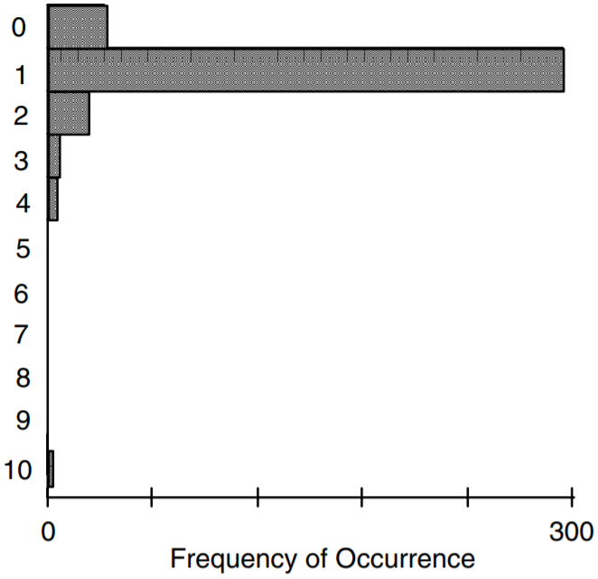
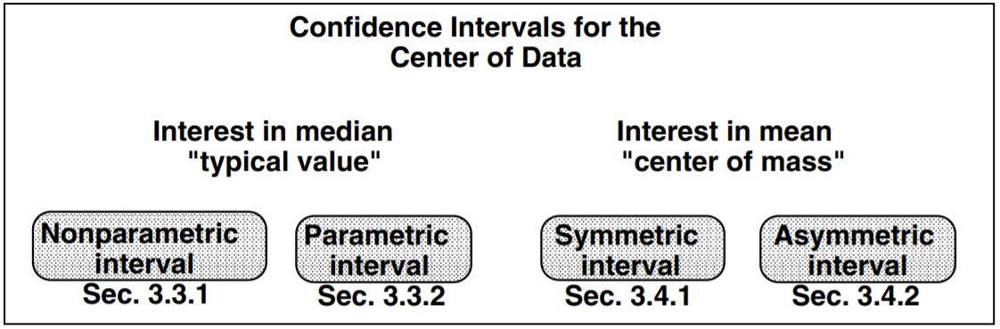
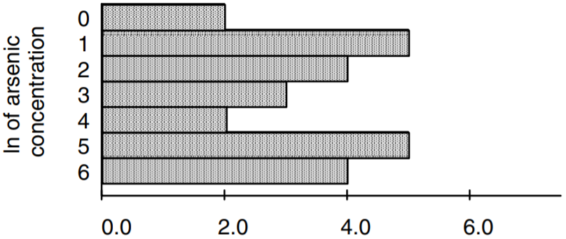

# Describing Uncertainty {#ch3}

The mean nitrate concentration in a shallow aquifer under agricultural land was calculated as $5.1 \; mg/L$. How reliable is this estimate? Is $5.1 \; mg/L$ in violation of a health advisory limit of $5 \; mg/L$? Should it be treated differently than another aquifer having a mean concentration of $4.8 \; mg/L$?

Thirty wells over a 5-county area were found to have a mean specific capacity of 1 gallon per minute per foot, and a standard deviation of 7 gallons per minute per foot. A new well was drilled and developed with an acid treatment. The well produced a specific capacity of 15 gallons per minute per foot. To determine whether this increase might be due to the acid treatment, how likely is a specific capacity of 15 to result from the regional distribution of the other 30 wells?

An estimate of the 100-year flood, the 99th percentile of annual flood peaks, was determined to be 10,000 cubic feet per second (cfs). Assuming that the choice of a particular distribution to model these floods (Log Pearson Type III) is correct, what is the reliability of this estimate?

In chapter \@ref(ch1) several summary statistics were presented which described key attributes of a data set. They were sample estimates (such as $\overline{x}$ and $s^{2}$) of true and unknown population parameters (such as µ and σ^2^). In this chapter, descriptions of the uncertainty or reliability of sample estimates is presented. As an alternative to reporting a single estimate, the utility of reporting a range of values called an "interval estimate" is demonstrated. Both parametric and nonparametric interval estimates are presented. These intervals can also be used to test whether the population parameter is significantly different from some pre-specified value.

## Definition of Interval Estimates

The sample median and sample mean estimate the corresponding center points of a population. Such estimates are called **point estimates**. By themselves, point estimates do not portray the reliability, or lack of reliability (variability), of these estimates. For example, suppose that two data sets X and Y exist, both with a sample mean of 5 and containing the same number of data. The Y data all cluster tightly around 5, while the X data are much more variable. The point estimate of 5 for X is much less reliable than that for Y because of the greater variability in the X data. In other words, more caution is needed when stating that 5 estimates the true population mean of X than when stating this for Y. Reporting only the sample (point) estimate of 5 fails to give any hint of this difference.

As an alternative to point estimates, **interval estimates** are intervals which have a stated probability of containing the true population value. The intervals are wider for data sets having greater variability. Thus in the above example an interval between 4.7 and 5.3 may have a 95% probability of containing the (unknown) true population mean of Y. It would take a much wider interval, say between 2.0 and 8.0, to have the same probability of containing the true mean of X. The difference in the reliability of the two estimates is therefore clearly stated using interval estimates. Interval estimates can provide two pieces of information which point estimates cannot:

1. A statement of the probability or likelihood that the interval contains the true population value (its reliability).
2. A statement of the likelihood that a single data point with specified magnitude comes from the population under study.

Interval estimates for the first purpose are called confidence intervals; intervals for the second purpose are called prediction intervals. Though related, the two types of interval estimates are not identical, and cannot be interchanged.

In sections \@ref(ch3-3) and \@ref(ch3-4), confidence intervals will be developed for both the median and mean. Prediction intervals, both parametric and nonparametric, will be used in sections \@ref(ch3-5) and \@ref(ch3-6) to judge whether one new observation is consistent with existing data. Intervals for percentiles other than the median will be discussed in section \@ref(ch3-7).

```{r, echo = FALSE, fig.align="center"}
knitr::include_graphics("figures/3_A.png")
```

## Interpretation of Interval Estimates

Suppose that the true population mean µ of concentration in an aquifer was 10. Also suppose that the true population variance σ^2^ equals 1. As these values in practice are never known, samples are taken to estimate them by the sample mean \overline{x} and sample variance s^2^. Sufficient funding is available to take 12 water samples (roughly one per month) during a year, and the days on which sampling occurs are randomly chosen. From these 12 samples \overline{x} and s^2^ are computed. Although in reality only one set of 12 samples would be taken each year, using a computer 12 days can be selected multiple times to illustrate the concept of an interval estimate. For each of 10 independent sets of 12 samples, a confidence interval on the mean is computed using equations given later in section \@ref(ch3-4-1). The results are shown in table \@ref(tab:3-1) and figure \@ref(fig:fig-3-1).

Table: (\#tab:3-1) Ten 90% confidence intervals around a true mean of 10. Data follow a normal distribution. The interval with the asterisk does not inclue the true value.

||N|Mean|St. Dev.|90% Confidence Interval|
|:--:|:--:|:--:|:--:|:--:|
|1|12|10.06|1.11|(9.49 to 10.64)|
|2|12|10.60|0.81|*(10.18 to 11.02)|
|3|12|9.95|1.26|(9.29 to 10.60)|
|4|12|10.18|1.26|(9.52 to 10.83)|
|5|12|10.17|1.33|(9.48 to 10.85)|
|6|12|10.22|1.19|(9.60 to 10.84)|
|7|12|9.71|1.51|(8.92 to 10.49)|
|8|12|9.90|1.01|(9.38 to 10.43)|
|9|12|9.95|0.10|(9.43 to 10.46)|
|10|12|9.88|1.37|(9.17 to 10.59)|

```{r fig-3-1, echo = FALSE, fig.cap = "Ten 90% confidence intervals for normally-distributed data with true mean = 10.", fig.align="center"}
knitr::include_graphics("figures/3_1.png")
```

These ten intervals are "90% confidence intervals" on the true population mean. That is, the true mean will be contained in these intervals an average of 90 percent of the time. So for the 10 intervals in the table, nine are expected to include the true value while one is not. This is in fact what happened. Of course when a one-time sampling occurs, the computed interval will either include or not include the true, unknown population mean. The probability that the interval does include the true value is called the **confidence level** of the interval. The probability that this interval will not cover the true value, called the **alpha level** ($\alpha$), is computed as
\begin{equation}
\alpha = 1 - confidence level.
(\#eq:3-1)
\end{equation}
The width of a confidence interval is a function of the shape of the data distribution (its variability and skewness), the sample size, and of the confidence level desired. As the confidence level increases the interval width also increases, because a larger interval is more likely to contain the true value than is a shorter interval. Thus a 95% confidence interval will be wider than a 90% interval for the same data.

Symmetric confidence intervals on the mean are commonly computed assuming the data follow a normal distribution (see section \@ref(ch3-4-1)). If not, the distribution of the mean itself will be approximately normal as long as sample sizes are large (say 50 observations or greater). Confidence intervals assuming normality will then include the true mean ($1 − \alpha$)% of the time. In the above example, the data were generated from a normal distribution, so the small sample size of 12 is not a problem. However when data are skewed and sample sizes below 50 or more, symmetric confidence intervals will not contain the mean ($1 − \alpha$)% of the time. In the example below, symmetric confidence intervals are incorrectly computed for skewed data (figure \@ref(fig:fig-3-2)). The results (figure \@ref(fig:fig-3-3) and table \@ref(tab:3-2)) show that the confidence intervals miss the true value of 1 more frequently than they should. The greater the skewness, the larger the sample size must be before symmetric confidence intervals can be relied on. As an alternative, asymmetric confidence intervals can be computed for the common situation of skewed data. They are also presented in the following sections.

Table: (\#tab:3-2) Ten 90% confidence intervals around a true mean of 1. Data do not follow a normal distribution. Intervals with an asterisk do not inclue the true value.

||N|Mean|St. Dev.|90% Confidence Interval|
|:--:|:--:|:--:|:--:|:--:|
|1|12|0.784|0.320|*(0.618 to 0.950)|
|2|12|0.811|0.299|*(0.656 to 0.966)|
|3|12|1.178|0.700|(0.815 to 1.541)|
|4|12|1.030|0.459|(0.792 to 1.267)|
|5|12|1.079|0.573|(0.782 to 1.376)|
|6|12|0.833|0.363|(0.644 to 1.021)|
|7|12|0.789|0.240|*(0.664 to 0.913)|
|8|12|1.159|0.815|(0.736 to 1.581)|
|9|12|0.822|0.365|*(0.633 to 0.992)|
|10|12|0.837|0.478|(0.589 to 1.085)|

```{r fig-3-2, echo = FALSE, fig.cap = "Histogram of skewed example data. µ = 1.0 σ = 0.75.", fig.align="center"}

```

```{r fig-3-3, echo = FALSE, fig.cap = "Ten 90% confidence intervals for skewed data with true mean = 1.0", fig.align="center"}
knitr::include_graphics("figures/3_3.png")
```

## Confidence Intervals for the Median {#ch3-3}

A confidence interval for the true population median may be computed either without assuming the data follow any specific distribution (section \@ref(ch3-3-1)), or assuming they follow a distribution such as the lognormal (section \@ref(ch3-3-2)).

```{r, echo = FALSE, fig.align="center"}

```

### Nonparametric Interval Estimate For The Median {#ch3-3-1}

A nonparametric interval estimate for the true population median is computed using the binomial distribution. First, the desired significance level $\alpha$ is stated, the acceptable risk of not including the true median. One-half ($\alpha / 2$) of this risk is assigned to each end of the interval (figure \@ref(fig:fig-3-4)). A table of the binomial distribution provides lower and upper critical values x' and x at one-half the desired alpha level ($\alpha / 2$). These critical values are transformed into the ranks R~l~ and R~u~ corresponding to data points C~l~ and C~u~ at the ends of the confidence interval.
```{r fig-3-4, echo = FALSE, fig.cap = "Probability of containing the true median P~.50~ in a 2-sided interval estimate. P~.50~ will be below the lower interval bound (C~l~) α/2% of the time, and above the upper interval bound (C~u~) α/2% of the time.", fig.align="center"}
knitr::include_graphics("figures/3_4.png")
```
For small sample sizes, the binomial table is entered at the $p = 0.5$ (median) column in order to compute a confidence interval on the median. This column is reproduced in Appendix Table B5 -- it is identical to the quantiles for the sign test (see chapter 6). A critical value x' is obtained from Table B5 corresponding to $\alpha / 2$, or as close to $\alpha / 2$ as possible. This critical value is then used to compute the ranks R~u~ and R~l~ corresponding to the data values at the upper and lower confidence limits for the median. These limits are the R~l~th ranked data points going in from each end of the sorted list of n observations. The resulting confidence interval will reflect the shape (skewed or symmetric) of the original data.
\begin{equation}
R_{l} = x^{\prime} \\
(\#eq:3-2)
\end{equation}
\begin{equation}
\begin{aligned}
R_{u} & = n - x^{\prime} = x && \text{for $x^{\prime}$ and from Appendix Table B5}
\end{aligned}
(\#eq:3-3)
\end{equation}
Nonparametric intervals cannot always exactly produce the desired confidence level when sample sizes are small. This is because they are discrete, jumping from one data value to the next at the ends of the intervals. However, confidence levels close to those desired are available for all but the smallest sample sizes.

<u>Example 2</u>

The following 25 arsenic concentrations (in ppb) were reported for ground waters of southeastern New Hampshire (@boudette_high_1985). A histogram of the data is shown in figure \@ref(fig:fig-3-5). Compute the $\alpha = 0.05$ interval estimate of the median concentration.

|1.3|1.5|1.8|2.6|2.8|3.5|4.0|4.8|8|
|:--:|:--:|:--:|:--:|:--:|:--:|:--:|:--:|:--:|
|9.5|12|14|19|23|41|80|100|110|
|120|190|240|250|300|340|580|||

```{r fig-3-5, echo = FALSE, fig.cap = "Histogram of Example 2 arsenic concentrations (in ppb)", fig.align="center"}
knitr::include_graphics("figures/3_5.png")
```

The sample median concentration $\hat{C}_{0.5} = 19$, the 13th observation ranked from smallest to largest. To determine a 95% confidence interval for the true median concentration $C_{0.5}$, the tabled critical value with an entry nearest to $\alpha / 2 = 0.025$ is $x^{\prime} = 7$ from Table B5. The entry value of 0.022 is quite near 0.025, and is the equivalent to the shaded area at one side of figure \@ref(fig:fig-3-4). From equations \@ref(eq:3-2) and \@ref(eq:3-3) the rank R~l~ of the observation corresponding to the lower confidence limit is 8, and R~u~ corresponding to the upper confidence limit is 25 − 7 = 18.

For this confidence interval the alpha level $\alpha = 2 \bullet 0.022 = 0.044$. This is equivalent to a 1−0.044 or 95.6% confidence limit for $C_{0.5}$, and is the interval between the 8th and 18th ranked observations (the 8th point in from either end), or $$C_{l} = 4.8 \leq C_{0.5} \leq 110 = C_{u} \; \; \text{at} \; \alpha = 0.044$$ The asymmetry around $\hat{C}_{0.5} = 19$ reflects the skewness of the data.

An alternative method for computing the same nonparametric interval is used when the sample size $n > 20$. This large-sample approximation utilizes a table of the standard normal distribution available in every basic statistics textbook to approximate the binomial distribution. By using this approximation, only small tables of the binomial distribution up to $n = 20$ need be included in statistics texts. A critical value $z_{\alpha / 2}$ from the normal table determines the upper and lower ranks of observations corresponding to the ends of the confidence interval. Those ranks are
\begin{equation}
R_{l} = \frac{n - z_{\alpha / 2} \sqrt{n}}{2} \\
(\#eq:3-4)
\end{equation}
\begin{equation}
R_{u} = \frac{n + z_{\alpha / 2} \sqrt{n}}{2} + 1
(\#eq:3-5)
\end{equation}
The computed ranks R~u~ and R~l~ are rounded to the nearest integer when necessary.

<u>Example 2,cont.</u>

For the $n = 25$ arsenic concentrations, an approximate 95 percent confidence interval on the true median $C_{0.5}$ is computed using $z_{\alpha / 2} = 1.96$ so that
\begin{equation}
\begin{aligned}
R_{l} &= \frac{25 - 1.96 \bullet \sqrt{25}}{2} &&= 7.6\\ 
R_{u} &= \frac{25 + 1.96 \bullet \sqrt{25}}{2} + 1 &&= 18.4
\end{aligned}
\end{equation}

the "7.6th ranked observation" in from either end. Rounding to the nearest integer, the 8th and 18th ranked observations are used as the ends of the $\alpha = 0.05$ confidence limit on $C_{0.5}$, agreeing with the exact 95.6% confidence limit computed previously. 

### Parametric Interval Estimate For The Median {#ch3-3-2}

As mentioned in chapter \@ref(ch1), the geometric mean of x ($GM_{x}$) is an estimate of the median in original (x) units when the data logarithms $y = \ln{(x)}$ are symmetric. The mean of $y$ and confidence interval on the mean of y become the geometric mean with its (asymmetric) confidence interval after being retransformed back to original units by exponentiation (equations \@ref(eq:3-6) and \@ref(eq:3-7)). These are parametric alternatives to the point and interval estimates of section \@ref(ch3-3-1). Here it is assumed that the data are distributed as a lognormal distribution. The geometric mean and interval would be more efficient (shorter interval) measures of the median and its confidence interval when the data are truly lognormal. The sample median and its interval are more appropriate and more efficient if the logarithms of data still exhibit skewness and/or outliers.
\begin{equation}
\begin{aligned}
& GM_{x} = \exp{\left( \overline{y} \right)} && \text{where $y = \ln{(x)}$ and $\overline{y} =$ sample mean of $y$.}
\end{aligned}
(\#eq:3-6)
\end{equation}
\begin{equation}
\exp{\left( \overline{y} - t_{(\alpha / 2, n - 1)} \sqrt{s^{2}_{y} / n} \right)} \leq GM_{x} \leq \exp{\left( \overline{y} + t_{(\alpha / 2, n - 1)} \sqrt{s^{2}_{y} / n}  \right)} \\
\text{where $s^{2}_{y} =$ sample variance of $y$ in natural log units.}
(\#eq:3-7)
\end{equation}

<u>Example 2,cont.</u>

Natural logs of the arsenic data are as follows:

|0.262|0.405|0.588|0.956|1.030|1.253|1.387|1.569|2.079|
|:--:|:--:|:--:|:--:|:--:|:--:|:--:|:--:|:--:|
|2.251|2.485|2.639|2.944|3.135|3.714|4.382|4.605|4.700|
|4.787|5.247|5.481|5.521|5.704|5.829|6.363|||

The mean of the logs $= 3.17$, with standard deviation of 1.96. From figure \@ref(fig:fig-3-6) the logs of the data appear more symmetric than do the original units of concentration shown previously in figure \@ref(fig:fig-3-5).

```{r fig-3-6, echo = FALSE, fig.cap = "Histogram of natural logs of the arsenic concentrations of Example 2", fig.align="center"}

```

From equations \@ref(eq:3-6) and \@ref(eq:3-7), the geometric mean and its 95% confidence interval are: $$GM_{C} = \exp{(3.17)} = 23.8$$
\begin{equation}
\begin{aligned}
\exp{\left( 3.17 - 2.064 \bullet \sqrt{1.96^{2} / 25} \right)} \leq &GM_{C} \leq \exp{\left( 3.17 + 2.064 \bullet \sqrt{1.96^{2} / 25} \right)} \\
\exp{(2.36)} \leq &GM_{C} \leq \exp{(3.98)}
10.6 \leq &GM_{C} \leq 53.5
\end{aligned}
\end{equation}
The scientist must decide whether it is appropriate to assume a lognormal distribution. If not, the nonparametric interval of section \@ref(ch3-3-1) would be preferred.

## Confidence Intervals For The Mean {#ch3-4}

Interval estimates may also be computed for the true population mean $\mu$. These are appropriate if the center of mass of the data is the statistic of interest (see Chapter \@ref(ch1)). Intervals symmetric around the sample mean $\overline{X}$ are computed most often. For large sample sizes a symmetric interval adequately describes the variation of the mean, regardless of the shape of the data distribution. This is because the distribution of the sample mean will be closely approximated by a normal distribution as sample sizes get larger, even though the data may not be normally distributed[^1]. For smaller sample sizes, however, the mean will not be normally distributed unless the data themselves are normally distributed. As data increase in skewness, more data are required before the distribution of the mean can be adequately approximated by a normal distribution. For highly skewed distributions or data containing outliers, it may take more than 100 observations before the mean will be sufficiently unaffected by the largest values to assume that its distribution will be symmetric.

[^1]: This property is called the Central Limit Theorem (@conover_practical_1980). It holds for data which follow a distribution having finite variance, and so includes most distributions of interest in water resources.

### Symmetric Confidence Interval For The Mean {#ch3-4-1}

Symmetric confidence intervals for the mean are computed using a table of the student's t distribution available in statistics textbooks and software. This table is entered to find critical values for t at one-half the desired alpha level. The width of the confidence interval is a function of these critical values, the standard deviation of the data, and the sample size. When data are skewed or contain outliers, the assumptions behind the t-interval do not hold. The resulting symmetric interval will be so wide that most observations will be included in it. It may also extend below zero on the lower end. Negative endpoints of a confidence interval for data which cannot be negative are clear signals that the assumption of a symmetric confidence interval is not warranted. For such data, assuming a lognormal distribution as described in section \@ref(ch3-4-2) would be more appropriate.

The student's t statistic $t_{(\alpha / 2, n − 1)}$ is used to compute the following symmetric confidence interval:
\begin{equation}
\overline{x} - t_{(\alpha / 2, n - 1)} \bullet \sqrt{s^{2} / n} \leq \mu \leq \overline{x} + t_{(\alpha / 2, n - 1)} \bullet \sqrt{s^{2} / n}
(\#eq:3-8)
\end{equation}
<u>Example 2,cont.</u>

The sample mean arsenic concentration $\overline{C} = 98.4$. This is the point estimate for the true unknown population mean $\mu$. An $\alpha = 0.05$ confidence interval on $\mu$ is
\begin{equation}
\begin{aligned}
98.4 - t_{(0.025, 24)} \bullet \sqrt{144.7^{2} / 25} \leq &\mu \leq 98.4 + t_{(0.025, 24)} \bullet \sqrt{144.7^{2} / 25} \\
98.4 - 2.064 \bullet 28.9 \leq &\mu \leq 98.4 + 2.064 \bullet 28.9 \\
38.7 \leq &\mu \leq 158.1
\end{aligned}
\end{equation}
Thus there is a 95% probability that $\mu$ is contained in the interval between 38.7 and 158.1 ppb, assuming that a symmetric confidence interval is appropriate. Note that this confidence interval is, like $\overline{C}$, sensitive to the highest data values. If the largest value of 580 were changed to 380, the median and its confidence interval would be unaffected. $\overline{C}$ would change to 90.4, with a 95% interval estimate for $\mu$ from 40.7 to 140.1. 

### Asymmetric Confidence Interval For The Mean (For Skewed Data){#ch3-4-2}

Means and confidence intervals may also be computed by assuming that the logarithms $y = \ln{(x)}$ of the data are symmetric. If the data appear more like a lognormal than a normal distribution, this assumption will give a more reliable (lower variance) estimate of the mean than will computation of the usual sample mean without log transformation.

To estimate the population mean $\mu_{x}$ in original units, assume the data are lognormal. One-half the variance of the logarithms is added to $\overline{y}$ (the mean of the logs) prior to exponentiation (@aitchison_lognormal_1981). As the sample variance $s^{2}_{y}$ is only an estimate of the true variance of the logarithms, the sample estimate of the mean is biased (@bradu_estimation_1970). However, for small $s^{2}_{y}$ and large sample sizes the bias is negligible. See Chapter 9 for more information on the bias of this estimator.
\begin{equation}
\begin{aligned}
& \hat{\mu}_{x} = \exp{\left( \overline{y} + 0.5 \bullet s^{2}_{y} \right)} &&\text{where $y = \ln{(x)}$,} \\
\end{aligned}
(\#eq:3-9)
\end{equation}
$$\overline{y} = \text{sample mean and $s^{2}_{y} =$ sample variance of $y$ in natural log units.}$$
The confidence interval around $\hat{\mu}_{x}$ is <u>not</u> the interval estimate computed for the geometric mean in equation \@ref(eq:3-7). It cannot be computed simply by exponentiating the interval around $\overline{y}$. An exact confidence interval in original units for the mean of lognormal data can be computed, though the equation is beyond the scope of this book. See @land_confidence_1971 and @land_evaluation_1972 for details. 

<u>Example 2,cont.</u>

To estimate the mean concentration assuming a lognormal distribution, $$\hat{\mu}_{C} = \exp{\left( 3.17 + 0.5 \bullet 1.96^{2} \right)} = 162.8 .$$ This estimate does not even fall within the confidence interval computed earlier for the geometric mean ($10.6 \leq GM_{C} \leq 53.5$). Thus here is a case where it is obvious that the CI on the geometric mean is not an interval estimate of the mean. It is an interval estimate of the median, assuming the data follow a lognormal distribution.  

## Nonparametric Prediction Intervals {#ch3-5}

The question is often asked whether one new observation is likely to have come from the same distribution as previously-collected data, or alternatively from a different distribution. This can be evaluated by determining whether the new observation is outside the **prediction interval** computed from existing data. Prediction intervals contain $100 \bullet (1 − \alpha)$ percent of the data distribution, while $100 \bullet \alpha$ percent are outside of the interval. If a new observation comes from the same distribution as previously-measured data, there is a $100 \bullet \alpha$ percent chance that it will lie outside of the prediction interval. Therefore being outside the interval does not "prove" the new observation is different, just that it is likely to be so. How likely this is depends on the choice of $\alpha$ made by the scientist.

Prediction intervals are computed for a different purpose than confidence intervals -- they deal with individual data values as opposed to a summary statistic such as the mean. A prediction interval is wider than the corresponding confidence interval, because an individual observation is more variable than is a summary statistic computed from several observations. Unlike a confidence interval, a prediction interval takes into account the variability of single data points around the median or mean, in addition to the error in estimating the center of the distribution. When the mean $\pm$ 2 standard deviations are mistakenly used to estimate the width of a prediction interval, new data are asserted as being from a different population more frequently than they should.

In this section nonparametric prediction intervals are presented -- intervals not requiring the data to follow any particular distributional shape. Prediction intervals can also be developed assuming the data follow a particular distribution, such as the normal. These are discussed in section \@ref(ch3-6). Both two-sided and one-sided prediction intervals are described.

```{r, echo = FALSE, fig.align="center"}
knitr::include_graphics("figures/3_C.png")
```

It may also be of interest to know whether the median or mean of a new set of data differs from that for an existing group. To test for differences in medians, use the rank-sum test of Chapter 5. To test for differences in means, the two-sample t-test of Chapter 5 should be performed.

### Two-Sided Nonparametric Prediction Interval

The nonparametric prediction interval of confidence level α is simply the interval between the $\alpha / 2$ and $1 − (\alpha / 2)$ percentiles of the distribution (figure \@ref(fig:fig-3-7)). This interval contains $100 \bullet (1 − \alpha)$ percent of the data, while $100 \bullet \alpha$ percent lies outside of the interval. Therefore if the new additional data point comes from the same distribution as the previously measured data, there is a $100 \bullet \alpha$ percent chance that it will lie outside of the prediction interval and be incorrectly labeled as "changed". The interval will reflect the shape of the data it is developed from, and no assumptions about the form of that shape need be made.
\begin{equation}
PI_{np} = X_{\alpha / 2 \bullet (n + 1)} \;\; \text{to} \;\; X_{\lbrack 1 - (\alpha / 2) \rbrack \bullet (n+1)}
(\#eq:3-10)
\end{equation}

```{r fig-3-7, echo = FALSE, fig.cap = "Two-sided prediction interval. A new observation will be below X~l~ α/2% and above $X_{u}$ α/2% of the time, when the data distribution is unchanged.", fig.align="center"}
knitr::include_graphics("figures/3_7.png")
```

<u>Example 2,cont.</u>

Compute a 90% ($\alpha = 0.10$) prediction interval for the arsenic data without assuming the data follow any particular distribution.

The 5th and 95th percentiles of the arsenic data are the observations with ranks of ($0.05 \bullet 26$) and ($0.95 \bullet 26$), or 1.3 and 24.7. By linearly interpolating between the 1st and 2nd, and 24th and 25th observations, the $\alpha = 0.10$ prediction interval is
\begin{equation}
\begin{aligned}
X_{1} + 0.3 \bullet \left( X_{2} - X_{1} \right) & \text{ to } X_{24} + 0.7 \bullet \left( X_{25} - X_{24} \right) \\
1.3 + 0.3 \bullet 0.2 & \text{ to } 340 + 0.7 \bullet 240 \\
1.4 & \text{ to } 508 \text{ ppb}
\end{aligned}
\end{equation}
A new observation less than 1.4 or greater than 508 can be considered as coming from a different distribution at a 10% risk level ($\alpha = 0.10$). 

### One-Sided Nonparametric Prediction Interval

One-sided prediction intervals are appropriate if the interest is in whether a new observation is larger than existing data, or smaller than existing data, but not both. The decision to use a onesided interval must be based entirely on the question of interest. It should not be determined after looking at the data and deciding that the new observation is likely to be only larger, or only smaller, than existing information. One-sided intervals use $\alpha$ rather than $\alpha / 2$ as the error risk, placing all the risk on one side of the interval (figure \@ref(fig:fig-3-8)).
\begin{equation}
\begin{aligned}
\text{one-sided PI np: $\;\;\;\;\;$} & \text{new $x$} < X_{\alpha \bullet (n + 1)} \text{ , or} \\
& \text{new $x$} < X_{\lbrack 1 - (\alpha / 2) \rbrack \bullet (n+1)} \\
& \text{(but not either, or)}
\end{aligned}
(\#eq:3-11)
\end{equation}

```{r fig-3-8, echo = FALSE, fig.cap = "Confidence level and alpha level for a 1-sided prediction interval Probability of obtaining a new observation greater than $X_{u}$ when the distribution is unchanged is α.", fig.align="center"}
knitr::include_graphics("figures/3_8.png")
```

<u>Example 2,cont.</u>

An arsenic concentration of 350 ppb is found in a New Hampshire well. Does this indicate a change to larger values as compared to the distribution of concentrations for the example 2 data? Use $\alpha = 0.10$.

As only large concentrations are of interest, the new data point will be considered larger if it exceeds the $\alpha = 0.10$ one-sided prediction interval, or upper 90th percentile of the existing data. $X_{0.90 \bullet 26} = X_{23.4}$. By linear interpolation this corresponds to a concentration of $$X_{23} + 0.4 \bullet (X_{24} - X_{23}) = 300 + 0.4 \bullet (40) = 316$$ In other words, a concentration of 316 or greater will occur approximately 10 percent of the time if the distribution of data has not increased. Therefore a concentration of 350 ppb is considered larger than the existing data at an α level of 0.10.

## Parametric Prediction Intervals {#ch3-6}

Parametric prediction intervals are also used to determine whether a new observation is likely to come from a different distribution than previously-collected data. However, an assumption is now made about the shape of that distribution. This assumption provides more information with which to construct the interval, as long as the assumption is valid. If the data do not approximately follow the assumed distribution, the prediction interval may be quite inaccurate.

### Symmetric Prediction Interval

The most common assumption is that the data follow a normal distribution. Prediction intervals are then constructed to be symmetric around the sample mean, and wider than confidence intervals on the mean. The equation for this interval differs from that for a confidence interval around the mean by adding a term $\sqrt{s^{2}} = s$, the standard deviation of individual observations around their mean:
\begin{equation}
PI = \overline{x} - t_{(\alpha / 2, n - 1)} \bullet \sqrt{s^{2} + \left( s^{2} / n \right)} \;\; \text{to} \;\; \overline{x} + t_{(\alpha / 2, n - 1)} \bullet \sqrt{s^{2} + \left( s^{2} / n \right)}
(\#eq:3-12)
\end{equation}
One-sided intervals are computed as before, using $\alpha$ rather than $\alpha / 2$ and comparing new data to only one end of the prediction interval.

<u>Example 2,cont.</u>

Assuming symmetry, is a concentration of 350 ppb different (not just larger) than what would be expected from the previous distribution of arsenic concentrations? Use $\alpha = 0.10$.

The parametric two-sided $\alpha = 0.10$ prediction interval is
\begin{equation}
\begin{aligned}
98.4 - t_{(0.05, 24)} \bullet \sqrt{144.7^{2} + \left( 144.7^{2} / 25 \right)} &\text{$\;$to$\;$} 98.4 + t_{(0.05, 24)} \bullet \sqrt{144.7^{2} + \left( 144.7^{2} / 25 \right)} \\
98.4 - 1.711 \bullet 147.6 &\text{$\;$to$\;$} 98.4 + 1.711 \bullet 147.6 \\
-154.1 &\text{$\;$to$\;$} 350.9
\end{aligned}
\end{equation}
350 ppb is at the upper limit of 350.9, so the concentration is not declared different at $\alpha = 0.10$. The negative concentration reported as the lower prediction bound is a clear indication that the underlying data are not symmetric, as concentrations are non-negative. To avoid an endpoint as unrealistic as this negative concentration, an asymmetric prediction interval should be used instead.

### Asymmetric Prediction Intervals

Asymmetric intervals can be computed either using the nonparametric intervals of section \@ref(ch3-5), or by assuming symmetry of the logarithms and computing a parametric interval on the logs of the data. Either asymmetric interval is more valid than a symmetric interval when the underlying data are not symmetric, as is the case for the arsenic data of example 2. As stated in Chapter \@ref(ch1), most water resources data and indeed most environmental data show positive skewness. Thus they should be modelled using asymmetric intervals. Symmetric <u>prediction</u> intervals should be used only when the data are known to come from a normal distribution. This is because prediction intervals deal with the behavior of individual observations. Therefore the Central Limit Theorem (see first footnote in this chapter) does not apply. Data must be assumed nonnormal unless shown otherwise. It is difficult to disprove normality using hypothesis tests (Chapter 4) due to the small sample sizes common to environmental data sets. It is also difficult to see non-normality with graphs unless the departures are strong (Chapter 10). It is unfortunate that though most water resources data sets are asymmetric and small, symmetric intervals are commonly used.

An asymmetric (but parametric) prediction interval can be computed using logarithms. This interval is parametric because percentiles are computed assuming that the data follow a lognormal distribution. Thus from equation \@ref(eq:3-12):
\begin{equation}
PI = \exp{\left( \overline{y} - t_{(\alpha / 2, n - 1)} \bullet \sqrt{s^{2}_{y} + \left( s^{2}_{y} / n \right)}\right)} \text{$\;$to$\;$} \exp{\left( \overline{y} + t_{(\alpha / 2, n - 1)} \bullet \sqrt{s^{2}_{y} + \left( s^{2}_{y} / n \right)}\right)} \\
\text{where $y = \ln{(X)}$, $\overline{y}$ is the mean and $s^{2}_{y}$ the variance of the logarithms.}
(\#eq:3-13)
\end{equation}
<u>Example 2,cont.</u>

An asymmetric prediction interval is computed using the logs of the arsenic data. A 90% prediction interval becomes
\begin{equation}
\begin{aligned}
\ln{(PI)} = 3.17 - t_{(0.05, 24)} \bullet \sqrt{1.96^{2} + 1.96^{2} / 25} &\text{$\;\;$to$\;\;$} 3.17 + t_{(0.05, 24)} \bullet \sqrt{1.96^{2} + 1.96^{2} / 25} \\
3.17 - 1.71 \bullet 2.11 &\text{$\;\;$to$\;\;$} 3.17 + 1.71 \bullet 2.11 \\
0.44 &\text{$\;\;$to$\;\;$} 6.78 \\
\text{which when exponentiated into original units becomes} \\
1.55 &\text{$\;\;$to$\;\;$} 880.1
\end{aligned}
\end{equation}
As percentiles can be transformed directly from one measurement scale to another, the prediction interval in log units can be directly exponentiated to give the prediction interval in original units. This parametric prediction interval differs from the one based on sample percentiles in that a lognormal distribution is assumed. The parametric interval would be preferred if the assumption of a lognormal distribution is believed. The sample percentile interval would be preferred when a robust interval is desired, such as when a lognormal model is not believed, or when the scientist does not wish to assume any model for the data distribution.

## Confidence Intervals For Percentiles (Tolerance Intervals) {#ch3-7}

Quantiles or percentiles have had the traditional use in water resources of describing the frequency of flood events. Thus the 100-year flood is the 99th percentile (0.99 quantile) of the distribution of annual flood peaks. It is the magnitude of flood which is expected to be exceeded only once in 100 years. The 20-year flood is of a magnitude which is expected to be exceeded only once in 20 years (5 times in 100 years), or is the 95th percentile of annual peaks. Similarly, the 2-year flood is the median or 50th percentile of annual peaks. Flood percentiles are determined assuming that peak flows follow a specified distribution. The log Pearson Type III is often used in the United States. Historically, European countries have used the Gumbel (extreme value) distribution, though the GEV distribution is now more common (@ponce_engineering_1989).

The most commonly-reported statistic for analyses of low flows is also based on percentiles, the "7-day 10-year low flow" or $7Q10$. The $7Q10$ is the 10th percentile of the distribution of annual values of $Y$, where $Y$ is the lowest average of mean daily flows over any consecutive 7-day period for that year. $Y$ values are commonly fit to Log Pearson III or Gumbel distributions in order to compute the percentile. Often a series of duration periods is used to better define flow characteristics, i.e. the $30Q10$, $60Q10$, and others (@ponce_engineering_1989).

Recently, percentiles: water quality of water-quality records appear to be becoming more important in a regulatory framework. @crabtree_percentile_1987 among others have reported an increasing reliance on percentiles for developing and monitoring compliance with water quality standards[^2]. In these scenarios, the median, 95th, or some other percentile should not exceed (or be below) a standard. As of now, no distribution is usually assumed for water-quality concentrations, so that sample percentiles are commonly computed and compared to the standard. In regulatory frameworks, exceedance of a tolerance interval on concentration is sometimes used as evidence of contamination. A tolerance interval is nothing other than a confidence interval on the percentile. The percentile used is the ‘coverage coefficient’ of the tolerance interval.

[^2]: Data presented by @crabtree_percentile_1987 shows that for each of their cases, percentiles of flow and water-quality constituents are best estimated by (nonparametric) sample percentiles rather than by assuming some distribution. However they come to a different conclusion for two constituents (see their Table 2) by assuming that a parametric process is better unless proven otherwise. In those two cases either could be used.

In light of the ever increasing use of percentiles in water resources applications, understanding of their variability is quite important. In section \@ref(ch3-7-1), interval estimates will be computed without assuming a distribution for the data. Estimates of peak flow percentiles computed in this way will therefore differ somewhat in comparison to those computed using a Log Pearson III or Gumbel assumption. Computation of percentile interval estimates when assuming a specific distributional shape is discussed in section \@ref(ch3-7-3). In sections \@ref(ch3-7-2) and \@ref(ch3-7-4), use of interval estimates for testing hypotheses is illustrated.

```{r, echo = FALSE, fig.align="center"}
knitr::include_graphics("figures/3_D.png")
```

### Nonparametric Confidence Intervals For Percentiles {#ch3-7-1}

Confidence intervals can be developed for any percentile analogous to those developed in section \@ref(ch3-3) for the median. First the desired confidence level is stated. For small sample sizes a table of the binomial distribution is entered to find upper and lower limits corresponding to critical values at one-half the desired alpha level ($\alpha / 2$). These critical values are transformed into the ranks corresponding to data points at the ends of the confidence interval.

The binomial table is entered at the column for $p$, the percentile (actually the quantile) for which a confidence interval is desired. So for a confidence interval on the 75th percentile, the $p = 0.75$ column is used. Go down the column until the appropriate sample size $n$ is found. The tabled probability $p^{*}$ should be found which is as close to $\alpha / 2$ as possible. The lower critical value $x_{l}$ is the integer corresponding to this probability $p^{*}$. A second critical value $x_{u}$ is similarly obtained by continuing down the column to find a tabled probability $p^{\prime} \cong (1 − \alpha / 2)$. These critical values $x_{l}$ and $x_{u}$ are used to compute the ranks $R_{l}$ and $R_{u}$ corresponding to the data values at the upper and lower ends of the confidence limit (equations \@ref(eq:3-14) and \@ref(eq:3-15)). The resulting confidence level of the interval will equal ($p^{\prime} − p^{*}$).
\begin{equation}
R_{l} = x_{l} +1
(\#eq:3-14)
\end{equation}
\begin{equation}
R_{u} = x_{u}
(\#eq:3-15)
\end{equation}
<u>Example 2,cont.</u>

For the arsenic concentrations of @boudette_high_1985, determine a 95% confidence interval on $C_{0.20}$, the 20th percentile of concentration ($p = 0.2$).

The sample 20th percentile $\hat{C}_{0.20} = 2.9$ ppb, the $0.20 \bullet (26) = 5.2$ smallest observation, or two-tenths of the distance between the 5th and 6th smallest observations. To determine a 95% confidence interval for the true 20th percentile $C_{0.20}$, the binomial table from a statistics text such as @bhattacharyya_statistical_1977 is entered at the $p = 0.20$ column. The integer $x_{l}$ having an entry nearest to $\alpha / 2 = 0.025$ is found to be $1$ ($p^{*} = 0.027$, the error probability for the
lower side of the distribution). From equation \@ref(eq:3-14) the rank $R_{l}  = 2$. Going further down the column, $p^{\prime} = 0.983$ for an $x_{u} = R_{u} = 9$. Therefore a 95.6% confidence interval ($0.983 − 0.027 = 0.956$) for the 20th percentile is the range between the 2nd and 9th observations, or $$1.5 \leq C_{0.20} \leq 8 \;\; \text{at} \; \alpha = 0.044$$ The asymmetry around $\hat{C}_{0.20} = 2.9$ reflects the skewness of the data.

When $n > 20$, a large-sample (normal) approximation to the binomial distribution can be used to obtain interval estimates for percentiles. From a table of quantiles of the standard normal distribution, $z_{\alpha / 2}$ and $z_{\lbrack 1 - \alpha / 2 \rbrack}$ (the $\alpha / 2$th and $\lbrack 1 − \alpha / 2 \rbrack$th normal quantiles) determine the upper and lower ranks of observations corresponding to the ends of the confidence interval. Those ranks are
\begin{equation}
R_{l} = np + z_{\alpha / 2} \bullet \sqrt{np(1 - p)} + 0.5
(\#eq:3-16)
\end{equation}
\begin{equation}
R_{l} = np + z_{\lbrack 1 - \alpha / 2 \rbrack} \bullet \sqrt{np(1 - p)} + 0.5
(\#eq:3-17)
\end{equation}
The 0.5 terms added to each reflect a continuity correction (see Chapter 4) of 0.5 for the lower bound and −0.5 for the upper bound, plus the +1 term for the upper bound analogous to equation \@ref(eq:3-5). The computed ranks $R_{u}$ and $R_{l}$ are rounded to the nearest integer.

<u>Example 2,cont.</u>

Using the large sample approximation of equations \@ref(eq:3-16) and \@ref(eq:3-17), what is a 95% confidence interval estimate for the true 0.2 quantile?

Using $z_{\alpha / 2} = - 1.96$ the lower and upper ranks of the interval are
\begin{equation}
\begin{aligned}
R_{l} &= 25 \bullet 0.2 + (-1.96) \bullet \sqrt{25 \bullet 0.2(1 - 0.2)} + 0.5 &&= 5 - 1.96 \bullet 2 + 0.5 &&&= 1.6 \\
R_{u} &= 25 \bullet 0.2 + 1.96 \bullet \sqrt{25 \bullet 0.2(1 - 0.2)} + 0.5 &&= 5 + 1.96 \bullet 2 + 0.5 &&&= 9.4
\end{aligned}
\end{equation}
After rounding, the 2nd and 9th ranked observations are found to be an approximate $\alpha = 0.05$ confidence limit on $C_{0.2}$, agreeing with the exact confidence limit computed previously.

### Nonparametric Tests For Percentiles {#ch3-7-2}

Often it is of interest to test whether a percentile is different from, or larger or smaller than, some specified value. For example, a water quality standard $X_{0}$ could be set such that the median of daily concentrations should not exceed $X_{0}$ ppb. Or the 10-year flood (90th percentile of annual peak flows) may be tested to determine if it differs from a regional design value $X_{0}$. Detailed discussions of hypothesis tests do not begin until the next chapter. However, a simple way to view such a test is discussed below. It is directly related to confidence intervals. 

#### N-P test for whether a percentile differs from $X_{0}$ (a two-sided test)

To test whether the percentile of a data set is significantly different (either larger or smaller) from a pre-specified value X0, compute an interval estimate for the percentile as described in section \@ref(ch3-7-1). If $X_{0}$ falls within this interval, the percentile is not significantly different from $X_{0}$ at a significance level = $\alpha$ (figure \@ref(fig:fig-3-9)). If $X_{0}$ is not within the interval, the percentile significantly differs from $X_{0}$ at the significance level of $\alpha$.

```{r, echo = FALSE}
fig_cap_3_9 <- "Interval estimate of $p$th percentile $X_{p}$ as a test for whether $X_{p} = X_{0}$.\n
A. $X_{0}$ inside interval estimate: $X_{p}$ not significantly different from $X_{0}$.\n
B. $X_{0}$ outside interval estimate: $X_{p}$ significantly different from $X_{0}$."

fig_cap_3_10 <- "One-sided interval estimate as a test for whether $X_{p} > X_{0}$.\n
A. $X_{0}$ inside interval estimate: $X_{p}$ not significantly greater than $X_{0}$.\n
B. $X_{0}$ below interval estimate: $X_{p}$ significantly greater than $X_{0}$."

fig_cap_3_11 <- "One-sided interval estimate as a test for whether $X_{p} < X_{0}$.\n
A. $X_{0}$ inside interval estimate: $X_{p}$ not significantly less than $X_{0}$.\n
B. $X_{0}$ above interval estimate: $X_{p}$ significantly less than $X_{0}$."
```

```{r fig-3-9, echo = FALSE, fig.cap = fig_cap_3_9, fig.align="center"}
knitr::include_graphics("figures/3_9.png")
```

<u>Example 3</u>

In Appendix C1 are annual peak discharges for the Saddle River at Lodi, NJ from 1925 to 1967. Of interest is the 5-year flood, the flood which is likely to be equalled or exceeded once every 5 years (20 times in 100 years), and so is the 80th percentile of annual peaks. Though flood percentiles are usually computed assuming a Log Pearson Type III or Gumbel distribution (@ponce_engineering_1989), here they will be estimated by the sample 80th percentile. Is there evidence that the 20-year flood between 1925-1967 differs from a design value of 1300 cfs at an $\alpha = 0.05$?

The 80th percentile is estimated from the 43 values between 1925 and 1967 as the $0.8 \bullet (44) = 35.2$ value when ranked from smallest to largest. Therefore $\hat{Q}_{0.8} = 1672$ cfs, 0.2 of the distance between the 35th and 36th ranked peak flow. A two-sided confidence interval on this percentile is (following equations \@ref(eq:3-16) and \@ref(eq:3-17)):
\begin{equation}
\begin{aligned}
&R_{l} = np + z_{\alpha / 2} \bullet \sqrt{np(1 - p)} + 0.5 &&R_{u} = np + z_{\lbrack 1 - \alpha / 2 \rbrack} \bullet \sqrt{np(1 - p)} + 0.5 \\
&R_{l} = 43(0.8) - 1.96 \bullet \sqrt{43 \bullet 0.8 (0.2)} + 0.5 &&R_{u} = 43(0.8) + 1.96 \bullet \sqrt{43 \bullet 0.8 (0.2)} + 0.5 \\
&R_{l} = 29.8 &&R_{u} = 40.0\\
\end{aligned}
\end{equation}
The $\alpha = 0.05$ confidence interval lies between the 30th and 40th ranked peak flows, or $$1370 < Q_{0.8} < 1860$$ which does not include the design value $X_{0} = 1300$ cfs. Therefore the 20-year flood does differ from the design value at a significance level of 0.05. 

#### N-P test for whether a percentile exceeds $X_{0}$ (a one-sided test)

To test whether a percentile $X_{p}$ significantly exceeds a specified value or standard $X_{0}$, compute the one-sided confidence interval of section \@ref(ch3-7-1). Remember that the entire error level $\alpha$ is placed on the side below the percentile point estimate $\hat{X}_{p}$ (figure \@ref(fig:fig-3-10)). $X_{p}$ will be declared significantly higher than $X_{0}$ if its one-sided confidence interval lies entirely above $X_{0}$. 

```{r fig-3-10, echo = FALSE, fig.cap = fig_cap_3_10, fig.align="center"}
knitr::include_graphics("figures/3_10.png")
```

<u>Example 2,cont.</u>

Suppose that a water-quality standard stated that the 90th percentile of arsenic concentrations in drinking water shall not exceed 300 ppb. Has this standard been violated at the $\alpha = 0.05$ confidence level by the New Hampshire data of example 2?

The 90th percentile of the example 2 arsenic concentrations is
\begin{equation}
\begin{aligned}
\hat{C}_{0.90} &= (25 + 1) \bullet 0.9\text{th} &&= 23.4\text{th data point} &&&= 300 + 0.4(340 − 300) \\
&= 316 \text{ppb.}
\end{aligned}
\end{equation}
Following equation \@ref(eq:3-16) but using $\alpha$ instead of $\alpha / 2$, the rank of the observation corresponding to a one-sided 95% lower confidence bound on $C_{0.90}$ is
\begin{equation}
\begin{aligned}
R_{l} &= np + z_{\alpha} \bullet \sqrt{np(1 - p)} + 0.5 &&= 25 \bullet 0.9 + z_{0.05} \bullet \sqrt{25 \bullet 0.9(0.1)} + 0.5 \\
&= 22.5 + (- 1.64) \bullet \sqrt{2.25} + 0.5 \\
&= 20.5
\end{aligned}
\end{equation}
and thus the lower confidence limit is the 20.5th lowest observation, or 215 ppb, halfway between the 20th and 21st observations. This confidence limit is less than $X_{0} = 300$, and therefore the standard has not been exceeded at the 95% confidence level.  

#### N-P test for whether a percentile is less than $X_{0}$ (a one-sided test) 

To test whether a percentile $X_{p}$ is significantly less than $X_{0}$, compute the one-sided confidence interval placing all error $\alpha$ on the side above $\hat{X}_{p}$ (figure \@ref(fig:fig-3-11)). $X_{p}$ will be declared as significantly less than $X_{0}$ if its one-sided confidence interval is entirely below $X_{0}$.

```{r fig-3-11, echo = FALSE, fig.cap = fig_cap_3_11, fig.align="center"}
knitr::include_graphics("figures/3_11.png")
```

<u>Example 4</u>

The following 43 values are annual 7-day minimum flows for 1941−1983 on the Little Mahoning Creek at McCormick, PA. Though percentiles of low flows are often computed using a Log Pearson Type III distribution, here the sample estimate of the percentile will be computed. Is the $7Q10$ low-flow (the 10th percentile of these data) significantly less than 3 cfs at $\alpha = 0.05$?

|0.69|0.80|1.30|1.40|1.50|1.50|1.80|1.80|2.10|2.50|2.80|
|:--:|:--:|:--:|:--:|:--:|:--:|:--:|:--:|:--:|:--:|:--:|
|2.90|3.00|3.10|3.30|3.70|3.80|3.80|4.00|4.10|4.20|4.30|
|4.40|4.80|4.90|5.70|5.80|5.90|6.00|6.10|7.90|8.00|8.00|
|9.70|9.80|10.00|11.00|11.00|12.00|13.00|16.00|20.00|23.00||

The sample 10th percentile of the data is 4.4th observation, or $\hat{7Q}_{0.10} = 1.4$ cfs. The upper 95% confidence interval for $Q_{0.10}$ is located (following equation \@ref(eq:3-17) but using $\alpha$) at rank $R_{u}$:
\begin{equation}
\begin{aligned}
R_{l} &= np + z_{\lbrack 1 - \alpha \rbrack} \bullet \sqrt{np(1 - p)} + 0.5\\
&= 43 \bullet 0.1 + 1.64 \bullet \sqrt{43 \bullet 0.1(0.9)} + 0.5 \\
&= 8.0
\end{aligned}
\end{equation}
So the upper 95% confidence limit equals 1.8 cfs. This is below the $X_{0}$ of 3 cfs, and therefore the $7Q10$ is significantly less than 3 cfs at an $\alpha = 0.05$.

### Parametric Confidence Intervals For Percentiles {#ch3-7-3}

Confidence intervals for percentiles can also be computed by assuming that data follow a particular distribution. Distributional assumptions are employed because there are often insufficient data to compute percentiles with the required precision. Adding information contained in the distribution will increase the precision of the estimate <u>as long as the distributional assumption is a reasonable one</u>. However when the distribution which is assumed does not fit the data well, the resulting estimates are less accurate, and more misleading, than if nothing were assumed. Unfortunately, the situation in which an assumption is most needed, that of small sample sizes, is the same situation where it is difficult to determine whether the data follow the assumed distribution.

There is little theoretical reason why data should follow one distribution over another. As stated in Chapter \@ref(ch1), most environmental data have a lower bound at zero and may have quite large observations differing from the bulk of the data. Distributions fit to such data must posses skewness, such as the lognormal. But few "first principles" can be drawn on to favor one skewed distribution over another. Empirical studies have found that for specific locations and variables certain distributions seem to fit well, and those have become traditionally used. Thus the lognormal, Pearson Type III and Gumbel distributions are commonly assumed in water resources applications.

Computation of point and interval estimates for percentiles assuming a lognormal distribution are straightforward. First the sample mean $\overline{y}$ and sample standard deviation $s_{y}$ of the logarithms are computed. The point estimate is then 
\begin{equation}
\hat{X}_{p} = \exp{\left( \overline{y} + z_{p} \bullet s_{y} \right)}
(\#eq:3-18)
\end{equation}
where $z_{p}$ is the pth quantile of the standard normal distribution and $y = \ln{(x)}$.

The interval estimate for the median was previously given by equation \@ref(eq:3-7) assuming that data are lognormal. For other percentiles, confidence intervals are computed using the non-central t-distribution (@stedinger_confidence_1983). Tables of that distribution are found in Stedinger's article, with more complete entries online in commercial computer mathematical libraries. The confidence interval on $X_{p}$ is:
\begin{equation}
CI \left({X}_{p} \right) = \exp{\left( \overline{y} + \zeta_{\alpha / 2} \bullet s_{y}, \overline{y} + \zeta_{\lbrack 1 - \alpha / 2 \rbrack} \bullet s_{y}\right)}
(\#eq:3-19)
\end{equation}
where $\zeta_{\alpha / 2}$ is the $\alpha / 2$ quantile of the non-central t distribution for the desired percentile with sample size of $n$.

<u>Example 2,cont.</u>

Compute a 90% interval estimate for the 90th percentile of the New Hampshire arsenic concentrations, assuming the data are lognormal.

The 90th percentile assuming concentrations are lognormal is as given in equation \@ref(eq:3-18):
\begin{equation}
\begin{aligned}
\hat{C}_{0.90} &= \exp{\left( \overline{y} + z_{0.90} \bullet s_{y} \right)} &&= \exp{(3.17 + 1.28 \bullet 1.96)} \\
&= 292.6 \; \text{ppb.}
\end{aligned}
\end{equation}
(which is lower than the sample estimate of 316 ppb obtained without assuming the data are lognormal).

The corresponding 90% interval estimate from equation \@ref(eq:3-19) is:
\begin{equation}
\begin{aligned}
\exp{\left( \overline{y} + \zeta_{0.05} \bullet s_{y} \right)} < & C_{0.90} && < \exp{\left( \overline{y} + \zeta_{0.95} \bullet s_{y} \right)} \\
\exp{\left( 3.17 + 0.898 \bullet 1.96 \right)} < & C_{0.90} && < \exp{\left( 3.17 + 1.838 \bullet 1.96 \right)} \\
138.4 < & C_{0.90} && < 873.5
\end{aligned}
\end{equation}
This estimate would be preferred over the nonparametric estimate if it was believed that the data were truly lognormal. Otherwise a nonparametric interval would be preferred. When the data are truly lognormal, the two intervals should be quite similar.

Interval estimates for percentiles of the Log Pearson III distribution are computed in a similar fashion. See @stedinger_confidence_1983 for details on the procedure. 

### Parametric Tests For Percentiles {#ch3-7-4}

Analogous to section \@ref(ch3-7-2), parametric interval estimates may be used to conduct a parametric test for whether a percentile is different from (2-sided test), exceeds (1-sided test), or is less than (1-sided test) some specified value $X_{0}$. With the 2-sided test for difference, if $X_{0}$ falls within the interval having $\alpha / 2$ on either side, the percentile is not proven to be significantly different from $X_{0}$. If $X_{0}$ falls outside this interval, the evidence supports $X_{p} \neq X_{0}$ with an error level of $\alpha$. For the one-sided tests, the error level $\alpha$ is placed entirely on one side before conducting the test, and $X_{0}$ is again compared to the end of the interval to determine difference or similarity.

<u>Example 2,cont.</u>

Test whether the 90th percentile of arsenic concentrations in drinking water exceeds 300 ppb at the $\alpha = 0.05$ significance level, assuming the data are lognormal.

The one-sided 95% lower confidence limit for the 90th percentile was computed above as 138.4 ppb. (note the nonparametric bound was 215 ppb). This limit is less than the $p_{0}$ value of 300, and therefore the standard has not been exceeded at the 95% confidence level. 

## Other Uses For Confidence Intervals

Confidence intervals are used for purposes other than as interval estimates. Three common uses are to detect outliers, for quality control charts, and for determining sample sizes necessary to achieve a stated level of precision. Often overlooked are the implications of data non-normality for the three applications. These are discussed in the following three sections.

### Implications of Non-Normality For Detection of Outliers

An outlier is an observation which appears to differ in its characteristics from the bulk of the data set to which it is assigned. It is a subjective concept -- different people may define specific points as either outliers, or not. Outliers are sometimes deleted from a data set in order to use procedures based on the normal distribution. One of the central themes of this book is that this is a dangerous and unwarranted practice. It is dangerous because these data may well be totally valid. There is no law stating that observed data must follow some specific distribution, such as the normal. Outlying observations are often the most important data collected, providing insight into extreme conditions or important causative relationships. Deleting outliers is unwarranted because procedures not requiring an assumption of normality are both available and powerful. Many of these are discussed in the following chapters.

In order to delete an outlier, an observation must first be declared to be one. Rules or "tests" for outliers have been used for years, as surveyed by @beckman_outlier_1983. The most common tests are based on a t-interval, and assume that data follow a normal distribution.

Usually equation \@ref(eq:3-12) for a normal prediction interval is simplified by assuming the ($s^{2} / n$) terms under the square root sign are negligable compared to $s^{2}$ (true for large $n$). Points beyond the simplified prediction interval are declared as outliers, and dropped.

Real world data may not follow a normal distribution. As opposed to a mean of large data sets, there is no reason to assume that they should. Rejection of points by outlier tests may not indicate that data are in any sense in error, but only that they do not follow a normal distribution (@fisher_mathematical_1922). For example, below are 25 observations from a lognormal distribution. When the t-prediction interval is applied with $\alpha = 0.05$, the largest observation is declared to be an outlier. Yet it is known to be from the same non-normal distribution as generated the remaining observations.

```{r tab-3-3, echo = FALSE, tab.cap = 'Lognormal data set with "outlier" more than +2 sd above the mean.', fig.align="center"}
knitr::include_graphics("figures/3_E.png")
```

Multiple outliers cause other problems for outlier tests that are based on normality (@beckman_outlier_1983). They may so inflate the estimated standard deviation that no points are declared as outliers. When several points are spaced at increasingly larger distances from the mean, the first may be declared an outlier upon using the test once, but re-testing after deletion causes the second largest to be rejected, and so on. Replication of the test may eventually discard a substantial part of the data set. The choice of how many times to apply the test is entirely arbitrary. 

### Implications of Non-Normality For Quality Control

A visual presentation of confidence intervals used extensively in industrial processes is a **control chart** (@montgomery_introduction_1991). A small number of products are sampled from the total possible at a given point in time, and their mean calculated. The sampling is repeated at regular or random intervals, depending on the design, resulting in a series of sample means. These are used to construct one type of control chart, the xbar chart. This chart visually detects when the mean of future samples become different from those used to construct the chart. The decision of difference is based on exceeding the parametric confidence interval around the mean given in section \@ref(ch3-4-1).

Suppose a chemical laboratory measures the same standard solution at several times during a day to determine whether the equipment and operator are producing consistent results. For a series of $n$ measurements at $m$ time intervals, the total sample size $N = n \bullet m$. The best estimate of the concentration for that standard is the overall mean $$\overline{X} = \sum_{i=1}^{N} \frac{X_{i}}{N}$$ $\overline{X}$ is plotted as the center line of the chart. A confidence interval on that mean is described by equation \@ref(eq:3-8), using the sample size $n$ available for computing each individual mean value. Those interval boundaries are also plotted as parallel lines on the quality control chart. Mean values will on average plot outside of these boundaries only $\alpha \bullet 100$% of the time if the means are normally distributed. Points falling outside the boundaries more frequently than this are taken to indicate that something in the process has changed.

If $n$ is large (say 30 or more) the Central Limit Theorem states that the means will be normally distributed even though the underlying data may not be. However if $n$ is much smaller, as is often the case, the means may not follow this pattern. In particular, for skewed data (data with outliers on only one side), the distribution around the mean may still be skewed. The result is a large value for the standard deviation, and wide confidence bands. Therefore the chart will have lower power to detect departures or drifts away from the expected mean value than if the data were not skewed.

Control charts are also produced to illustrate process variance. These either use the range (R chart) or standard deviation (S chart). Both charts are even more sensitive to departures from normality than is the $\overline{X}$ chart (@montgomery_introduction_1991). Both will have a difficult time in detecting changes in variance when the underlying data are non-normal, and the sample size $n$ for each mean is small.

In water quality studies the most frequent application of control charts is to laboratory chemical analyses. As chemical data tend to be positively skewed, control charts on the logs of the data are usually more applicable than those in the original units. Otherwise large numbers of samples must be used to determine mean values. Use of logarithms results in the center line estimating the median in original units, with multiplicative variation represented by the confidence bands of section \@ref(ch3-3-2).

Nonparametric control charts may be utilized if sample sizes are sufficiently large. These could use the confidence intervals for the median rather than the mean, as in section \@ref(ch3-3). Alternatively, limits could be set around the mean or median using the "F-psuedosigma" of @hoaglin_understanding_1983. This was done by @schroder_results_1987. The F-psuedosigma is the interquartile range divided by 1.349. It equals the standard deviation for a normal distribution, but is not as strongly affected by outliers. It is most useful for characterizing symmetric data containing outliers at both ends, providing a more resistant measure of spread than does the standard deviation.

### Implications of Non-Normality For Sampling Design

The t-interval equations are also used to determine the number of samples necessary to estimate a mean with a specified level of precision. However, such equations require the data to approximately follow a normal distribution. They must consider power as well as the interval width. Finally, one must decide whether the mean is the most appropriate characteristic to measure for skewed data.

To estimate the sample size sufficient for determining an interval estimate of the mean with a specified width, equation \@ref(eq:3-8) is solved for $n$ to produce
\begin{equation}
n = \left( \frac{t_{\alpha / 2, n - 1}s}{\Delta} \right)^{2}
(\#eq:3-20)
\end{equation}
where $s$ is the sample standard deviation and $\Delta$ is one-half the desired interval width. @sanders_design_1983 and other authors have promoted this equation. As discussed above, for sample sizes less than 30 to 50 and even higher with strongly skewed data, this calculation may have large errors. Estimates of s will be inaccurate, and strongly inflated by any skewness and/or outliers. Resulting estimates of n will therefore be large. For example, @haakanson_sediment_1984 estimated the number of samples necessary to provide reasonable interval widths for mean river and lake sediment characteristics, including sediment chemistry. Based on the coefficients of variation reported in the article, the data for river sediments were quite skewed, as might be expected. Necessary sample sizes for rivers were calculated at 200 and higher.

Before using such simplistic equations, skewed data should be transformed to something closer to symmetry, if not normality. For example, logarithms will drastically lower estimated sample sizes for skewed data, equivalent to equation \@ref(eq:3-13). Samples sizes would result which allow the median (geometric mean) to be estimated within a multiplicative tolerance factor equal to $ \pm 2 \Delta$ in log units.

A second problem with equations like \@ref(eq:3-20) for estimating sample size, even when data follow a normal distribution, is pointed out by @kupper_appropriate_1989. They show that eq. \@ref(eq:3-20) underestimates the true sample size needed for a given level of precision, even for estimates of $n \geq 40$. This is because eq. \@ref(eq:3-20) does not recognize that the standard deviation $s$ is only an estimate of the true value $\sigma$. They suggest adding a tolerance probability to eq. \@ref(eq:3-20), akin to a statement of power. Then the estimated interval width will be at least as small as the desired interval width for some stated percentage (say 90 or 95%) of the time. For example, when $n$ would equal 40 based on equation \@ref(eq:3-20), the resulting interval width will be less than the desired width $2 \Delta$ only about 42% of the time! The sample size should instead be 53 in order to insure the interval width is within tolerance range 90% of the time. They conclude that eq. \@ref(eq:3-20) and similar equations which do not take power into consideration "behave so poorly in all instances that their future use should be strongly discouraged".

Sample sizes necessary for interval estimates of the median or to perform the nonparametric tests of later chapters may be derived without the assumption of normality required above for t-intervals. @noether_sample_1987 describes these more robust sample size estimates, which do include power considerations and so are more valid than equation \@ref(eq:3-20). However, neither the normaltheory or nonparametric estimates consider the important and frequently-observed effects of seasonality or trend, and so may never provide estimates sufficiently accurate to be anything more than a crude guide. 

## Exercises {-}

### 3.1 {-}

Compute both nonparametric and parametric 95% interval estimates for the median of the granodiorite data of exercise 2.3. Which is more appropriate for these data? Why?

### 3.2 {-}

Compute the symmetric 95% interval estimate for the mean of the quartz monzonite data of exercise 2.3. Compute the sample mean, and the mean assuming the data are lognormal. Which point estimate is more appropriate for these data? Why? 

### 3.3 {-}

A well yield of 0.85 gallons/min/foot was measured in a well in Virginia. Is this yield likely to belong to the same distribution as the data in exercise 1.1, or does it represent something larger? Answer by computing 95% parametric and nonparametric intervals. Which interval is more appropriate for these data?

### 3.4 {-}

Construct the most appropriate 95 percent interval estimates for the mean and median annual streamflows for the Conecuh River at Brantley, Alabama (data in Appendix C2).

### 3.5 {-}

Suppose a water intake is to be located on the Potomac River at Chain Bridge in such a way that the intake should not be above the water surface more than 10 percent of the time. Data for the design year (365 daily flows, ranked in order) are given in Appendix C3. Compute a 95% confidence interval for the daily flow guaranteed by this placement during the 90% of the time the intake is below water.
