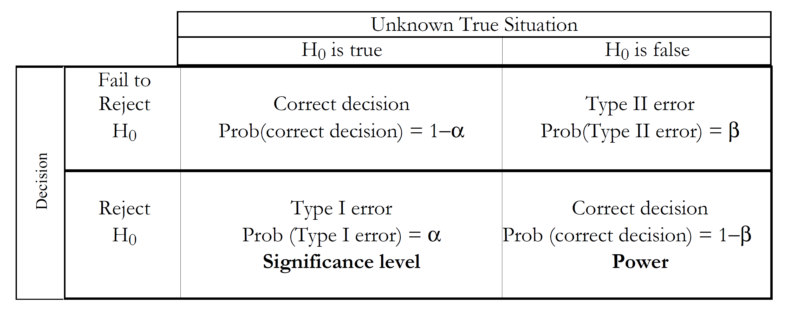
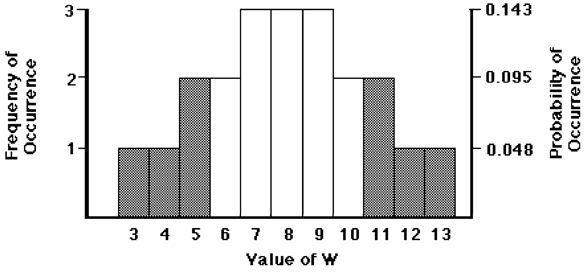

# Hypothesis Tests {#ch4}
Scientists collect data in order to learn about the processes and systems those data represent. Often they have prior ideas, called hypotheses, of how the systems behave. One of the primary purposes of collecting data is to test whether those hypotheses can be substantiated, with evidence provided by the data. Statistical tests are the most quantitative ways to determine whether hypotheses can be substantiated, or whether they must be modified or rejected outright.

One important use of hypothesis tests is to evaluate and compare groups of data. Water resources scientists have made such comparisons for years, sometimes without formal test procedures. For example, water quality has been compared between two or more aquifers, and some statements made as to which are different. Historic frequencies of exceeding some critical surface-water discharge have been compared with those observed over the most recent 10 years. Rather than using hypothesis tests, the results are sometimes expressed as the author's educated opinions -- "it is clear that development has increased well yield." Hypothesis tests have at least two advantages over educated opinion:

1) they insure that every analyst of a data set using the same methods will arrive at the same result. Computations can be checked on and agreed to by others.

2) they present a measure of the strength of the evidence (the p-value). The decision to reject an hypothesis is augmented by the risk of that decision being incorrect.

In this chapter hypothesis tests are classified based on when each is appropriate for use. The basic structure of hypothesis testing is introduced. The rank-sum test is used to illustrate this structure, as well as to illustrate the origin of tables of test statistic quantiles found in most statistics textbooks. Finally, tests for normality are discussed. Concepts and terminology found here will be used throughout the rest of the book.

```{r fig-4-1,  echo=FALSE, fig.cap = "Five types of hypothesis tests", fig.align="center"}
knitr::include_graphics("figures/4_1.png")
```

## Classification of Hypothesis Tests {#ch4-1}
The numerous varieties of hypothesis tests often cause unnecessary confusion to scientists. Tests can be classified into the five major types shown in figure \@ref(fig:fig-4-1), based on the measurement scales of the data being tested. Within these types, the distributional shape of the data determine which of two major divisions of hypothesis tests, parametric or nonparametric, are appropriate for use. Thus the data, along with the objectives of the study, determine which test procedure should be employed.

The terms **response variable** and **explanatory variable** are used in the following discussion. A response variable is one whose variation is being studied. In the case of regression, for example, the response variable is sometimes called the "dependent variable" or "y variable". An explanatory variable is one used to explain why and how the magnitude of the response variable changes. With a t-test, for example, the explanatory variable consists of the two categories of data being tested.

### Classification Based on Measurement Scales {#Ch4-1-1}
In figure \@ref(fig:fig-4-1), five groupings of test procedures are represented by the five boxes. Each differs only in the measurement scales of the response and explanatory variables under study. The scales of measurement may be either continuous or categorical. Both parametric and nonparametric tests may be found within a given box.

Tests represented by the three boxes in the top row of figure \@ref(fig:fig-4-1) are all similar in that the response variable is measured on a continuous scale. Examples of variables having a continuous scale are concentration, streamflow, porosity, and many of the other items measured by water resources scientists. Tests represented by the two boxes along the bottom of figure \@ref(fig:fig-4-1), in contrast, have response variables measured only on a categorical or grouped measurement scale. These variables can only take on a finite, usually small, number of values. They are often designated as letters or integer values. Categorical variables used primarily as explanatory variables include aquifer type, month, land use group, and station number. Categorical variables used as response variables include above/below a reporting limit (perhaps recorded as 0 or 1), presence or absence of a particular species, and low/medium/high risk of contamination.

The top left box represents the two- and multi-sample hypothesis tests such as the rank-sum and t-tests. The subject of Chapters \@ref(ch5) through \@ref(ch7), these tests determine whether a continuous response variable (such as concentration) differs in its central value among two or more grouped explanatory variables (such as aquifer unit).

The top right box represents two often-used methods -- linear regression and correlation. Both relate a continuous response variable (the dependent or y variable) to a continuous explanatory variable (the independent or x variable). Examples include regression of the 100-year flood magnitude versus basin characteristics, and correlations between concentrations of two chemical constituents. Analysis of trends over time is a special case of this class of methods, where the explanatory variable of primary interest is time.

The top center box is a blend of these two approaches, called analysis of covariance. A continuous response variable is related to several explanatory variables, some of which are continuous and some categorical. This is discussed in Chapter \@ref(ch11).

The bottom left box represents a situation similar to that for use of t-tests or analysis of variance, except that the response variable is categorical. Examples include determining whether the probability of finding a volatile organic above the reporting limit varies by land-use grouping. Contingency tables appropriately measure the association between two such categorical variables. Further information is found in Chapter \@ref(ch12).

The bottom right box shows that a regression-type relationship can be developed for the case of a categorical response variable. Perhaps the proportion of pesticide or other data below the reporting limit exceeds fifty percent, and it makes little sense to try to model mean or median concentrations. Instead, the probability of finding a detectable concentration can be related to continuous variables such as population density, percent of impervious surface, irrigation intensities, etc. This is done through the use of logistic regression, one subject of Chapter \@ref(ch15). Logistic regression can also incorporate categorical explanatory variables in a multiple regression context, making it the equivalent of analysis of covariance for categorical response variables.

### Classification Based on the Data Distribution {#Ch4-1-2}
Hypothesis tests which assume that the data have a particular distribution (usually a normal distribution, as in Fig. \@ref(fig:fig-1-2)) are called **parametric tests**. This is because the information contained in the data is summarized by parameters, usually the mean and standard deviation, and the test statistic is computed using these parameters. This is an efficient process if the data truly follow the assumed distribution. When they do not, however, the parameters may only poorly represent what is actually occurring in the data. The resulting test can then reach an incorrect conclusion, usually because it lacks sensitivity (power) to detect real effects.

Hypothesis tests not requiring the assumption that data follow a particular distribution are called distribution-free or **nonparametric tests**. Information is extracted from the data by comparing each value with all others (ranking the data) rather than by computing parameters. A common misconception is that nonparametric tests "lose information" in comparison to parametric tests because nonparametric tests "discard" the data values. Bradley (@bradley1968distribution, p.13) responded to this misconception: "Actually, the utilization of the additional sample information [in the parameters] is made possible by the additional population 'information' embodied in the parametric test's assumptions. Therefore, the distribution-free test is discarding information only if the parametric test's assumptions are known to be true." Rather than discarding information, nonparametric tests efficiently extract information on the relative magnitudes (ranks) of data without collapsing the information into only a few simple statistics. Both parametric and nonparametric tests will be presented in the upcoming chapters for each category of hypothesis tests.

## Structure of Hypothesis Tests {#Ch4-2}
Hypothesis tests are performed by following the structure discussed in the next six sections:

|STRUCTURE OF HYPOTHESIS TESTS|
|:--|
|1) Choose the appropriate test.|
|2) Establish the null and alternate hypotheses.|
|3) Decide on an acceptable error rate α.|
|4) Compute the test statistic from the data.|
|5) Compute the p-value.|
|6) Reject the null hypothesis if p ≤ α.|
  
### Choose the Appropriate Test {#Ch4-2-1}
Test procedures are selected based on the data characteristics and study objectives. Figure \@ref(fig:fig-4-1) presented the first selection criteria -- the measurement scales of the data. The second criteria is the objective of the test. Hypothesis tests are available to detect differences between central values of two groups, three or more groups, between spreads of data groups, and for covariance between two or more variables, among others. For example, to compare central values of two independent groups of data, either the t-test or rank-sum test might be selected (see figure \@ref(fig:fig-4-2)). Subsequent chapters are organized by test objectives, with several alternate tests discussed in each.

The third selection criteria is the choice between parametric or nonparametric tests. This should be based on the expected distribution of the data involved. If similar data in the past were normally distributed, a parametric procedure would usually be selected. If data were expected to be non-normal, or not enough is known to assume any specific distribution, nonparametric tests would be preferred. The power of parametric tests to reject H0 when H0 is false can be quite low when applied to non-normal data, and type II errors commonly result @bradley1968distribution. This loss of power is the primary concern when using parametric tests.

Sometimes the choice of test is based on a prior test of normality for that particular data set. If normality is rejected a nonparametric test is chosen. Otherwise, a parametric test is used. This can lead to two problems. First, with small data sets it is difficult to reject the null hypothesis of normality because there is so little evidence on which to base a decision. Tests based on little data have little power. Thus a parametric test might easily be used when the underlying data are actually non-normal. Nonparametric tests are particularly appropriate for small data sets unless experience supports the assumption of normality. Second, small departures from normality not large enough to detect with a test may be sufficiently large to weaken the power of parametric tests. An example is given in Chapter \@ref(ch10). For nearly-normal data, such as produced by power transformations to near-symmetry, the two classes of methods will often give the same result.

Test procedures should be selected that have greater power for the types of data expected to be encountered. Comparisons of the power of two test procedures, one parametric and one nonparametric, can be based on the tests' asymptotic relative efficiencies (ARE), a property of their behavior with large sample sizes (@bradley1968distribution, p.58). A test with larger ARE will have generally greater power. For non-normal data the ARE of nonparametric tests can be many times those of parametric tests @hollander1973nonparametric. Thus their power to reject H0 when it is truly false is generally much higher in this case. When data are produced by a normal distribution, nonparametric tests have generally lower (5-15%) ARE than parametric tests @hollander1973nonparametric. Thus nonparametric tests are, in general, never much worse than their parametric counterparts in their ability to detect departures from the null hypothesis, and may be far, far better. As an example, the rank-sum test has a larger ARE (more power) than the t-test for distributions containing outliers (@conover1980practical, p.225). Kendall and Stuart (@kendall1979advanced, p.540) show that for the gamma distribution (a skewed distribution commonly used in water resources) a moderate skew of 1.15 produces an ARE of greater than 1.25 for the rank-sum versus the t test. As skewness increases, so does the ARE. Therefore in the presence of skewness and outliers, precisely the characteristics commonly shown by water resources data, nonparametric tests exhibit greater power than do parametric tests.

One question which always arises is how non-normal must a distribution be in order for nonparametric tests to be preferred? Blair and Higgins @blair1980comparison gave insight into this question. They mixed data from two normal distributions, 95 percent from one normal distribution and 5 percent from a second normal distribution with quite different mean and standard deviation. Such a situation could easily be envisioned when data result from low to moderate discharges with occasional storm events, or from a series of wells where 5 percent are affected by a contaminant plume, etc. A difference of 5 percent from truly normal may not be detectable by a graph or test for normality. Yet when comparing two groups of this type, they found that the rank-sum test exhibited large advantages in power over the t-test. As a result, data groups correctly discerned as different by the rank-sum test could be found "not significantly different" by the t-test. Their paper is recommended for further detail and study.

The greatest strengths of parametric procedures are in modeling and estimation, such as performed with regression. Relationships among multiple variables can be described and tested which are difficult, if not nearly impossible, with nonparametric methods. Statistical practice has historically been dominated by parametric procedures, due largely to their computational elegance. Transformations are sometimes used to make data more normally distributed, prior to performing a parametric test. There is no guarantee that a given transformation, such as taking logarithms, will produce data sufficiently close to a normal distribution. Often several attempts to find a suitable transformation are required before the data appear approximately normal. The primary pitfall in using transformations is that when two or more groups are to be compared, no single transformation may provide nearly-normal data simultaneously for all groups. Groups whose right-skewness was solved by transformation may be offset by relatively symmetric groups which are now left-skewed. When several tests are performed, such as trend tests at numerous locations, parametric tests might be appropriate in some cases but not in others. Comparisons of results across sites are more difficult when test procedures and/or transformations vary for each case. Nonparametric tests allow the freedom to use the identical test procedure in all cases, without the requirement that the many individual data sets follow the same distribution. Finally, transformations may produce nearly-symmetric data, but cannot compensate for a heavy-tailed distribution -- the presence of more data near the extremes than found in a normal distribution.

It should be noted that there are actually three versions of most nonparametric tests:

**1. Exact test.** Exact versions of nonparametric tests provide results (in the form of p-values, defined soon) which are exactly correct . They are computed by comparing the test statistic to a table of quantiles that is specific for the sample sizes present. Therefore an extensive set of tables is required, one for every possible combination of sample sizes. When sample sizes are small, only the exact version will provide accurate results.

**2. Large sample approximation.** To avoid the necessity for large books filled with tables of test statistic quantiles, approximate p-values are obtained by assuming that the distribution of the test statistic can be approximated by some common distribution, such as the normal. This does not mean the data themselves follow that distribution, but only that the test statistic does. For large sample sizes (30 or more observations per group, but sometimes less) this approximation is very accurate. The test statistic is modified if necessary (often standardized by subtracting its mean, and dividing by its standard deviation), and then compared to a table of the common distribution to determine the p-value.

<u>WARNING</u>: Computer software predominantly uses large sample approximations when reporting p-values, whether or not the sample sizes are sufficient to warrant using them. For small sample sizes, p-values should be taken from exact tables rather than from the computer printout.

**3. Rank transformation test.** In this approximation, parametric procedures are computed not on the data themselves, but on the ranks of the data (smallest observation has rank=1, largest has rank=N). Conover and Iman @conover1981rank have shown this to adequately approximate many exact nonparametric tests for large samples sizes. The rank-sum test would be approximated in this fashion by computing a t-test on joint ranks of the data. In fact, Iman and Conover @iman_modern_1983 use the name "rank-sum test" for just this procedure. We would call this version a "t-test on ranks", reserving the traditional name for the first or second versions of the test and more accurately describing what was done. Rank approximations are most useful when performing nonparametric tests using statistics packages which contain only parametric procedures. They are also very useful for situations where there is no equivalent nonparametric analog, such as for multiple-factor analysis of variance.

In figure \@ref(fig:fig-4-2), exact and rank transform tests are aligned with their parametric counterparts, as a guide to the use of hypothesis tests.

### Establish the Null and Alternate Hypotheses {#Ch4-2-2}
The null and alternate hypotheses should be established prior to collecting data. These hypotheses are a concise summary of the study objectives, and will keep those objectives in focus during data collection.

The **null hypothesis** (H0) **is what is assumed to be true about the system under study prior to data collection, until indicated otherwise**. It usually states the "null" situation -- no difference between groups, no relation between variables. One may "suspect", "hope", or "root for" either the null or alternate hypothesis, depending on one's vantage point. But the null hypothesis is what is assumed true until the data indicate that it is likely to be false. For example, an engineer may test the hypothesis that wells upgradient and downgradient of a hazardous waste site have the same concentrations of some contaminant. They may "hope" that downgradient concentrations are higher (the company gets a new remediation project), or that they are the same (the company did the original site design!). In either case, the null hypothesis assumed to be true is the same: concentrations are similar in both groups of wells.

The **alternate hypothesis** (H1) **is the situation anticipated to be true if the evidence (the data) show that the null hypothesis is unlikely**. It is in some cases just the negation of H0, such as "the 100-year flood is not equal to the design value." H1 may also be more specific than just the negation of H0 -- "the 100-year flood is greater than the design value." Alternate hypotheses come in two general types: one-sided, and two-sided. Their associated hypothesis tests are called one-sided and two-sided tests. These are often confused and misapplied.

**Two-sided tests occur when evidence in either direction** from the null hypothesis (larger or smaller, positive or negative) would cause the null hypothesis to be rejected in favor of the alternate hypothesis. For example, if evidence that "the 100-year flood is smaller than the design value" or "the 100-year flood is greater than the design value" would both cause doubt about the null hypothesis, the test is two-sided. Most tests in water resources are of this kind.


```{r fig-4-2, echo = FALSE, fig.cap = "Guide to the classification of some hypothesis tests", fig.align="center"}
knitr::include_graphics("figures/4_2.png")
```

**One-sided tests occur when departures in only one direction from the null hypothesis would cause the null hypothesis to be rejected** in favor of the alternate hypothesis. With one-sided tests, it is considered supporting evidence for H0 should the data indicate differences opposite in direction to the alternate hypothesis. For example, suppose only evidence that the 100-year flood is greater than the previous design value is of interest, as only then must the culvert be replaced. The null hypothesis would be stated as "the 100-year flood is less-than or equal to the design flood", while the alternate hypothesis is that "the 100-year flood exceeds the design value." Any evidence that the 100-year flood is smaller than the design value is considered evidence for H0.

**If it cannot be stated prior to looking at any data that departures from H0 in only one direction are of interest, a two-sided test should be performed.** If one simply wants to look for differences between two streams or two aquifers or two time periods, then a two-sided test is appropriate. It is not appropriate to look at the data, find that group A is considerably larger in value than group B, and perform a one-sided test that group A is larger. This would be ignoring the real possibility that had group B been larger there would have been interest in that situation as well. Examples in water resources where one-sided tests would be appropriate are:

    1. testing for decreased annual floods or downstream sediment loads after completion of a flood-control dam,
    2. testing for decreased nutrient loads or concentrations due to a new sewage treatment plant or best management practice,
    3. testing for an increase in concentration when comparing a suspected contaminated site to an upstream or upgradient control site.

### Decide on an Acceptable Error Rate α {#ch4-2-3}
The α-value, or significance level, is the probability of incorrectly rejecting the null hypothesis (rejecting H0 when it is in fact true, called a "Type I error"). Figure \@ref(fig:fig-4-3) shows that this is one of four possible outcomes of an hypothesis test. The significance level is the risk of a Type I error deemed acceptable by the decision maker. It is a "management tool" dependent not on the data, but on the objectives of the study. Statistical tradition uses a default of 5% (0.05) for α, but there is no reason why other values should not be used. Suppose that an expensive cleanup process will be mandated if the null hypothesis of "no contamination" is rejected, for example. The α-level for this test might be set very small (such as 1%) in order to minimize the chance of needless cleanup costs. On the other hand, suppose the test was simply a first cut at classifying sites into "high" and "low" values prior to further analysis of the "high" sites. In this case the α - level might be set to 0.10 or 0.20, so that all sites with high values would likely be retained for further study.


```{r fig-4-3, echo = FALSE, fig.cap = "Four possible results of hypothesis testing.", fig.align="center"}

```

Since α represents one type of error, why not keep it as small as possible? One way to do this would be to never reject H0 -- α would then equal zero. Unfortunately this would lead to large errors of a second type -- failing to reject H0 when it was in fact false. This second type of error is called a Type II error, or lack of power (Fig. \@ref(fig:fig-4-3)). Both errors are of concern to practitioners, and both will have some finite probability of occurrence unless decisions to "always reject" or "never reject" are made. Once a decision is made as to an acceptable Type I risk α, two steps can be taken to concurrently reduce the risk of Type II error β:

    1. Increase the sample size n. 
    2. Use the test procedure with the greatest power for the type of data being analyzed.

For water quality applications, null hypotheses are usually of "no contamination". Situations with low power mean that actual contamination may not be detected. This happens with simplistic formulas for determining sample sizes @kupper_appropriate_1989. Instead, probabilities of Type II errors should be considered when setting sample size. Power is also sacrificed when data having the characteristics outlined in Chapter 1 are analyzed with tests requiring a normal distribution. Power loss increases as skewness and the number of outliers increase.

### Compute the Test Statistic from the Data {#Ch4-2-4}
Test statistics summarize the information contained in the data. If the test statistic is not unusually different from what is expected to occur if the null hypothesis is true, the null hypothesis is not rejected. However, if the test statistic is a value unlikely to occur when H0 is true, the null hypothesis is rejected. The p-value measures how unlikely the test statistic is when H0 is true.

### Compute the p-Value {#Ch4-2-5}
The p-value is the probability of obtaining the computed test statistic, or one even less likely, when the null hypothesis is true. It is derived from the data, concisely expressing the evidence against the null hypothesis contained in the data. It measures the "believability" of the null hypothesis. The smaller the p-value, the less likely is the observed test statistic when H0 is true, and the stronger the evidence for rejection of the null hypothesis. The p-value is also called the "attained significance level", the significance level attained by the data.

How do p-values differ from α levels? The α-level does not depend on the data, but states the risk of making a Type I error that is acceptable a priori to the scientist or manager. The α-level is the critical value which allows a "yes/no" decision to be made -- the treatment plant has improved water quality, nitrate concentrations in the well exceed standards, etc.. The p-value provides more information -- the strength of the scientific evidence. Reporting the p-value allows someone with a different risk tolerance (different α) to make their own yes/no decision.

For example, consider a test of whether upgradient and downgradient wells have the same expected contaminant concentrations. If downgradient wells show evidence of higher concentrations, some form of remediation will be required. Data are collected, and a test statistic calculated. A decision to reject at α = 0.01 is a statement that "remediation is warranted as long as there is less than a 1 percent chance that the observed data would occur when upgradient and downgradient wells actually had the same concentration." This level of risk was settled on as acceptable, so that 1 percent of the time remediation would be performed when in fact it is not required. Reporting only "reject" or "not reject" would prevent the audience from distinguishing a case that is barely able to reject (p = 0.009) from one in which H0 is virtually certain to be untrue (p = 0.0001). Reporting a p-value of 0.02, for example, would allow a later decision by someone with a greater tolerance of unnecessary cleanup (α = 5 percent, perhaps) to decide for remediation.

### Make the Decision to Reject H0 or Not {#Ch4-2-6}

|Reject H0 when: p-value < α-level.|
|:--|

When the p-value is less than the decision criteria (the α-level), H0 is **rejected**. When the pvalue is greater than α, H0 is **not rejected**. The null hypothesis is never "accepted", or proven to be true. It is assumed to be true until proven otherwise, and is "not rejected" when there is insufficient evidence to do so.

## The Rank-Sum Test as an Example of Hypothesis Testing {#Ch4-3}
Suppose that aquifers X and Y are sampled to determine whether the concentrations of a contaminant in the aquifers are similar or different. This is a test for differences in location or central value, and will be covered in detail in Chapter \@ref(ch5). Two samples xi are taken from aquifer X (n = 2), and 5 samples yi from aquifer Y (m = 5) for a total of 7 samples (N = n+m = 7). Also suppose that there is a prior reason to believe that X values tend to be lower than Y values: aquifer X is deeper, and is likely to be uncontaminated. The null hypothesis (H0) and alternative hypothesis (H1) of this one-sided test are as follows:

  H0: x~i~ and y~i~ are samples from the same distribution, or
  
  H0: Prob (x~i~ ≥ y~i~ ) = 0.5.
  
  H1: x~i~ is from a distribution which is generally lower that of y~i~, or

  H1: Prob (x~i~ ≥ y~i~ ) < 0.5.


Remember that with one-sided tests such as this one, data indicating differences opposite in direction to H1 (x~i~ frequently larger than y~i~) are considered supporting evidence for H0. With one-sided tests we can only be interested in departures from H0 in one direction.

Having established the null and alternate hypotheses, an acceptable error rate α must be set. As in a court of law, innocence is assumed (i.e. concentrations are identical) unless evidence is collected to show "beyond a reasonable doubt" that aquifer Y has higher concentrations (i.e. that differences observed are not likely to have occurred by chance alone). The "reasonable doubt" is set by α, the significance level.

If the t-test were to be considered as the test procedure, each data group should be tested for normality. However, sample sizes of 2 and 5 are too small for a reliable test of normality. Thus the nonparametric rank-sum test is appropriate. This test procedure entails ranking all 7 values (lowest concentration has rank = 1, highest has rank = 7) and summing the ranks of the 2 values from the population with the smaller sample size (X). This rank-sum is the statistic W used in the exact test.

Next, W would be computed and compared to a table of test statistic quantiles to determine the p-value. Where do these tables come from? We will derive the table for sample sizes 2 and 5 as an example.

What are the possible values W may take, given that the null hypothesis is true? The collection of all of the possible outcomes of W defines its distribution, and therefore composes the table of rank-sum test statistic quantiles. Shown below are all the possible combinations of ranks of the two x values.

|   |    |    |    |    |    |
|---|----|----|----|----|----|
|1,2| 1,3| 1,4| 1,5| 1,6| 1,7|
|   | 2,3| 2,4| 2,5| 2,6| 2,7|
|   |    | 3,4| 3,5| 3,6| 3,7|
|   |    |    | 4,5| 4,6| 4,7|
|   |    |    |    | 5,6| 5,7|
|   |    |    |    |    | 6,7|

If H0 is true, each of the 21 possible outcomes must be equally likely. That is, it is just as likely for the two x's to be ranks 1 and 2, or 3 and 5, or 1 and 7, etc. Each one of the outcomes results in a value of W, the sum of the two ranks. The 21 W values corresponding to the above outcomes are

|   |    |    |    |    |    |
|---|----|----|----|----|----|
|3  |4   |5   |6   |7   |8   |
|   |5   |6   |7   |8   |9   |
|   |    |7   |8   |9   |10  |
|   |    |    |9   |10  |11  |
|   |    |    |    |11  |12  |
|   |    |    |    |    |13  |
            
The expected value of W is the mean (and median) of the above values, or 8. Given that each outcome is equally likely when H0 is true, the probability of each possible W value is:

|   |    |   |    |   |    |   |    |   |    |   |    |
|----|----|----|----|----|----|----|----|----|----|----|----|
|W | 3 |4 |5 |6 |7 |8 |9 |10 |11 |12 |13|
|Prob(W)| 1/21| 1/21| 2/21| 2/21| 3/21| 3/21| 3/21| 2/21| 2/21| 1/21| 1/21|

What if the data collected produced 2 x values having ranks 1 and 4? Then W would be 5, lower than the expected value E [W] = 8. If H1 were true rather than H0, W would tend toward low values. What is the probability that W would be as low as 5 or lower if H0 were true? It is the sum of the probabilities for W = 3, 4, and 5, or 4/21 = 0.190 (see figure \@ref(fig:fig-4-4)). This number is the p-value for the test statistic of 5. It says that the chance of a departure from E [W] of at least this magnitude occurring when H0 is true is 0.190, which is not very uncommon (about 1 chance in 5). Thus the evidence against H0 is not too convincing. If the ranks of the 2 x values had been 1 and 2, then W = 3 and the p-value would be 1/21 = 0.048. This result is much less likely than the previous case but is still not extremely rare. In fact, due to such a small sample size the test can never result in a highly compelling case for rejecting H0. Adding more data would make it possible to attain lower p-values, providing a stronger case against H0.

```{r fig-4-4, echo = FALSE, fig.cap = "Probabilities of occurrence for a rank-sum test with sample sizes of 2 and 5.The p-value for a one-sided test equals the area shaded.", fig.align="center"}
knitr::include_graphics("figures/4_4.png")
```

This example has considered only the one-sided p-value, which is appropriate when there is some prior notion that x should be smaller than y (or the reverse). Quite often the situation is that there is no prior notion of which should be lower. In this case a two-sided test must be done. The two-sided test has the same null hypothesis as was stated above, but H1 is now that xi and yi are from different distributions, or 
     
   $H1: Prob (x_i \geq y_i ) \neq 0.5.$

Suppose that W for the two-sided test were found to be 5. The p-value equals the probability that W will differ from E [W] by this much or more, in either direction. It is 

  $Prob (W \leq 5) + Prob (W \geq 11).$ (see figure 4.5) 

Where did the 11 come from? It is just as far from E [W] = 8 as is 5. The two-sided p-value therefore equals 8/21 = 0.381, twice the one-sided p-value. Symbolically we could state: 

  $Prob (|W− E [W] |\geq 3) = 8/21.$

To summarize the subject of p-values: they describe how "far" the observed test statistic is from that expected to occur if the null hypothesis were true. They are the probability of being that far or farther given that the null hypothesis is true. **The lower the p-value the stronger is the case against the null hypothesis.**

Now, lets look at an α-level approach. Return to the original problem, the case of a one-sided test. Assume α is set equal to 0.1. This corresponds to a critical value for W, call it $W^*$, such that $Prob (W ≤ W^*) = α. Whenever W≤W^*$, H0 is rejected with no more than a 0.1 frequency of error if H0 were always true. However, because W can only take on discrete, in fact integer, values as seen above, a W* which exactly satisfies the equation is not usually available. Instead the largest possible W* such that $Prob (W ≤ W^*) ≤ α$ is used.

```{r fig-4-5, echo = FALSE, fig.cap = "Probabilities of occurrence for a rank-sum test with sample sizes of 2 and 5.The p-value for a one-sided test equals the area shaded.", fig.align="center"}

```

Searching the above table of possible W values and their probabilities, $W^*$ = 4 because Prob (W ≤ 4) = 0.095 ≤ 0.1. Note the "lumpiness" of the relationship between α and $W^*$. If α =0.09 had been selected then $W^*$ would be 3. This lumpiness can be avoided by reporting p-values rather than only "reject" or "not reject".

For a two-sided test a pair of critical values $W_U*$ and $W_L^*$ is needed, where

  $Prob (W ≤ W_L^*) + Prob (W ≥ W_U*) ≤ α \ \ \ and \ \ \ \ W_U*− E [W] = E [W] − W_L*.$ 
  
These upper and lower critical values of W are symmetrical around E [W] such that the probability of W falling on or outside of these critical levels is as close as possible to α, without exceeding it, under the assumption that H0 is true. In the case at hand, if α = 0.1, then $WL^*= 3  \ \ \ and \ \ \ \ WU^*= 13$ because Prob (W ≤ 3) + Prob (W ≥ 13) = 0.048 + 0.048 = 0.095 ≤ 0.1.


Note that for a two-sided test, the critical values are farther from the expected value than in a one-sided test at the same α level.

It should be recognized that p-values are also influenced by sample size. For a given magnitude of difference between the x and y data, and a given amount of variability in the data, p values will tend to be smaller when the sample size is large. In the extreme case where vast amounts of data are available, it is a virtual certainty that p values will be small even if the differences between x and y are what might be called "of no practical significance."

Most statistical tables are set up for one-sided tests. That is, the rejection region α or the pvalue is given in only one direction. When a two-sided test at significance level α is performed, the tables must be entered using α/2. In this way rejection can occur with a probability of α/2 on either side, and an overall probability of α. Similarly, tabled p-values must be doubled to get p-values for a two-sided test. Modern statistical software often reports p-values with its output, eliminating the need for tables. Be sure to know whether it is one-sided or two-sided p-values being reported.

## Tests for Normality {#ch4-4}
The primary reason to test whether data follow a normal distribution is to determine if parametric test procedures may be employed. The null hypothesis for all tests of normality is that the data are normally distributed. Rejection of H0 says that this is doubtful. Failure to reject H0, however, does not prove that the data do follow a normal distribution, especially for small sample sizes. It simply says normality cannot be rejected with the evidence at hand. Use of a larger α-level (say 0.1) will increase the power to detect non-normality, especially for small sample sizes, and is recommended when testing for normality.


The test for normality used in this book is the probability plot correlation coefficient (PPCC) test discussed by Looney and Gulledge @looney1985use. Remember from Chapter \@ref(ch2) that the more normal a data set is, the closer it plots to a straight line on a normal probability plot. To test for normality, this linearity is tested by computing the linear correlation coefficient between data and their normal quantiles (or "normal scores", the linear scale on a probability plot). Samples from a normal distribution will have a correlation coefficient very close to 1.0. As data depart from normality, their correlation coefficient will decrease below 1. To perform a test of H0: the data are normal versus H1: they are not, the correlation coefficient (r) between the data and their normal quantiles is tested to see if it is significantly less than 1. For a sample size of n, if r is smaller than the critical value r* of table B3 for the desired α-level, reject H0. Looney and Gulledge @looney_probability_1985 have shown this table, developed using the Blom plotting position, is also valid for other plotting positions except the Weibull position i/(n+1). In order to use one plotting position for all functions in this book, the Cunnane plotting position was adopted as explained in Chapter \@ref(ch2).

To illustrate this test, probability plots of the unit well yield data from Chapter \@ref(ch2) are shown in figures \@ref(fig:fig-4-6) and \@ref(fig:fig-4-7). For the valleys without fracturing, r = 0.805, the correlation coefficient between yi and Zp in the left-hand side of Table 4.1.

From table B3 with n=12, if r is below the α = 0.05 critical value of r* = .928, normality is rejected. Therefore normality is rejected for the yields without fractures at α = 0.05. A p-value for this test would be <0.005, as r=0.805 is less than the tabled r* of 0.876 for α=0.005. Note the nonlinearity of the data on the probability plot (figure \@ref(fig:fig-4-6)). For the yields with fracturing, n=13, r* is 0.932 at α = 0.05, and the PPCC r = 0.943; therefore fail to reject normality at α=0.05. The p-value for the yields with fracturing is just under 0.10 (normality would barely be rejected at α=0.10). The probability plot, figure \@ref(fig:fig-4-7), shows a closer adherence to a straight line than for figure \@ref(fig:fig-4-6).

Table 4.1. Unit well yields (in gal/min/ft) in Virginia @wright_effects_1985
```{r, fig-4-12, echo = FALSE, fig.align="center"}
knitr::include_graphics("figures/4_12.png")
```

Computer packages use several methods for testing normality. Several are based on probability plots. The most common is perhaps the Shapiro-Wilk test, as its power to detect non-normality is as good or better than other tests @shapiro1968comparative. A table of quantiles for this test statistic is available for n < 50 @conover1980practical. Shapiro and Francia @shapiro1972approximate developed a modification of the Shapiro-Wilk test useful for all sample sizes. It is essentially identical to the PPCC test, as it is the $r^2$ for a regression between the data and their normal scores. Therefore pvalues and power characteristics for the two tests should be essentially the same.


Tests for normality not related to probability plots include the Kolmogorov and chi-square tests, described in more detail by Conover @conover1980practical. Both are general tests that may be used for data which are ordinal (data recorded only as low/medium/high, etc) but do not possess a continuous scale. This makes them less powerful than the probability plot tests, however, for the specific purpose of testing continuous data for normality @shapiro1968comparative.

The important advantage of the PPCC test is its graphical analog, the probability plot, which visually illustrates its results. The probability plot itself provides information on how the data depart from normality, something not provided by any test statistic. To make the PPCC test easy to perform by hand, normal quantiles for the Cunnane plotting positions of table B1 are listed in table B2 of the Appendix. For the n=12 yields without fracturing, for example, the upper six quantiles are easily found in the table. Lower quantiles are mirror images around zero of the upper quantiles, and so equal the upper values multiplied by −1. Table B2 quantiles were computed by first calculating the Cunnane plotting position to more significant digits than found in table B1, and then looking up the corresponding normal quantiles in a table of the normal distribution.


```{r fig-4-6, echo = FALSE, fig.cap = "Probability plot for the yields without fracturing, with PPCC r", fig.align="center"}
knitr::include_graphics("figures/4_6.png")
```

```{r fig-4-7, echo = FALSE, fig.cap = "Probability plot for the yields with fracturing, with PPCC r", fig.align="center"}
knitr::include_graphics("figures/4_7.png")
```


## Exercises {-}

### 4.1 {-}
The following are annual streamflows for the Green R. at Munfordville, KY. Beginning in 1969 the stream was regulated by a reservoir. 

||before|||| after|
|:----:|:----:|:----:|:----:|:----:|:----:|:----:|
|1950|4910| 1960|2340| |1969 1350|
|1951|3660| 1961|2600| |1970 2350|
|1952|3910| 1962|3410| |1971 3140|
|1953|1750| 1963|1870| |1972 3060|
|1954|1050| 1964|1730| |1973 3630|
|1955|2670| 1965|2730| |1974 3890|
|1956|2880| 1966|1550| |1975 3780|
|1957|2600| 1967|4060| |1976 3180|
|1958|3520| 1968|2870| |1977 2260|
|1959|1730| | | |1978 3430|
| | | || |1979 5290|  
| |||| |1980 2870| 


Test both before and after data sets for normality using the PPCC test. If either are nonnormal, transform the data and re-test in order to find a scale which appears to be close to a normal distribution.

```{r}
library("ggplot2")
library("ppcc")
number_ticks <- function(n) {function(limits) pretty(limits, n)}

## Before
before = data.frame(year = 1950:1968, flows = c(4910, 3660, 3910, 1750, 1050, 2670, 2880, 2600, 3520, 1730, 2340, 2600, 3410, 1870, 1730, 2730, 1550, 4060, 2870))

ggplot(before, aes(x = flows)) +
  geom_density(color="blue", alpha=0.8)+
  labs(x ="Annual streamflows (1950-1968)")+
  scale_x_continuous(breaks=number_ticks(10)) +
  scale_y_continuous(breaks=number_ticks(10))+
  theme_bw()


## After
after = data.frame(year = 1969:1980, flows = c(1350, 2350, 3140, 3060, 3630, 3890, 3780, 3180, 2260, 3430, 5290, 2870))

ggplot(after, aes(x = flows)) +
  geom_density(color="Red", alpha=0.8)+
  labs(x ="Annual streamflows (1968-1980)")+
  scale_x_continuous(breaks=number_ticks(10)) +
  scale_y_continuous(breaks=number_ticks(10))+
  theme_bw()

## PPCC test

ppccTest(before$flows)
ppccTest(after$flows)
```

PPCC test analysis-

The PPCC test for both before and after datasets shows normality because p value for both are found significant and datasets are showing normal distribution.

### 4.2 {-}
Test the arsenic data and transformed data of Exercise 2.2 for normality.

```{r}
ars_data = c(1.3, 1.5, 1.8, 2.6, 2.8, 3.5, 4.0, 4.8,
         8, 9.5, 12, 14, 19, 23, 41, 80, 100, 110, 120,
         190, 240, 250, 300, 340, 580)

ggplot() +
  geom_density(aes(x = ars_data), color = 'blue')+
  labs(x ="Arsenic data")+
  theme_bw()

##Normality test for normal data
shapiro.test(ars_data)


##Transformation of data
trans_data = (mean(ars_data) - ars_data)/sd(ars_data)

trans_data

ggplot() +
  geom_density(aes(x = trans_data), color = 'Red')+
  labs(x ="Transform arsenic data")+
  scale_x_continuous(limits = c(-3.8, 3.8))+
  theme_bw()
  
##Normality test for transformed data
shapiro.test(trans_data)
```

For the both the datasets, p value is not significant, that representing a strong confirmations for non-normality in data.


