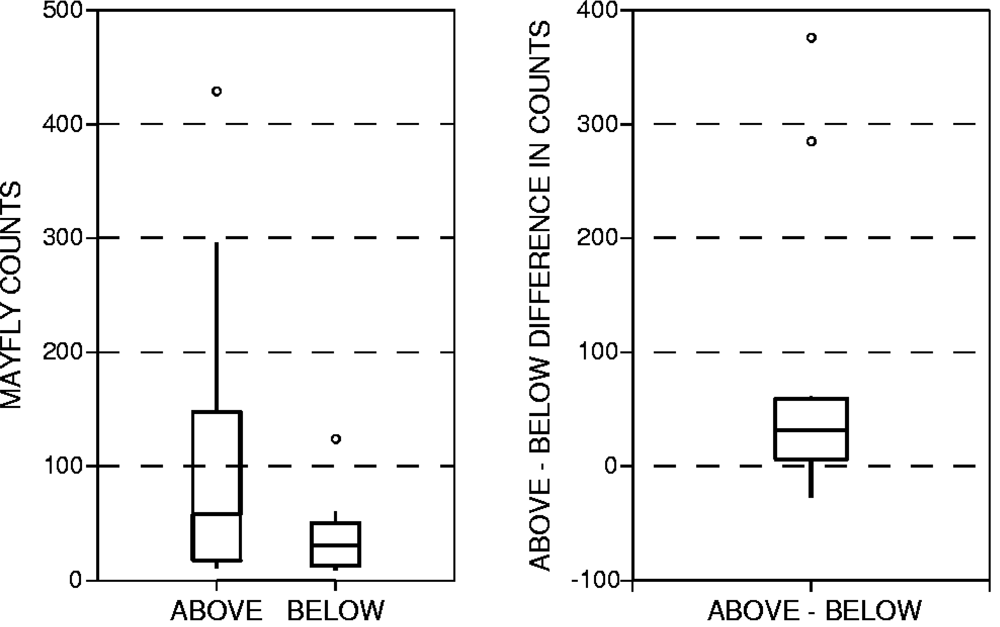
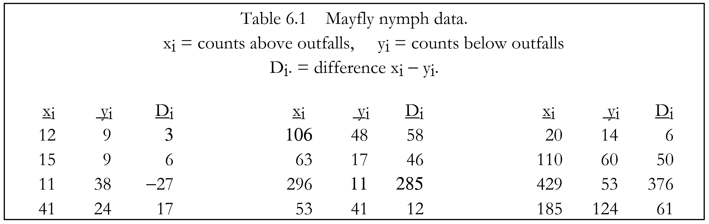
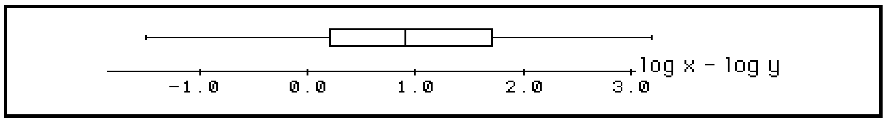
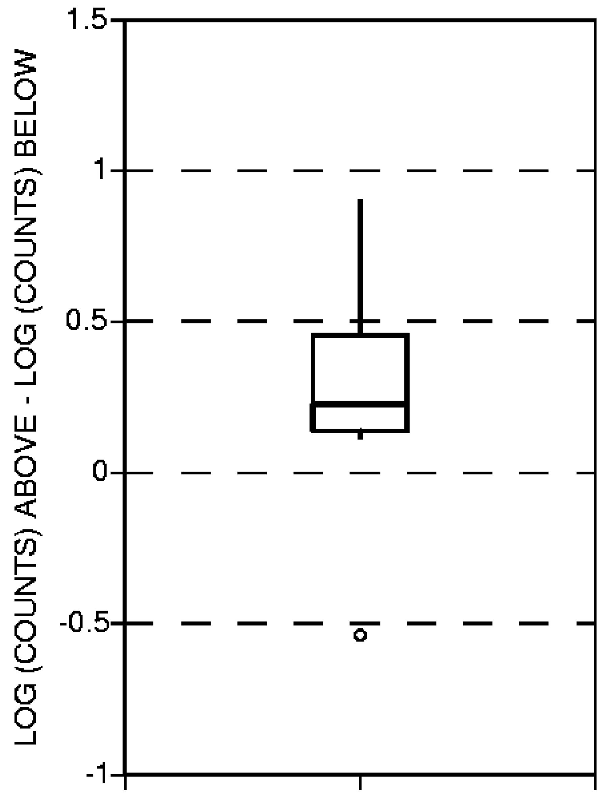
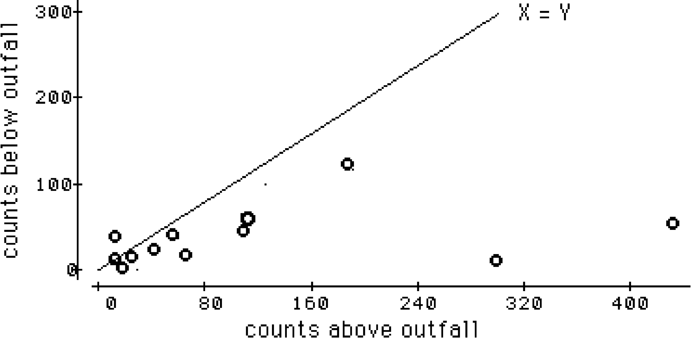

# Matched-Pair Tests {#ch6}
To determine the effectiveness of an acid solution in developing wells in carbonate rock, yields of twenty wells were measured both before and after treatment of the wells with acid. Factoring out the differences in yield between wells, have the yields changed as a result of using the acid? What is the magnitude of this change?

Annual sediment loads are measured at two sites over a period of twenty-four years. Both drainage basins are of essentially the same size, and have the same basin characteristics. However, logging has occurred in one basin during the period, but not in the other. Can the year to year variation in load (due to differences in precipitation) be compensated for, to determine whether the site containing logging produced generally higher loads than the other?

Two laboratories are compared in a quality assurance program. Each lab is sent one of a pair of 30 samples split into duplicates in the field, to determine if one lab consistently over- or underestimates the concentrations of the other. If no difference between the labs is seen, their data may be combined prior to interpretation. The differences between labs must be discerned above the sample to sample differences.

As with the tests of Chapter \@ref(ch5), we wish to determine if one group tends to contain larger values than the other. However, now there is a logical pairing of the observations within each group. Further, there may be a great deal of variability between these pairs, as with the year-to-year pairs of sediment data in the second example above. Both basins exhibit low yields in dry years, and higher yields in wet years. This variability between pairs of observations is noise which would obscure the differences between the two groups being compared if the methods of Chapter \@ref(ch5) were used. Instead, pairing is used to block out this noise by performing tests on the differences between data pairs. Two nonparametric tests are presented for determining whether paired observations differ, the sign test and the signed-rank test. Also presented is the paired ttest, the parametric equivalent which may be used when the differences between pairs are known to be normally distributed. After surveying graphical methods to illustrate the test results, estimators for the difference between the two groups are discussed.

For paired observations (x~i~,y~i~), i=1,2,...n, their differences D~i~ = x~i~ − y~i~ are computed. The tests in this chapter determine whether xi and yi are from the same population -- the null hypothesis -- by analyzing the D~i~. If there are differences, the null hypothesis is rejected.

When the D~i~'s have a normal distribution, a paired t-test can be employed. The paired t-test determines whether the mean of the D~i~'s equals 0. This is equivalent to stating that the mean of the x~i~ and the y~i~ are the same. If the D~i~'s are symmetric, but not necessarily normal, a signedrank test can be used. The signed-rank test determines whether the median of the the D~i~'s is equal to 0. The assumption of symmetry made by the signed-rank test is much less restrictive than that of normality, as there are many non-normal distributions which are symmetric. As a result, the signed-rank test is a more generally applicable method than the t-test. If the differences are asymmetric, the sign test may be used. The sign test does not require an assumption of symmetry or normality. It tests a more general hypothesis than comparisons of means or medians -- does x tend to be higher (or lower, or different) than y? The sign test is the most generally applicable of the three methods. It is also appropriate when the magnitude of the paired differences cannot be computed but one observation can be determined to be higher than the other, as when comparing a <1 to a 3. (Analysis of data below the detection limit is discussed in detail in Chapter \@ref(ch13). See also exercises 6.4 and 6.5 at the end of this chapter.)

## The Sign Test {#ch6-1}
For data pairs (x~i~,y~i~) i=1,...n, the sign test determines whether x is generally larger (or smaller, or different) than y, without regard to whether that difference is additive. The sign test may be used regardless of the distribution of the differences, and thus is fully nonparametric.

### Null and Alternate Hypotheses {#ch6-1-1}
The null and alternative hypotheses may be stated as follows:

    H0: Prob [x > y] = 0.5,

versus one of the three possible alternative hypotheses:

    H1: Prob [x > y] ≠ 0.5 (2-sided test -- x might be larger or smaller than y).
    H2: Prob [x > y] > 0.5 (1-sided test -- x is expected to be larger than y)
    H3: Prob [x > y] < 0.5 (1-sided test-- x is expected to be smaller than y).


### Computation of the Exact Test {#ch6-1-2}
If the null hypothesis is true, about half of the differences Di will be positive (x~i~ > y~i~) and about half negative (x~i~ < y~i~). If one of the alternate hypotheses is true instead, more than half of the differences will tend to be either positive or negative.

The exact form of the sign test is given below. It is the form appropriate when comparing 20 or fewer pairs of samples. With larger sample sizes the large-sample approximation may be used.

Remember that computer packages usually report p-values from the large sample approximation regardless of sample size.


**Exact form of the sign test**

**Situation** Two paired groups of data are to be compared, to determine if one group tends to produce larger (or different) values than the other group. No assumptions about the distribution of the differences D~i~ = x~i~ − y~i~, i = 1,...N are required. This means that no assumption is made that all pairs are expected to differ by about the same amount. Numerical values for the data are also not necessary, as long as their relative magnitudes may be determined.


**Tied data** Ignore all tied data pairs (all D~i~ =0). Reduce the sample size of the test to the number of nonzero differences n.

**Computation** Delete all Di= 0 (x~i~ = y~i~). The test uses the n nonzero differences n= N−[number of D~i~=0]. Assign a + for all Di > 0, and a − for all D~i~ < 0.


**Test Statistic** S+ = the number of +'s, the number of times x~i~ > y~i~, i = 1,...n.

**Decision Rule** To reject H0: Prob [x > y] = 0.5,

1. H1: Prob [x > y] ≠ 0.5 (the x measurement tends to be either larger or smaller than the y measurement).

Reject H0 if $S^+ \geq x_{α/2,n}$ or $S^+ \leq x'_{α/2,n}$ from Table B5; otherwise do not reject H0.


2. H2: Prob [x > y] > 0.5 (the x measurement tends to be larger than the y measurement).
Reject H0 if $S^+ \geq x_{α,n}$ from Table B5; otherwise do not reject H0.

3. H3: Prob [x > y] < 0.5 (the x measurement tends to be smaller than the y measurement).
Reject H0 if $S^+ \leq x'_{α,n}$ from Table B5; otherwise do not reject H0 .

<u>Example 1.</u> 
Counts of mayfly nymphs were recorded in 12 small streams at low flow above and below industrial outfalls. The mayfly nymph is an indicator of good water quality. The question to be considered is whether effluents from the outfalls decreased the number of nymphs found on the streambeds of that region. A Type I risk level α of 0.01 is set as acceptable. Figure \@ref(fig:fig-6-1a)a presents a separate boxplot of the counts for the above and below groups. Both groups are positively skewed. There is a great deal of variability within these groups due to the differences from one stream to another, though in general the counts below the outfalls appear to be smaller. A rank-sum test as in Chapter 5 between the the two groups would be inefficient, as it would not block out the stream to stream variation (no matching of the pair of above and below counts in each stream). Variation in counts among the streams could obscure the difference being tested for. The natural pairing of observations at the same stream can be used to block out the stream to stream variability by computing the above−below differences in counts for each stream (figure \@ref(fig:fig-6-1a) b). A test is then performed on these differences. Note the asymmetry of the paired differences. They do not appear to all be of about the same magnitude.


```{r fig-6-1a, echo = FALSE, fig.cap = "a) above and below counts. b) above − below differences.", fig.align="center"}

```


```{r fig6-1, echo = FALSE, fig.cap = " ", fig.align="center"}


```

The null hypothesis H0 is that the counts above the outfalls are equally likely to be higher or lower than counts below the outfalls. The one-sided alternate hypothesis H~2~ is that the counts below the outfalls are expected to be lower, in which case S^+^ would be large.

Of the 12 pairs, 11 are increases, so S^+^ = 11. Note that this statistic is very resistant to outliers, as the magnitudes of the differences are not used in computing the test statistic. From Table B5 of the Appendix, the one-sided p-value for S^+^ = 11 is 0.003. Therefore reject that counts above and below the outfall are the same at α = 0.01.


### The Large Sample Approximation {#ch6-1-3 }
For sample sizes n>20 the exact sign test statistic can be modified so that its distribution closely follows a standard normal distribution. Again, this does not mean that the data or their differences require normality. It is only the modified test statistic which follows a normal distribution.

The large sample approximation for the sign test takes the standardized form

\[
\begin{equation}
Z_{rs} = 
\begin{cases} 
\frac{S^{+}-1/2-\mu_S{+}}{\sigma_S^{+}}  &\text{if } S^{+} > \mu_S+
\\\\ \ \  \ \ \ \ \ \ \ {0}    &\text{if } S^{+}=\mu_S+ \\\\
\frac{S^{+} +1/2-\mu_S+}{\sigma_S+}         & \text{if } S^{+}   < \mu_S+
\end{cases}
\end{equation}
\]

$$where \ \ \ \mu_S+ = \frac{n}{2}, \ \ and \ \ \sigma_{S^+}=\frac{1}{2}{\sqrt{n} \ \ .} $$
The 1/2 in the numerator of Z^+^ is again a continuity correction (see Chapter 5). Z^+^ is compared to a table of the standard normal distribution to obtain the approximate p-value. Using the mayfly data of Example 1, the approximate p-value of p = 0.005 is obtained below. This is very close to the true (exact) p=0.003, and both are sufficiently small that the decision to reject H0 would not be altered by their difference.

Therefore, if accurate p-values are of primary concern, such as when p is close to the agreedupon risk α, and the sample size is 20 or smaller, perform the exact test to get accurate p-values. Regardless of sample size, if p-values are not the primary interest and one must simply decide to reject H0 or not, when p-values are much smaller (such as 0.001) or much larger (such as 0.50) than α the decision whether to reject H0 will be sufficiently clear from the approximate procedure.

<u>Example 1, cont.</u>
$$For \ \ \ S^+=11, \ \ \ \  \mu_S+=\frac{12}{2}=6\sigma_S+=\frac{1}{2}{\sqrt{12}=1.73} \\Z^+=\frac{11-\frac{1}{2}-6}{1.73}=2.60$$
And from a table of the normal distribution, the approximate one-sided p-value = 0.005.

## The Signed-Rank Test {#ch6-2}
The signed-rank test was developed by @wilcoxon1945individual, and is sometimes called the Wilcoxon signed-rank test. It is used to determine whether the median difference between paired observations equals zero. It may also be used to test whether the median of a single data set is significantly different from zero.

### Null and Alternate Hypotheses {#ch6-2-1}
For D~i~ = x~i~ − y~i~, the null hypothesis for the signed-rank test is stated as:

    H0: median[D] = 0.
    

The alternative hypothesis is one of three statements:

    H1: median[D] ≠ 0 (2-sided test -- x might be larger or smaller than y).
    H2: median[D] > 0 (1-sided test -- x is expected to be larger than y)
    H3: median[D] < 0 (1-sided test-- x is expected to be smaller than y).
    

The signed-rank test is usually stated as a determination of whether the x's and y's come from the same population (same median and other percentiles), or alternatively that they differ only in location (central value or median). If both groups are from the same population, regardless of the shape, about half of the time their difference will be above 0, and half below 0. In addition, the distribution of data above 0 will on average mirror that below 0, so that given a sufficient sample size the differences will be symmetric. They may not be anything like a normal distribution, however. If the alternative hypothesis is true, the differences will be symmetric when x and y come from the same shaped distribution (whatever the shape), differing only in central value (median). This is called an **additive difference** between the two groups, meaning that the variability and skewness within each group is the same for both. Boxplots for the two groups would look very similar, with the only difference being an offset of one from the other. The signed-rank test determines whether this "offset", the magnitude of difference between paired observations, is significantly different from zero. For additive differences (the assumption of symmetric differences is valid), the signed-rank test has more power to detect differences than does the sign test.

In addition, the signed-rank test is also appropriate when the differences are not symmetric in the units being used, but **a logarithmic transformation of both data sets will produce differences which are symmetric**. In such a situation a multiplicative relationship is made into an additive relationship in the logarithms. For example, figure \@ref(fig:fig-6-2) displays the differences between two positively skewed distributions. A multiplicative relationship between x and y is suspected, ie. x = c•y, where c is some constant. This is a common occurrence with water resources data; data sets having higher median values also often have higher variances than "background" sites with low median values. In the original units the D~i~ from such data are asymmetric. Changing units by taking the logarithms of the data prior to calculating differences, the boxplot of figure \@ref(fig:fig-6-3) results. The log transformation (θ = 0) changes a multiplicative relationship to an additive one: log x = log c + log y. The variances of the logs are often made similar by the transformation, so that the logs differ only in central value. The Dl~i~, the differences in log units, are therefore much more symmetric than the differences in the original units. The median difference in the logs can then be re-transformed to estimate the median ratio of the original units, $\hat{c} = median [y/x] = exp (median [Dl]$ ).

```{r fig-6-2, echo = F, fig.align='center', fig.cap="Boxplot of asymmetric D~i~ = x~i~ − y~i~", }
knitr::include_graphics("figures/6_2.png")
```

```{r fig-6-3, echo=FALSE, fig.align='center', fig.cap="Boxplot of symmetric $Dl_i = log(x_i) − log(y_i)$"}

```

### Computation of the Exact Test {#ch6-2-2}
If the null hypothesis is true, the median [D] will be close to zero, and the differences will be symmetric around zero. If one of the alternate hypotheses is true instead, the differences will not have a median near zero, but show a symmetric distribution around a nonzero median. Therefore more than half will be either positive or negative. The signed-rank test uses both the signs of the differences as in the sign test, along with the ranks of the absolute values of those differences. This latter information makes sense to use only when the differences are symmetric.

The exact form of the signed-rank test is given below. It is the only form appropriate for comparing 15 or less pairs of samples. With larger sample sizes either large-sample or rank transform approximations may be used.

```{r, fig6-2, echo=FALSE, fig.align='center', fig.cap=""}
knitr::include_graphics("figures/T_6_2.png")
```

<u>Example 1, cont.</u>
The differences D~i~ result in the signed-ranks R~i~ of table 6.2. From these

$W^+$ = the sum of the positive $R_{i}'s$
     = 72

From Table B6, the one-sided p-value for n=12 and W^+^ = 72 is 0.003. This is strong evidence against the null hypothesis being true. However, the D~i~ are asymmetric, violating one of the test's assumptions, and indicating that the differences between the two groups may not be an
additive one. Asymmetry can be expected to occur when large values tend to produce large differences, and smaller values smaller differences. This indicates that a multiplicative relationship between the data pairs is more realistic. So projecting that a multiplicative relationship may have produced the skewed distribution of Di's, the base 10 logs of the data were calculated, and a new set of differences

$Dl_i = log(x_i) − log(y_i)$
    
are computed and presented in table 6.2 and figure \@ref(fig:fig-6-4). Comparing figures \@ref(fig:fig-6-4) and figure \@ref(fig:fig-6-1a)b, note that these Dl~i~ are much more symmetric than those in the original units. Using the Dl~i~,

$W^+$ = the sum of the positive $Rl_i's = 69$

and the exact p-value from Table B6 is 0.008. This should be considered more correct than the results for the untransformed data, as the differences are more symmetric, meeting the requirements of the test procedure. Note that the p-values are not drastically changed, however,
and the conclusion to reject H0 was not affected by the lack of a transformation.

```{r fig-T-6-2-2, echo = FALSE, fig.align='center', fig.cap=""}
knitr::include_graphics("figures/T_6_2_2.png")
```

### The Large Sample Approximation {#ch6-2-3}
To avoid requiring a large table of exact signed-rank test statistics for all possible sample sizes, the exact test statistic is standardized by subtracting its mean and dividing by its standard deviation so that its distribution closely follows a standard normal distribution. This
approximation is valid for sample sizes of n>15.


```{r fig-6-4, echo = F, fig.align='center', fig.cap="Boxplot for the differences of the base 10 logarithms of the mayfly data.", }

```

The large sample approximation for the signed-ranks test takes the standardized form


\[
\begin{equation}
Z_{sr^+} = 
\begin{cases} 
\frac{W^{+}-\frac{1}{2}-\mu_W{+}}{\sigma_W^{+}}  &\text{if } W^{+} > \mu_W+
\\\\ \ \  \ \ \ \ \ \ \ {0}    &\text{if } W^{+}=\mu_W+ \\\\
\frac{W^{+} +\frac{1}{2}-\mu_W+}{\sigma_W+}         & \text{if } W^{+}   < \mu_W+
\end{cases}
\end{equation}
\]

$$where \ \ \ \mu_W+ = \frac{n•{(n+1)}}{4}, \ \ and \ \ \sigma_{W^+}={\sqrt \frac{n•(n+1)•(2n+1)}{24} \ \ .} $$

The 1/2 in the numerator of Z~sr~^+^ is the continuity correction. Z~sr~^+^ is compared to a table of the standard normal distribution to obtain the approximate p-value for the signed-rank test. For the logarithms of the mayfly data of Example 1, the approximate p-value of p = 0.01 is obtained below. This is close to the exact value of 0.008, considering that the sample size of 12 is too small for use of the approximation. When the sample size is 15 or smaller, perform the exact
test to get accurate p-values.

<u> Example 1, cont.</u>
For $W^+=69$,      

$$\mu_W+=\frac{12•(13)}{4}=39 \ \ \ \ \ \ \ \ \ \sigma_W+=\sqrt\frac{12•(13)•(25)}{24}=12.75\\ Z_{sr+}=\frac{69-\frac{1}{2}-39}{12.75}=1.31$$

And from a table of the normal distribution, the approximate one-sided p-value = 0.010.


### The Rank Transform Approximation {#ch6-2-4}
The rank transform approximation for the signed-rank test is computed by performing a paired t-test on the signed ranks R~i~ (or Rl~i~, if the differences of the logs are more symmetric) rather than on the original data. For this approximation the zero differences D~i~ = 0 are retained prior to computing the test so that there are N, not n, signed ranks. This approximation should be called a "t-test on signed ranks" rather than a signed-ranks test for the sake of clarity. Computations will be given in detail following the presentation of the paired t-test in the next section. The rank-transform p-value calculated in that section for the logs of the mayfly data is 0.005, close to the exact p-value of 0.008. The rank transform approximation should be acceptable for sample sizes greater than 15.

## The Paired t-Test {#ch6-3}
The paired t-test is the most commonly used test for evaluating matched pairs of data. However, it should not be used without expecting the paired differences Di to follow a normal distribution. Only if the Di are normal should the t-test be used. As with the signed-ranks test,
logarithms may be taken prior to testing for normality if a multiplicative relationship is suspected. In contrast, all symmetric data, or data which would be symmetric after taking logarithms, may be tested using the signed-ranks test regardless of whether they follow a normal distribution.

### Assumptions of the Test {#ch6-3-1}
The paired t-test assumes that the paired differences Di are normally distributed around their mean. The two groups of data are assumed to have the same variance and shape. Thus if they differ, it is only in their mean (central value). The null hypothesis can be stated as 

$H0 : \mu_x = μ_y$ the means for groups x and y are identical, or
$H0 : \mu_{[D]} = 0$ the mean difference between groups x and y equals 0.

When the Di are not normal, and especially when they are not symmetric, the p-values obtained from the t-test will not be accurate. When the D~i~ are asymmetric, the mean will not provide a good estimate of the center, as discussed in Chapter \@ref(ch1). Therefore $\mu_{[D]}$ will not be a good estimate of the additive difference between x and y.

### Computation of the Paired t-Test {#ch6-3-2}

**Paired t-test**
**Situation** Two paired groups of data are to be compared, to determine if their differences D~i~ = x~i~ − y~i~ are significantly different from zero. These differences must be normally distributed. Both x and y follow the same distribution (same variance), except that μ~x~ and μ~y~ might not be equal.

Test Statistic Compute the paired t-statistic: 
$$t_p =\frac{\bar{D}\sqrt{n}}{s}$$

where $\bar{D}$ is the sample mean of the differences D~i~ $\bar{D} = \frac{\sum_{i=1}^n D_i}{n}, \ \ \ \ \ and \ \ \ s=\frac{\sqrt{\sum_{i=1}^n (D_i-\bar{D})^2}}{n-1}$ the sample standard deviation of the D~i~'s.

**Decision Rule.** To reject H0 : μx = μy

1. H1 : μx ≠ μy (the two groups have different mean values, but there is no prior knowledge which of x or y might be higher) Reject H0 if $tp < −t_{(1−α/2),(n−1)}$ or $tp > t_{(1−α/2),(n−1)}$ from a table of the t distribution; otherwise do not reject H0.


2. H2 : μx > μy (prior to seeing any data, x is expected to be greater than y) Reject H0 if $tp > t_{(1−α),(n−1)}$ from a table of the t distribution; otherwise do not reject H0 .


3. H3 : μx < μy (prior to seeing any data, y is expected to be greater than x) Reject H0 if $tp < −t_{(1−α),(n−1)}$ from a table of the t distribution; otherwise do not reject H0 .

<u>Example 1, cont.</u>
**Paired t-test on the mayfly data:** The PPCC test for normality on the paired differences D~i~ has r = 0.82, with an associated p-value of <0.005. Therefore it is highly unlikely that these data come from a normal distribution, and the t-test cannot validly be run. In an attempt to obtain a distribution closer to normal, the logs of the data are computed. Again as with the signed-rank test, this implies that a multiplicative rather than an additive relationship exists between x and y. The PPCC test for normality of the differences between the logarithms Dli has r = 0.92, and a p-value of 0.036. Therefore normality of the logarithms would still be rejected at α = 0.05, and the t-test should still not be performed. One could try a series of power transformations,
selecting the one whose PPCC test coefficient is closest to 1.0. Howver, it may be difficult to translate the results back into original units -- "the negative square root of differences is statistically different". If the t-test performed on the logs, the following would result:

$\bar{D}=0.333, \ \ \ s=\sqrt{\frac {1.59^2}{11}=0.479, \ \ \ \ \ so \ \ \ t_p=2.41.}$

Reject H0 in favor of H2 if $t_p > t_{0.95, 11} = 1.80$. Therefore reject that μ~x~ = μ~y~. The onesided p-value for tp is about 0.02. Note that this is higher than the signed-rank test's p-value of 0.008, reflecting a probable slight loss in power for the t-test as computed on the (non-normal) logarithms of the data.

Rank approximation to the signed-rank test (t-test on signed-ranks): The t-test is performed on the signed-ranks of Dl~i~, (see Table 6.2).

$\bar{Rl}=5, \ \ \ \ \ \ \ s=\sqrt{\frac{18.71^2}{11}}=5.64, \ \ \ and \ \ t_r=3.07.$

Reject H0 in favor of H2 if $t_r > t_{0.95, 11} = 1.80$. Therefore reject H0. The one-sided p-value equals 0.005, close to the exact p-value of 0.008. Note that the t-test on signed-ranks, as a nonparametric test, ably overlooks the non-normality of the data. The paired t-test does not, and is less able to distinguish the differences between the data logarithms (as shown by its higher p-value) because those differences are non-normal.

## Consequences of Violating Test Assumptions {#ch6-4}
### Assumption of Normality (t-Test) {#ch6-4-1}
The primary consequence of overlooking the normality assumption underlying the t-test is a loss of power to detect differences which may truly be present. The second consequence is an unfounded assumption that the mean difference is a meaningful description of the differences between the two groups.

For example, suppose a t-test was blindly conducted on the mayfly data without checking for normality of the differences. The test statistic of t=2.08 has a one-sided p-value of 0.03. This is one order of magnitude above the exact p-value for the (nonparametric) sign test of 0.003. Had an α of 0.01 been chosen, the t-test would be unable to reject H0 while the sign test would easily reject. The non-normality of the differences "confuses" the t-test by inflating the estimate of standard deviation s, and making deviations from a zero difference difficult to discern.

The mean difference $\bar{D}$ of 74.4 counts for the mayfly data is larger than 10 of the 12 paired differences listed in table \@ref(fig:fig6-1). It has little usefulness as a measure of how many more mayfly nymphs are found above outfalls than below. The lack of resistance of the mean to skewness and outliers heavily favors the general use of the median or Hodges-Lehmann estimator. Another drawback to the mean is that when transformations are used prior to computing a t-test, re-transforming the estimate of the mean difference back into the original units does not provide an estimate of the mean difference in the original units.

### Assumption of Symmetry (Signed-Rank Test) {#ch6-4-2}
When the signed-rank test is performed on asymmetric differences, it rejects H0 slightly more often than it should. The null hypothesis is essentially that symmetric differences have a median of zero, and asymmetry favors rejection as does a nonzero median. Some authors have in fact stated that it is a test for asymmetry. However, asymmetry must be severe before a substantial influence is felt on the p-value. While only one outlier can disrupt the t-test's ability to detect
differences between two groups of matched pairs, most of the negative differences must be smaller in absolute value than are the positive differences before a signed-rank test rejects H0 due solely to asymmetry. One or two outliers will have little effect on the signed-rank test, as it uses their rank and not their value itself for the computation. Therefore violation of the symmetry assumption of the signed-rank test produces p-values only slightly lower than they
should be, while violating the t-test's assumption of normality can produce p-values much larger than what is correct. Add to this the fact that the assumption of symmetry is less restrictive than that of normality, and the signed-rank test is seen to be relatively insensitive to violation of its assumptions as compared to the t-test.

Inaccurate p-values for the signed-rank test is therefore not the primary problem caused by asymmetry. The p-values for the mayfly data, for example, are not that different (p = 0.003 for the original units and 0.008 for the logs) before and after a transformation to achieve symmetry. Both are similar to the p-value for the sign test, which does not require symmetry. However, inappropriate estimates of the magnitude of the difference between data pairs will result from estimating an additive difference when the evidence points towards a multiplicative relationship. Therefore symmetry is especially important to check if the magnitude of the difference between data pairs is to be estimated. Equally as important to check is the form of the relationship
between x and y, using the scatterplots of the next section.

## Graphical Presentation of Results {#ch6-5}
Methods for illustrating matched-pair test results are those already given in Chapter \@ref(ch2) for illustrating a single data set, as the differences between matched pairs constitute a single data set.
A probability plot of the paired differences, for example, will show whether or not the data follow a normal distribution. Of the methods in Chapter \@ref(ch2), the boxplot is the single graphic which best illustrates both the test results and the degree of conformity to the test's assumptions. The equivalent graphic to a Q-Q plot for paired data is a scatterplot of the data pairs. The addition of the x=y line and a smooth of the paired data will help illustrate the test results.

### Boxplots {#6-5-1}
The best method for directly illustrating the results of the sign, signed-rank or paired t-tests is a boxplot of the differences, as in figure \@ref(fig:fig-6-1a) b. The number of data above and below zero and the nearness of the median difference to zero are clearly displayed, as is the degree of symmetry of the D~i~. Though a boxplot is an effective and concise way to illustrate the characteristics of the differences, it will not show the characteristics of the original data. This can be better done with a scatterplot.

### Scatterplots With X=Y Line {#ch6-5-2}
Scatterplots illustrate the relationships between the paired data (figure \@ref(fig:fig-6-5). Each (x,y) pair is plotted as a point. Similarity between the two groups of data is illustrated by the closeness of the data to the x=y line. If x is generally greater than y, most of the data will fall below the line. When y exceeds x, the data will lie largely above the x=y line. This relationship can be made clearer for large data sets by superimposing a lowess smooth (see Chapter \@ref(ch10) ) of the paired data onto the plot.

Data points (or their smooth) generally parallel to the x=y line on the scatterplot would indicate an additive difference between the (x,y) data pairs. Therefore the line x = y + d could be plotted on the figure to illustrate the magnitude of the difference between x and y, where d is the appropriate estimate of the difference between x and y as described in the next section. In figure 6.6 the line x = y + 31.5 is plotted, where 31.5 is the median difference. For an additive relationship the data points would scatter around this line. Obviously the differences do not appear to be additive.


```{r fig-6-5, echo = FALSE, fig.cap = "Scatterplot of the example 1 mayfly data.", fig.align="center"}

```


```{r fig-6-6, echo = FALSE, fig.cap = "Mayfly data with ill-fitting additive relationship x = y+31.5.", fig.align="center"}
knitr::include_graphics("figures/6_6.png")
```


```{r fig-6-7, echo = FALSE, fig.cap = "Mayfly data with multiplicative relationship x = y•1.76.", fig.align="center"}
knitr::include_graphics("figures/6_7.png")
```

Alternatively, an increasing difference between the data and the x=y reference line indicates that there is a multiplicative difference between x and y, requiring a logarithmic transformation prior to the signed-rank or t-test. For a multiplicative relation the line $x = y•f^{−1}(d)$ can be plotted as an aid in visualizing the relation between x and y. For base 10 logs, $f^{−1}(d) = 10^d$ while for natural logs it is exp(d). The mayfly data of example 1 exhibit such a multiplicative relationship, as shown in figure \@ref(fig:fig-6-7). There $d = \bar{D}$, the Hodges-Lehmann estimate in log units, resulting in the line x = y•1.76.

## Estimating the Magnitude of Differences Between Two Groups {#ch6-6}
After testing for differences between matched pairs, a measure of the magnitude of that difference is usually desirable. If outliers are not present, and the differences can be considered normal, an efficient estimator is the mean difference$\bar{D}$. This estimator is appropriate whenever the paired t-test is valid. When outliers or non-normality are suspected, a more robust estimator is necessary. The estimator associated with the signed-rank test is a Hodges-Lehmann estimator
$\bar{\Delta}$ @hollander1973nonparametric . $\bar{\Delta}$ is the median of all possible pairwise averages of the differences. When the D~i~ are not symmetric and the sign test is used, the associated estimate of difference is simply the median of the differences D~med~.

### The Median Difference (Sign Test) {#ch6-6-1}
For the mayfly data of example 1, the median difference in counts is 31.5. As these data are asymmetric, there is no statement that the two groups are related in an additive fashion. But subtracting this median value from the x data (the sites above the outfalls) would produce data
having no evidence for rejection of H0 as measured by the sign test. Therefore the median is the most appropriate measure of how far from "equality" the two groups are in their original units. Half of the differences are larger, and half smaller, than the median.

A confidence inteval on this difference is simply the confidence interval on the median previously presented in Chapter 4.

### The Hodges-Lehmann Estimator (Signed-Rank Test) {#ch6-6-2}
Hodges-Lehmann estimators are computed as the median of all possible appropriate combinations of the data. They are associated with many nonparametric test procedures. For the matched-pairs situation, $\bar{\Delta}$ is the median of the n•(n+1)/2 possible pairwise averages:

$\bar{\Delta}=median[A_{ij}] \ \ \ \ \ \ \ \ \ \ where A_{ij}=[(D_i+D_j)/2)] \ \ \ \ \ \ \ for\ \ \ all\ \ \ \ i≤j \ \ \ \ \ \ \ \ 6.1$

$\bar{\Delta}$ is related to the signed-rank test in that subtracting $\bar{\Delta}$ from all paired differences (or equivalently, from the x's or y's, whichever is larger) would cause the signed-rank test to have W^+^ close to 0, and find no evidence of difference between x and y. For the cases of symmetric differences where the signed-rank test is appropriate, the Hodges-Lehmann estimator more efficiently measures the additive difference between two data groups than does the sample median of the differences D~med~. For the mayfly data, $\bar{\Delta}$ of the logs = 0.245. The log of upstream counts minus 0.245 estimates the log of the counts below the outfalls. Thus the counts above the outfalls divided by 10 0.245 = 1.76 best estimates the counts below the outfalls (the line X = 1.76 Y in figure \@ref(fig:fig-6-7).

### Confidence interval on $\bar{\Delta}$ {#ch6-6-2-1}
A nonparametric interval estimate of the difference between paired observations is computed by a process similar to that for the confidence interval for other Hodges-Lehmann estimators. The tabled distribution of the test statistic is entered to find upper and lower critical values at onehalf the desired alpha level. These critical values are transformed into ranks. The pairwise differences $A_{ij}$ are ordered from smallest to largest, and those corresponding to the computed ranks are the ends of the confidence interval.

For small sample sizes, table B6 for the signed-rank test is entered to find the critical value x' having a p-value nearest to α/2. This critical value is then used to compute the ranks Ru and Rl

corresponding to the pairwise averages $A_{ij}$ at the upper and lower confidence limits for $\bar{\Delta}$. These limits are the $R_lth$ ranked $A_{ij}$ going in from either end of the sorted list of n(n+1)/2 differences.

R~l~ = x' for x' = (α/2)th quantile of signed-rank test statistic               [6.2]

R~u~ = x + 1 for x = (1−α/2)th quantile of signed-rank test statistic           [6.3]

<u>Example 1, cont.d</u>
For the n=12 logarithms of the mayfly data, there are N=78 pairwise averages. For an α ≅ 0.05 confidence interval, x'=14 and x=64 from table B6 (α =2•0.026 = 0.052). The confidence interval is composed of the 14th and 65th ranked averages (the 14~th~ average in from either end. For larger sample sizes where the large-sample approximation is used, a critical value zα/2 from the table of standard normal quantiles determines the upper and lower ranks of the pairwise averages $A_{ij}$ corresponding to the ends of the confidence interval. Those ranks are

$R_l=\frac{N-z_\alpha/2 •\sqrt{\frac{n(n+1)(2n+1)}{6}}}{2}$

$R_l=\frac{N+z_\alpha/2•\sqrt{\frac{n(n+1)(2n+1)}{6}}}{2}+1\\=N-R_l+1 \ \ \ \ \ \text{where N=n(n+1)/2}$

<u>Example 1 cont.</u>
For the mayfly data with N=78 and n=12, an approximate α=0.05 confidence interval is between the 14~th~ and 65~th~ ranked averages, as computed below:

$R_l=\frac{78-1.96•\sqrt{\frac{12(13)(25)}{6}}}{2}=14.0 \\R_u=78-14+1=65$


### Mean Difference (t-Test){#ch6-6-3}
For the situation where the differences are not only symmetric but normally distributed and the t-test is used, the most efficient estimator of the difference between the two groups is the mean
difference $\bar{D}$. However, $\bar{D}$ is only slightly more efficient than is $\hat{\Delta}$, so that when the data depart from normality even slightly the Hodges-Lehmann estimator is just as efficient as $\bar{D}$. This mirrors the power characteristics of their associated tests, as the signed-rank test is as efficient as the t-test for only slight departures from normality @lehmann1975nonparametrics. Therefore when using "real data" which is never "exactly normal" the mean difference has little advantage over $\hat{\Delta}$, while $\hat{\Delta}$ is more appropriate in a wider number of situations -- for data which are symmetric but not normal.

### Confidence interval on the mean difference {#ch6-6-3-1}
A confidence interval on the mean difference $\hat{\Delta}$ is computed exactly like any confidence interval for a mean:

$CI = \bar{D}± t_{\alpha/2,(n-1)}\frac{s}{\sqrt{n}} \ \ \ \ \ \ \ [6.6]$

where s is the standard deviation of the differences D~i~.


## Exercises {-}

### 6.1 {-}
Test the null hypothesis that the median of annual flows for the Conecuh R. at Brantley, Ala. (data in Appendix C2) is 683 cfs for 1941 - 1960. The alternate hypothesis is that it is less than 683 cfs, and alpha = 0.05.

```{r}
data <- read.csv('data/appendix_c2.csv')
print(data)
summary(data[,2])
x <- data[,2]
y <- 682.75
hypo_test <- wilcox.test(x, y, correct = FALSE, alternative = "less")

hypo_test
```

### 6.2 {-}
Which of the following are not matched pairs?

a. analyses of same standard solutions sent to two different laboratories

b. daily sediment discharges above and below a reservoir

c. nitrate analyses from randomly selected wells in each of two aquifers

d. all of the above are matched pairs.

    Answer - c. Nitrate analyses from randomly selected wells in each of two aquifers


### 6.3 {-}

The following values of specific conductance were measured on the two forks of the Shenandoah River in Virginia (D. Lynch, personal communication).

a. State the appropriate null and alternate hypotheses to see if conductance values are the same in the two forks.

    Null hypothesis: the specific conductance values are similar for two groups
    Alternate hypotheses: the specific conductance values are different for two groups


b. Determine whether a parametric or nonparametric test should be used.

    Parametric test, as the boxplot shows low median and no outliers.

c. Compute an α = .05 test and report the results.

```{r}
 south_fork =c(194, 348, 383, 225, 266, 194, 212, 320, 340, 310)
 north_fork =c(255, 353, 470, 353, 353, 295, 199, 410, 346, 405)
 data <- data.frame(site = rep(c("south_fork", "north_fork"), each = 10),
                    conc = c(south_fork, north_fork))

 print(data)
 test <- wilcox.test(x = south_fork, y = north_fork, paired = TRUE, correct = FALSE)
 test
```
Alternative hypothesis(H1) accept.


d. Illustrate and check the results with a plot.

```{r}

 library("ggplot2")
 ggplot(data, aes(x = site, y = conc, fill = site)) +
   geom_boxplot()+
   theme_bw()
```

e. Estimate the amount by which the forks differ in conductance, regardless of the test outcome.

||Date|South Fork| North Fork| Date| South Fork| North Fork|
|:---:|:----:|:----:|:---:|:----:|:----:|:---:|
||5-23-83|194|255|2-22-84|194|295|
||8-16-83|348|353|4-24-84|212|199|
||10-05-83|383|470|6-04-84|320|410|
||11-15-83|225|353|7-19-84|340|346|
||1-10-84|266|353|8-28-84|310|405|

```{r}
 forks_diff_cond <- mean(south_fork) - mean(north_fork)
 forks_diff_cond
```

### 6.4 {-}
Atrazine concentrations in shallow groundwaters were measured by Junk et al. (1980) before (June) and after (September) the application season. The data are given in Appendix C4. Determine if concentrations of atrazine are higher in groundwaters following surface application than before.

```{r}
 data <- read.csv('data/appendix_c4.csv')
 print(data)
 summary(data)
 x = data[,1]
 y = data[,2]
 conc_atrazine <- wilcox.test(x, y, correct = FALSE, paired = TRUE, alternative = "greater")
 conc_atrazine
```


### 6.5 {-}
Try performing the comparison of atrazine concentrations in 6.4 using a t-test, setting all values below the detection limit to zero. Compare the results with those of 6.4. Discuss why the results are similar or different.

```{r}
comp_atrazine_conc <- t.test(x, y, paired = TRUE, alternative = "greater")

 comp_atrazine_conc
```


